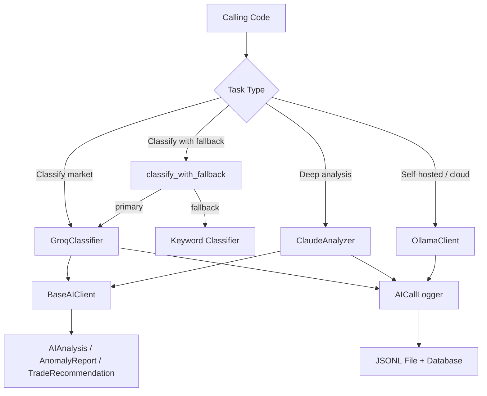

# AI Analysis

# AI Analysis Module

## Overview

The AI Analysis module provides a multi-provider AI integration layer for prediction market analysis. It wraps three AI backends—Claude, Groq, and Ollama—behind a common interface, each optimized for different tasks:

| Provider | Strength | Typical Use |
|----------|----------|-------------|
| **Claude** | Deep reasoning, nuanced analysis | Signal analysis, trade decisions, anomaly detection |
| **Groq** | Low latency (~50ms) | Market classification, detail extraction, quick checks |
| **Ollama** | Self-hosted or cloud via OpenAI-compatible API | General analysis and classification with cost control |

All providers share the same data types and prompt builders, defined in `base.py`.

## Architecture



## Data Types

All return types are defined in `base.py`.

### `AIAnalysis`

Result of any signal or market analysis. Returned by `analyze_signal()` across all providers.

| Field | Type | Description |
|-------|------|-------------|
| `reasoning` | `str` | The model's textual reasoning |
| `confidence` | `float` | 0–1 confidence score |
| `recommendation` | `Optional[str]` | Optional action recommendation |
| `risk_factors` | `List[str]` | Extracted risk factors |
| `raw_response` | `str` | Unprocessed model output |
| `model_used` | `str` | Model identifier |
| `provider` | `str` | `"claude"`, `"groq"`, or `"ollama"` |
| `latency_ms` | `float` | Round-trip time in milliseconds |
| `tokens_used` | `int` | Total tokens consumed |
| `timestamp` | `datetime` | UTC timestamp of the call |

Use `to_dict()` for serialization (excludes `raw_response`).

### `AnomalyReport`

Produced by `detect_anomalies()` in Claude and Ollama clients.

| Field | Type | Description |
|-------|------|-------------|
| `market_ticker` | `str` | Market identifier |
| `anomaly_type` | `str` | `"price_spike"`, `"volume_anomaly"`, `"spread_unusual"`, or `"ai_detected"` |
| `severity` | `str` | `"low"`, `"medium"`, or `"high"` |
| `description` | `str` | Human-readable explanation |
| `detected_at` | `datetime` | UTC timestamp |
| `ai_analysis` | `Optional[str]` | Full AI response for context |

### `TradeRecommendation`

Produced exclusively by `ClaudeAnalyzer.analyze_trade_decision()`.

| Field | Type | Description |
|-------|------|-------------|
| `signal_ticker` | `str` | Market ticker |
| `should_trade` | `bool` | Whether to execute |
| `recommended_size` | `Optional[float]` | Adjusted position size |
| `reasoning` | `str` | Model's explanation |
| `risk_assessment` | `str` | Risk summary |
| `confidence` | `float` | 0–1 confidence |
| `caveats` | `List[str]` | Additional warnings |

### `AIProvider` Enum

```python
class AIProvider(str, Enum):
    CLAUDE = "claude"
    GROQ = "groq"
    OLLAMA = "ollama"
```

## Providers

### BaseAIClient (Abstract)

All provider clients inherit from `BaseAIClient`, which defines three required async methods:

```python
class BaseAIClient(ABC):
    async def analyze_signal(self, signal_data: Dict, context: Optional[Dict] = None) -> AIAnalysis
    async def classify_market(self, title: str, description: str = "") -> tuple[str, float]
    async def detect_anomalies(self, markets: List[Dict]) -> List[AnomalyReport]
```

- `classify_market` returns `(category, confidence)` where category is one of: `weather`, `crypto`, `politics`, `economics`, `sports`, `other`.
- `detect_anomalies` returns an empty list by default in `GroqClassifier` (not its strength).

### ClaudeAnalyzer

**File:** `claude.py`  
**Default model:** `claude-sonnet-4-20250514`  
**Requires:** `anthropic` package, `ANTHROPIC_API_KEY` setting

```python
analyzer = ClaudeAnalyzer(api_key="sk-...", model="claude-sonnet-4-20250514")
result = await analyzer.analyze_signal(signal_data, context={"weather_data": {...}})
category, conf = await analyzer.classify_market("Will BTC exceed $100k by March?")
anomalies = await analyzer.detect_anomalies(markets_list)
recommendation = await analyzer.analyze_trade_decision(signal_data, portfolio_state)
```

Key behaviors:
- **Lazy client initialization**: The Anthropic SDK client is created on first use via `_get_client()`. If no API key is passed, it reads `settings.ANTHROPIC_API_KEY`.
- **Confidence heuristic**: Parses confidence from response text using keyword matching (`"high confidence"` → 0.85, `"low confidence"` → 0.4, `"uncertain"` → 0.5, default 0.7).
- **Trade decision parsing**: `analyze_trade_decision()` checks for `"yes"` in the first 50 characters of the response and uses regex to extract a numeric confidence value.
- **Graceful degradation**: All methods catch exceptions and return valid but empty/low-confidence result objects rather than raising.

### GroqClassifier

**File:** `groq.py`  
**Default model:** `llama-3.1-70b-versatile`  
**Requires:** `groq` package, `GROQ_API_KEY` setting

```python
classifier = GroqClassifier(api_key="gsk_...")
category, conf = await classifier.classify_market("Will it rain in NYC tomorrow?")
details = await classifier.extract_market_details("BTC above $50k on Dec 31")
result = await classifier.analyze_signal(signal_data)
```

Key behaviors:
- **Low temperature**: Classification uses `temperature=0.1` for deterministic categorization.
- **`extract_market_details()`**: Parses structured data (threshold, direction, asset, timeframe) from market titles. Returns a dict with numeric threshold extraction via regex.
- **`classify_with_fallback()`**: A standalone async function that tries Groq first, then falls back to `backend.core.classifier.classify_market()` (keyword-based) on failure.

### OllamaClient

**File:** `ollama.py`  
**Default models:** `glm-5.1:cloud` (analysis), `minimax-m2.7:cloud` (classification)  
**Requires:** Running Ollama server with OpenAI-compatible endpoint, configured via `settings.OLLAMA_BASE_URL`

```python
client = await get_ollama_client()  # singleton
result = await client.analyze_signal(signal_data)
category, conf = await client.classify_market(title, description)
anomalies = await client.detect_anomalies(markets_list)
await client.close()  # cleanup httpx client
```

Convenience wrappers are also available:

```python
from backend.common.ai.ollama import analyze_signal_with_ollama, classify_market_with_ollama
result = await analyze_signal_with_ollama(signal_data)
category, conf = await classify_market_with_ollama(title)
```

Key behaviors:
- **Two-model strategy**: Uses `analysis_model` for reasoning-heavy tasks and `classify_model` for fast categorization. Both are configurable via `settings`.
- **OpenAI-compatible API**: Communicates via `httpx.AsyncClient` to `/chat/completions`, supporting any Ollama-served model including cloud subscriptions.
- **JSON parsing for anomalies**: `detect_anomalies()` instructs the model to return JSON and handles markdown code block wrapping.
- **Singleton pattern**: `get_ollama_client()` manages a module-level instance. Call `close()` on shutdown to release the HTTP connection pool.
- **120s timeout**: Cloud models can be slow; the httpx client uses a 120-second timeout.

## Prompt Engineering

Prompts are constructed in `base.py` by two functions that all providers use.

### `create_signal_prompt(signal_data, context)`

Builds a structured prompt from signal data containing:
- Market title, platform, category
- Model probability, market price, edge, suggested size, direction
- Optional context blocks for `weather_data` (temperature, ensemble agreement) and `crypto_data` (price, 24h change, market cap)

Requests 2–3 sentences covering: why the edge exists, key risks, and confidence in the probability estimate.

### `create_classification_prompt(title, description)`

Builds a classification prompt that lists the six valid categories and requests a `category,confidence` format response (e.g., `crypto,85`).

## Logging & Cost Tracking

**File:** `logger.py`

Every AI call across all providers is logged via `AICallLogger`, accessed through the `get_ai_logger()` singleton.

### What Gets Logged

Each call produces an `AICallRecord` containing:

- Timestamp, provider, model, call type (`classification`, `analysis`, `anomaly`)
- Truncated prompt (first 1000 chars) and response (first 2000 chars)
- Latency in ms, tokens used, estimated cost in USD
- Related market ticker, success flag, error message

### Output Destinations

1. **JSONL file**: Written to `logs/ai/ai_calls_YYYYMMDD.jsonl` (one JSON object per line)
2. **Database**: Each provider also writes an `AILog` record directly to the database via `SessionLocal()` (best-effort; failures are logged but don't propagate)
3. **Console**: Debug-level for successes, warning-level for failures

### Cost Estimation

`AICallLogger.COSTS` maps model names to per-1M-token input/output rates. Cost is estimated assuming a 50/50 input/output token split:

```python
avg_cost = (input_cost + output_cost) / 2
cost_usd = (tokens_used / 1_000_000) * avg_cost
```

Supported models and their rates (USD per 1M tokens):

| Model | Input | Output |
|-------|-------|--------|
| claude-sonnet-4-20250514 | $3.00 | $15.00 |
| claude-3-opus-20240229 | $15.00 | $75.00 |
| glm-5.1:cloud | $0.15 | $0.60 |
| minimax-m2.7:cloud | $0.10 | $0.40 |
| llama-3.1-70b-versatile | $0.59 | $0.79 |

### Daily Statistics

`get_daily_stats()` reads the current day's JSONL file and returns:

```python
{
    "total_calls": int,
    "total_tokens": int,
    "total_cost_usd": float,
    "avg_latency_ms": float,
    "by_provider": {"claude": N, "groq": N, "ollama": N},
    "by_call_type": {"classification": N, "analysis": N, ...},
    "errors": int
}
```

## Error Handling

All provider methods follow a consistent error handling pattern:

1. **Catch all exceptions** at the outermost level
2. **Log the error** via the standard logger and `AICallLogger` (with `success=False`)
3. **Return a valid but empty result** rather than raising:
   - `AIAnalysis` with `confidence=0.0` and error message in `reasoning`
   - `classify_market` returns `("other", 0.0)` or `("other", 0.3)`
   - `detect_anomalies` returns `[]`
   - `TradeRecommendation` returns `should_trade=True` (defaults to the deterministic signal)

This ensures the trading pipeline continues operating even if an AI provider is down.

## Configuration

Settings are read from `backend.common.config.settings`:

| Setting | Used By | Description |
|---------|---------|-------------|
| `ANTHROPIC_API_KEY` | ClaudeAnalyzer | API key for Claude |
| `GROQ_API_KEY` | GroqClassifier | API key for Groq |
| `OLLAMA_BASE_URL` | OllamaClient | Base URL for Ollama server |
| `OLLAMA_API_KEY` | OllamaClient | Auth key (optional, for cloud models) |
| `OLLAMA_ANALYSIS_MODEL` | OllamaClient | Model for `analyze_signal` (default: `glm-5.1:cloud`) |
| `OLLAMA_CLASSIFY_MODEL` | OllamaClient | Model for `classify_market` (default: `minimax-m2.7:cloud`) |

API keys can also be passed directly to constructors, which takes precedence over settings.