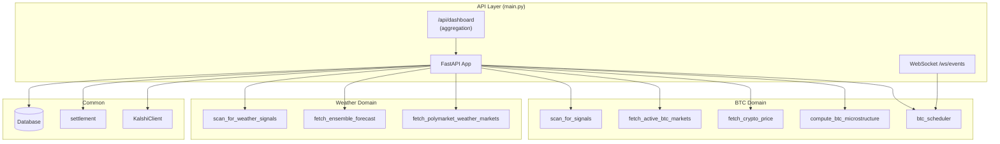

# API Layer

# API Layer

The FastAPI application serving the BTC 5-minute trading bot dashboard. It exposes REST endpoints for market data, signals, trades, calibration, weather markets, and bot control, plus a WebSocket channel for real-time event streaming.

## Architecture



## Application Lifecycle

**Startup** (`startup` event handler):
1. Initializes the database via `init_db()`
2. Creates or loads `BotState` — sets `is_running = True`
3. Starts the BTC scheduler (`start_scheduler()`)
4. Logs initialization event

**Shutdown** (`shutdown` event handler):
1. Stops the scheduler via `stop_scheduler()`

CORS is configured to allow all origins (`*`), all methods, and all headers — appropriate for a local dashboard but should be restricted in production.

## Pydantic Response Models

All API responses are typed through Pydantic models. The key models and their purposes:

| Model | Purpose |
|---|---|
| `BtcPriceResponse` | Current BTC price, 24h/7d change, market cap, volume |
| `BtcWindowResponse` | A single 5-minute BTC market window with prices, timing, spread |
| `MicrostructureResponse` | RSI, momentum (1m/5m/15m), VWAP deviation, SMA crossover, volatility |
| `SignalResponse` | Trading signal with model probability, market probability, edge, confidence, size |
| `TradeResponse` | Executed trade with entry price, size, result, PnL |
| `BotStats` | Bankroll, trade counts, win rate, PnL, running status |
| `CalibrationBucket` / `CalibrationSummary` | Model calibration: predicted vs actual win rates, Brier score |
| `WeatherForecastResponse` | Ensemble forecast for a city (mean/std high/low, agreement) |
| `WeatherMarketResponse` | A weather temperature market with threshold, direction, prices |
| `WeatherSignalResponse` | Weather trading signal with ensemble statistics |
| `DashboardData` | Aggregation of all dashboard data in one payload |
| `EventResponse` | A single log event with timestamp, type, message |

## REST Endpoints

### General

| Method | Path | Handler | Description |
|---|---|---|---|
| GET | `/` | `root` | API status and simulation mode flag |
| GET | `/api/health` | `health` | Health check |
| GET | `/api/stats` | `get_stats` | Bot stats (bankroll, win rate, PnL) |
| GET | `/api/events` | `get_events` | Recent log events (default limit 50) |

### BTC Markets & Signals

| Method | Path | Handler | Description |
|---|---|---|---|
| GET | `/api/btc/price` | `get_btc_price` | Current BTC price and 24h/7d change from CoinGecko |
| GET | `/api/btc/windows` | `get_btc_windows` | Active/upcoming 5-min BTC market windows |
| GET | `/api/signals` | `get_signals` | All current BTC trading signals |
| GET | `/api/signals/actionable` | `get_actionable_signals` | Only signals passing the edge threshold |

### Trades & Analytics

| Method | Path | Handler | Description |
|---|---|---|---|
| GET | `/api/trades` | `get_trades` | Trade history, filterable by `status`, paginated by `limit` |
| GET | `/api/equity-curve` | `get_equity_curve` | Cumulative PnL curve from settled trades |
| GET | `/api/calibration` | `get_calibration` | Model calibration buckets (5% bins) and summary stats |

### Actions

| Method | Path | Handler | Description |
|---|---|---|---|
| POST | `/api/simulate-trade` | `simulate_trade` | Place a manual trade from a signal (capped at 5% of bankroll) |
| POST | `/api/run-scan` | `run_scan` | Trigger a manual scan (BTC + weather if enabled) |
| POST | `/api/settle-trades` | `settle_trades_endpoint` | Trigger manual settlement of pending trades |

### Kalshi

| Method | Path | Handler | Description |
|---|---|---|---|
| GET | `/api/kalshi/status` | `get_kalshi_status` | Test Kalshi API auth and return balance |

### Weather

| Method | Path | Handler | Description |
|---|---|---|---|
| GET | `/api/weather/forecasts` | `get_weather_forecasts` | Ensemble forecasts for configured cities |
| GET | `/api/weather/markets` | `get_weather_markets` | Active weather temperature markets (Polymarket + Kalshi) |
| GET | `/api/weather/signals` | `get_weather_signals` | Current weather trading signals |

All weather endpoints return `[]` when `settings.WEATHER_ENABLED` is `False`.

### Bot Control

| Method | Path | Handler | Description |
|---|---|---|---|
| POST | `/api/bot/start` | `start_bot` | Set `is_running = True`, start scheduler if not running |
| POST | `/api/bot/stop` | `stop_bot` | Set `is_running = False` (pauses trading) |
| POST | `/api/bot/reset` | `reset_bot` | Delete all trades and AI logs, reset bankroll to `INITIAL_BANKROLL` |

### Dashboard Aggregation

| Method | Path | Handler | Description |
|---|---|---|---|
| GET | `/api/dashboard` | `get_dashboard` | Single-call aggregation of all dashboard data |

`get_dashboard` is the primary endpoint for the frontend. It fetches stats, BTC price (preferring microstructure data, falling back to CoinGecko), microstructure indicators, market windows, signals, recent trades, equity curve, calibration summary, and weather data — all in one response.

## WebSocket

**Path:** `/ws/events`

The `ConnectionManager` class manages active WebSocket connections and broadcasts messages to all connected clients.

On connection:
1. Client receives a welcome message
2. Last 20 events are replayed
3. Every 2 seconds, the server polls for new events and sends them, plus a heartbeat

Message format:
```json
{
  "timestamp": "2024-01-01T00:00:00",
  "type": "success|info|trade|error",
  "message": "Description of the event",
  "data": {}
}
```

## Internal Helpers

### `_signal_to_response(s: TradingSignal, actionable: bool = False) -> SignalResponse`

Converts a `TradingSignal` domain object into a `SignalResponse` API model. The `actionable` flag is set based on `s.passes_threshold` when called from `get_dashboard` and `get_actionable_signals`.

### `_weather_signal_to_response(s) -> WeatherSignalResponse`

Converts a weather signal domain object into a `WeatherSignalResponse` API model. Sets `actionable` from `s.passes_threshold`.

### `_compute_calibration_summary(db: Session) -> Optional[CalibrationSummary]`

Computes aggregate calibration statistics from settled signals:
- **Accuracy**: fraction of signals where `outcome_correct` is `True`
- **Avg predicted edge**: mean of `abs(edge)` across settled signals
- **Avg actual edge**: mean of `+edge` for correct predictions, `-edge` for incorrect
- **Brier score**: mean squared error of `model_probability` vs `settlement_value`

Returns `None` if no signals exist in the database.

## Error Handling Pattern

Most endpoints wrap their core logic in `try/except Exception` and return empty defaults (`[]`, `None`) on failure rather than propagating errors. This ensures the dashboard always renders even when individual data sources are unavailable. The exceptions are:

- `get_stats` raises `HTTPException(404)` if `BotState` is missing
- `simulate_trade` raises `HTTPException(404)` if the signal isn't found, or `HTTPException(500)` if bot state is missing
- `reset_bot` raises `HTTPException(500)` if the database transaction fails

## Database Dependency

All endpoints that read or write persistent state use FastAPI's `Depends(get_db)` to obtain a SQLAlchemy `Session`. The `get_db` generator handles session lifecycle (creation and closure).

## Configuration Dependencies

The module reads from `settings` (via `backend.common.config`):

| Setting | Used By |
|---|---|
| `INITIAL_BANKROLL` | `startup`, `reset_bot`, equity curve calculation |
| `SIMULATION_MODE` | `root` endpoint response |
| `MIN_EDGE_THRESHOLD` | `startup` log output |
| `KELLY_FRACTION` | `startup` log output |
| `SCAN_INTERVAL_SECONDS` | `startup` log output |
| `SETTLEMENT_INTERVAL_SECONDS` | `startup` log output |
| `WEATHER_ENABLED` | Weather endpoints, `run_scan`, `get_dashboard` |
| `WEATHER_SCAN_INTERVAL_SECONDS` | `startup` log output |
| `WEATHER_MIN_EDGE_THRESHOLD` | `startup` log output |
| `WEATHER_CITIES` | Weather endpoints, `get_dashboard` |
| `KALSHI_ENABLED` | `get_weather_markets` (for Kalshi market fetching) |

## Running

```bash
# Direct execution
python -m backend.common.api.main

# Or via uvicorn with auto-reload
uvicorn backend.common.api.main:app --host 0.0.0.0 --port 8000 --reload
```

The default port is `8000`, overridable via the `PORT` environment variable.