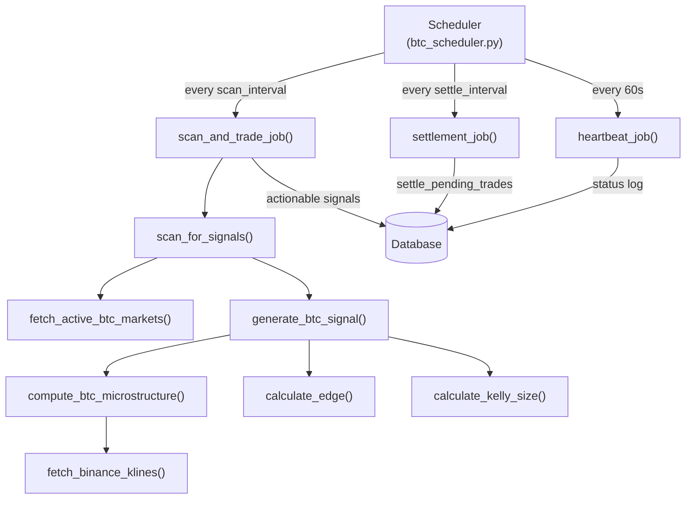

# BTC Trading

# BTC Trading Module

## Overview

The BTC Trading module automates trading on Polymarket's BTC 5-minute Up/Down markets. It runs a scheduled pipeline that fetches market data, computes technical indicators from real exchange candles, generates directional signals, and executes trades with risk controls including Kelly sizing, convergence filters, and daily loss circuit breakers.

## Architecture



## Key Components

### 1. Scheduler — `btc/core/btc_scheduler.py`

Manages the periodic job lifecycle using `AsyncIOScheduler`. A single global `scheduler` instance is created on first call to `start_scheduler()`.

**Scheduled Jobs:**

| Job | Default Interval | Purpose |
|-----|-----------------|---------|
| `scan_and_trade_job` | `SCAN_INTERVAL_SECONDS` | Scan markets, generate signals, execute trades |
| `settlement_job` | `SETTLEMENT_INTERVAL_SECONDS` | Check and settle pending trades |
| `heartbeat_job` | 1 minute | Log pending trade count and bankroll |
| `weather_scan_and_trade_job` | `WEATHER_SCAN_INTERVAL_SECONDS` | Weather market scanning (gated by `WEATHER_ENABLED`) |

**Risk Controls in `scan_and_trade_job`:**

- **Daily loss circuit breaker** — stops all trades when cumulative daily P&L reaches `-DAILY_LOSS_LIMIT`
- **Max pending trades** — skips new trades when `Trade.settled == False` count reaches `MAX_TOTAL_PENDING_TRADES`
- **Max trades per scan** — caps at `MAX_TRADES_PER_SCAN = 2` per cycle
- **Duplicate prevention** — skips markets where an unsettled trade already exists for the same `event_slug`
- **Position sizing** — `min(signal.suggested_size, bankroll * 0.03)` with a floor of `MIN_TRADE_SIZE = 10`

**Event Logging:**

The module maintains an in-memory `event_log` (capped at 200 entries) for terminal display. Use `log_event(event_type, message, data)` to record events and `get_recent_events(limit)` to retrieve them. Event types map to log levels: `error` → `logger.error`, `trade` → `logger.info`, etc.

**Manual Triggers:**

- `run_manual_scan()` — immediately invoke `scan_and_trade_job()`
- `run_manual_settlement()` — immediately invoke `settlement_job()`
- `is_scheduler_running()` — check whether the scheduler is active

### 2. Signal Generation — `btc/core/signals.py`

#### `TradingSignal` Dataclass

The core output type. Key fields:

| Field | Description |
|-------|-------------|
| `model_probability` | Our estimated probability of UP outcome |
| `market_probability` | Market's implied UP probability |
| `edge` | Difference between model and market probability |
| `direction` | `"up"` or `"down"` — whichever side has more edge |
| `passes_threshold` | `True` if `abs(edge) >= MIN_EDGE_THRESHOLD` |
| `suggested_size` | Kelly-derived dollar amount |
| `confidence` | 0–1 score based on convergence strength and volatility |
| `reasoning` | Human-readable string with indicator values and filter status |

#### Signal Pipeline: `scan_for_signals()`

1. Calls `fetch_active_btc_markets()` to discover current/upcoming 5-min windows
2. For each market, calls `generate_btc_signal(market)`
3. Sorts results by absolute edge (descending)
4. Persists signals with non-zero edge to the `Signal` table via `_persist_signals()`

#### Signal Generation: `generate_btc_signal(market)`

Computes a composite model probability from five indicators, then applies filters:

**Indicators (each normalized to -1…+1):**

| Indicator | Logic | Weight Config |
|-----------|-------|---------------|
| RSI | Mean reversion: oversold (<30) → UP, overbought (>70) → DOWN | `WEIGHT_RSI` |
| Momentum | Weighted blend of 1m/5m/15m % changes | `WEIGHT_MOMENTUM` |
| VWAP Deviation | Price above VWAP → UP bias | `WEIGHT_VWAP` |
| SMA Crossover | SMA5 > SMA15 → bullish | `WEIGHT_SMA` |
| Market Skew | Contrarian: strong market UP bias → fade it | `WEIGHT_MARKET_SKEW` |

**Composite → Probability:**

```
composite = Σ(indicator × weight)
model_up_prob = 0.50 + composite × 0.15    # clamped to [0.35, 0.65]
```

**Filters (all must pass for a signal to be actionable):**

1. **Convergence** — At least 2 of 4 core indicators (RSI, Momentum, VWAP, SMA) must agree on direction (sign > 0.05)
2. **Entry price** — The chosen side's price must be ≤ `MAX_ENTRY_PRICE` (only buy the cheap side)
3. **Time remaining** — Window must have between `MIN_TIME_REMAINING` and `MAX_TIME_REMAINING` seconds left

If any filter fails, `edge` is zeroed out (the signal is still returned for UI visibility but won't trigger trades).

#### Edge Calculation: `calculate_edge(model_prob, market_price)`

Compares UP edge (`model_prob - market_price`) vs DOWN edge (`(1 - model_prob) - (1 - market_price)`). Returns the larger edge and its corresponding direction.

#### Position Sizing: `calculate_kelly_size(edge, probability, market_price, direction, bankroll)`

Uses fractional Kelly criterion:

```
odds = (1 - price) / price
kelly = (win_prob × odds - lose_prob) / odds
kelly *= KELLY_FRACTION          # config-controlled fractional Kelly
kelly = min(kelly, 0.05)         # hard cap at 5% of bankroll
size = kelly × bankroll
size = min(size, MAX_TRADE_SIZE)  # config cap
```

### 3. Market Data — `btc/data/btc_markets.py`

#### `BtcMarket` Dataclass

Represents a single Polymarket BTC 5-min Up/Down market:

| Field | Description |
|-------|-------------|
| `slug` | Event slug, e.g. `btc-updown-5m-1708531200` |
| `market_id` | Polymarket market ID |
| `up_price` / `down_price` | Implied probabilities for UP/DOWN outcomes |
| `window_start` / `window_end` | 5-minute trading window timestamps |
| `volume` | Market volume |
| `is_active` | Whether the window is currently in progress |

#### Market Fetching: `fetch_active_btc_markets()`

Uses a two-method approach:

1. **Slug computation** — Calculates expected slugs from the current time (`_compute_window_slugs` rounds down to 5-min boundaries) and fetches each directly. This is the primary method and works reliably.
2. **Series search fallback** — Queries the Gamma API with `slug_contains=btc-updown-5m` to catch any markets the computation missed.

Both methods validate slugs against `_BTC_SLUG_RE = r"^btc-updown-5m-\d{10}$"` via `is_valid_btc_slug()`. Results are deduplicated, sorted by `window_end`, and filtered to exclude closed markets.

#### Settlement Fetching: `fetch_btc_market_for_settlement(slug)`

Same as `fetch_btc_market_by_slug` but intended for resolving already-closed markets. Does not filter out `closed=True` markets.

### 4. Crypto Data — `btc/data/crypto.py`

#### `BtcMicrostructure` Dataclass

Technical indicators computed from 1-minute candles:

| Field | Description |
|-------|-------------|
| `rsi` | 14-period Wilder-smoothed RSI |
| `momentum_1m` / `5m` / `15m` | % price change over respective lookbacks |
| `vwap` / `vwap_deviation` | 30-candle VWAP and % deviation from it |
| `sma_crossover` | SMA5 − SMA15 as % of price |
| `volatility` | Stdev of 1-min returns (last 30 candles) |
| `price` | Latest close price |
| `source` | Which exchange provided the data |

#### Kline Fetching: `fetch_binance_klines(limit=60)`

Fetches 60 one-minute BTC candles with a 30-second cache (`_CACHE_TTL = 30.0`). Uses a multi-exchange fallback chain:

1. **Coinbase** (US-accessible, primary)
2. **Kraken** (US-accessible, fallback)
3. **Binance** (geo-blocked in US, secondary fallback)
4. **Bybit** (last resort)

Each source normalizes its response to `[open_time, open, high, low, close, volume]` format. The `_source` key in the cache tracks which exchange provided the data.

#### Indicator Computation: `compute_btc_microstructure()`

Called by `generate_btc_signal()`. Fetches candles, then computes all indicators. Returns `None` if fewer than 20 candles are available.

#### CoinGecko Price Data

Separate from the microstructure pipeline, `fetch_crypto_price(symbol)` and `fetch_multiple_prices(symbols)` provide general price data from CoinGecko's free API. The `estimate_price_probability()` function offers a simple normal-distribution probability model but is not used in the main trading pipeline.

## Configuration

All thresholds and weights are controlled via `settings` (from `backend.common.config`):

| Setting | Purpose |
|---------|---------|
| `SCAN_INTERVAL_SECONDS` | How often the market scan runs |
| `SETTLEMENT_INTERVAL_SECONDS` | How often settlement checks run |
| `MIN_EDGE_THRESHOLD` | Minimum edge for a signal to be actionable |
| `MAX_ENTRY_PRICE` | Maximum price to pay for the chosen side |
| `MIN_TIME_REMAINING` / `MAX_TIME_REMAINING` | Time window filter bounds (seconds) |
| `KELLY_FRACTION` | Fractional Kelly multiplier |
| `MAX_TRADE_SIZE` | Hard cap on individual trade size |
| `INITIAL_BANKROLL` | Bankroll used for Kelly sizing |
| `DAILY_LOSS_LIMIT` | Daily loss circuit breaker threshold |
| `MAX_TOTAL_PENDING_TRADES` | Max concurrent unsettled trades |
| `WEIGHT_RSI`, `WEIGHT_MOMENTUM`, `WEIGHT_VWAP`, `WEIGHT_SMA`, `WEIGHT_MARKET_SKEW` | Indicator weights for composite |
| `WEATHER_ENABLED` | Enable/disable weather market jobs |

## Database Models

The scheduler interacts with three models from `backend.common.models.database`:

- **`Trade`** — Created when a signal is executed. Fields include `market_ticker`, `event_slug`, `direction`, `entry_price`, `size`, `model_probability`, `market_price_at_entry`, `edge_at_entry`, `settled`, `pnl`, `signal_id`.
- **`Signal`** — Persisted by `_persist_signals()`. Tracks `model_probability`, `market_price`, `edge`, `confidence`, `kelly_fraction`, `suggested_size`, `executed`. Deduplicated on `(market_ticker, timestamp)`.
- **`BotState`** — Stores `is_running`, `bankroll`, `total_trades`, `last_run`. Checked at the start of each scan to respect pause state.

## Execution Flow: Trade Lifecycle

1. **Scan** — `scan_and_trade_job()` calls `scan_for_signals()`, which fetches markets and generates signals
2. **Filter** — Only signals where `passes_threshold == True` are considered
3. **Guard checks** — Daily loss limit, max pending trades, bot running state, duplicate market check
4. **Size** — `min(signal.suggested_size, bankroll * 0.03)`, floored at `MIN_TRADE_SIZE`
5. **Execute** — Create a `Trade` row, link to the matching `Signal` (marking it `executed=True`), increment `BotState.total_trades`
6. **Settle** — `settlement_job()` calls `settle_pending_trades()` which resolves outcomes and updates P&L