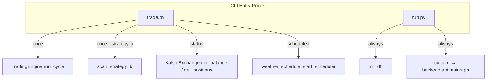

# CLI Entry Points

# CLI Entry Points

The trading bot has two standalone entry points: **`trade.py`** for running the arbitrage scanner and **`run.py`** for launching the API backend server. The `main.py` file is a placeholder and is not currently used.

## Architecture Overview



---

## `trade.py` — Trading Bot CLI

The primary interface for running the weather arbitrage trading bot. Supports simulation, live trading, one-shot scans, and account status checks.

### Command-Line Arguments

| Flag | Mode | Description |
|------|------|-------------|
| `--sim` | Default | Paper trading / simulation mode (no API keys needed) |
| `--live` | Mutually exclusive with `--sim` | Live trading with real money on Kalshi |
| `--once` | Modifier | Run a single scan cycle, then exit |
| `--strategy-b` | Modifier (requires `--once`) | Only run Strategy B (cross-bracket arbitrage), skip weather model |
| `--status` | Standalone | Print account balance and open positions, then exit |
| `--cities` | Modifier | Comma-separated city keys to scan (overrides config default) |

`--sim` and `--live` are mutually exclusive. If neither is specified, `--sim` is the default.

### Execution Modes

#### Single Scan (`--once`)

Runs one full scan cycle through `TradingEngine.run_cycle()` and prints detected opportunities with their status:

```
[APPROVED] weather NYC-2024-01-15 edge=8.3%
[DETECTED] weather CHI-2024-01-16 edge=5.1%
```

Status icons map to: `validated` → APPROVED, `complete` → EXECUTED, `partial` → PARTIAL, `cancelled` → REJECTED, `detected` → DETECTED.

With `--strategy-b`, it calls `scan_strategy_b()` directly on the exchange, bypassing the full `TradingEngine`. This outputs each arbitrage opportunity with edge percentage, cost, and bracket details.

#### Scheduled Mode (default)

Starts the weather scheduler via `start_scheduler()` and runs indefinitely. The scheduler handles periodic scan cycles internally. Press Ctrl+C to trigger a graceful shutdown via `stop_scheduler()`.

In this mode, `settings.SIMULATION_MODE` is explicitly set based on the `--sim`/`--live` flag, overriding any `.env` value.

#### Status Check (`--status`)

Connects to Kalshi and prints the account balance (available/total) and all open positions with ticker, side, size, and average price. Requires `KALSHI_API_KEY_ID` and `KALSHI_PRIVATE_KEY_PATH` environment variables.

### Key Functions

- **`main()`** — Entry point. Parses args, then dispatches to `run_status()`, `run_once()`, or `run_scheduled()` via `asyncio.run()`.
- **`run_once(simulation, strategy_b_only, cities)`** — Creates a `TradingEngine` with a `KalshiExchange` instance. If `strategy_b_only`, calls `scan_strategy_b()` directly; otherwise calls `engine.run_cycle()`.
- **`run_status()`** — Instantiates `KalshiExchange` directly (no `TradingEngine`) and calls `get_balance()` and `get_positions()`.
- **`run_scheduled(simulation)`** — Sets `settings.SIMULATION_MODE`, calls `start_scheduler()`, then blocks with `asyncio.sleep(1)` in a loop until interrupted.

### Usage Examples

```bash
# Paper trade with scheduler (default mode)
python trade.py

# Single scan in simulation mode
python trade.py --once

# Single scan, Strategy B only
python trade.py --once --strategy-b

# Live trading with scheduler (REAL MONEY)
python trade.py --live

# Check account status
python trade.py --status

# Scan specific cities
python trade.py --once --cities NYC,CHI
```

---

## `run.py` — Backend Server

Launches the FastAPI backend that serves the web dashboard and REST API.

### Startup Sequence

1. Calls `init_db()` to initialize the database schema
2. Reads `PORT` from environment (defaults to `8000`)
3. Starts uvicorn serving `backend.api.main:app`

### Auto-Reload Behavior

Uvicorn's hot-reload is enabled **only when not running on Railway**. The check is:

```python
reload=os.environ.get("RAILWAY_ENVIRONMENT") is None
```

This means reload is active in local development and disabled in production.

### Environment Variables

| Variable | Default | Purpose |
|----------|---------|---------|
| `PORT` | `8000` | Server listen port |
| `RAILWAY_ENVIRONMENT` | *(unset)* | When set, disables uvicorn reload (production mode) |

### Usage

```bash
# Start the backend server
python run.py

# Custom port
PORT=3000 python run.py
```

The API documentation is available at `http://localhost:<PORT>/docs` once running.

---

## Signal Handling

`trade.py` handles `KeyboardInterrupt` and `SystemExit` in the scheduled mode to call `stop_scheduler()` for a clean shutdown. The `--once` and `--status` modes run to completion and exit naturally. `run.py` delegates signal handling to uvicorn.