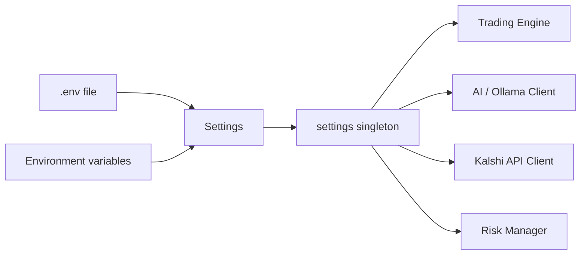

# Configuration

# Configuration Module

## Overview

The `config` module provides a centralized, type-safe configuration layer for the trading bot. It uses Pydantic's `BaseSettings` to load settings from environment variables and `.env` files, with sensible defaults for local development and simulation.

The singleton `settings` object is the single source of truth consumed across the codebase — no other module reads environment variables directly for application configuration.

## How It Works

`Settings` inherits from `pydantic_settings.BaseSettings`, which means:

1. **Environment variables take precedence.** Any setting can be overridden by setting an environment variable with the same name (e.g., `KALSHI_API_KEY_ID=abc123`).
2. **A `.env` file is loaded automatically** as a fallback, thanks to the inner `Config` class.
3. **Type coercion is handled by Pydantic.** Strings like `"true"` become `bool`, `"300.0"` becomes `float`, etc. Invalid types raise `ValidationError` at startup.
4. **Defaults are production-reasonable.** The bot runs in simulation mode by default (`SIMULATION_MODE=True`) and uses SQLite for Phase 1.

The module-level instantiation `settings = Settings()` evaluates once at import time. If required environment variables are missing or values fail validation, the application fails immediately — fail-fast behavior that prevents misconfigured runs.



## Settings Groups

### Database

| Field | Default | Notes |
|---|---|---|
| `DATABASE_URL` | `sqlite:///./tradingbot.db` | Switch to PostgreSQL URL for production |

### Kalshi API

| Field | Default | Notes |
|---|---|---|
| `KALSHI_API_KEY_ID` | `None` | Required for live trading; Kalshi RSA-PSS key ID |
| `KALSHI_PRIVATE_KEY_PATH` | `None` | Path to the RSA private key file for Kalshi auth |
| `KALSHI_ENABLED` | `True` | Set to `False` to disable all Kalshi interaction |
| `KALSHI_FEE_RATE` | `0.0` | Per-contract fee; adjust when Kalshi introduces fees |

### AI / Ollama Configuration

The bot uses two models through an OpenAI-compatible endpoint:

- **`OLLAMA_ANALYSIS_MODEL`** (`glm-5.1:cloud`) — the primary model for deep analysis.
- **`OLLAMA_CLASSIFY_MODEL`** (`minimax-m2.7:cloud`) — a faster model for classification tasks.

| Field | Default | Notes |
|---|---|---|
| `OLLAMA_BASE_URL` | `http://localhost:11434/v1` | OpenAI-compatible endpoint; change for cloud providers |
| `OLLAMA_API_KEY` | `""` | Empty for local Ollama; set when using a cloud proxy |

**Backward compatibility:** `GROQ_API_KEY` and `GROQ_MODEL` are retained for existing API endpoints. New code should use the `OLLAMA_*` fields.

**Cost control:**

| Field | Default | Notes |
|---|---|---|
| `AI_LOG_ALL_CALLS` | `True` | Log every AI call for auditing |
| `AI_DAILY_BUDGET_USD` | `1.0` | Hard cap on daily AI spend |

### BTC 5-Minute Trading

These settings control the bot's primary short-duration trading strategy on BTC price brackets.

| Field | Default | Notes |
|---|---|---|
| `SIMULATION_MODE` | `True` | Paper-trade only; no real orders |
| `INITIAL_BANKROLL` | `10000.0` | Starting capital for simulation tracking |
| `KELLY_FRACTION` | `0.15` | Fractional Kelly sizing (15% of full Kelly) |
| `SCAN_INTERVAL_SECONDS` | `60` | How often to scan for new opportunities |
| `SETTLEMENT_INTERVAL_SECONDS` | `120` | How often to check for settled markets |
| `BTC_PRICE_SOURCE` | `"coinbase"` | Price feed provider |
| `MIN_EDGE_THRESHOLD` | `0.02` | Minimum 2% edge to enter a trade |
| `MAX_ENTRY_PRICE` | `0.55` | Don't enter above 55¢ (these are ~50/50 markets) |
| `MAX_TRADES_PER_WINDOW` | `1` | One trade per 5-minute window |
| `MAX_TOTAL_PENDING_TRADES` | `20` | Cap on outstanding positions |

### Risk Management

| Field | Default | Notes |
|---|---|---|
| `DAILY_LOSS_LIMIT` | `300.0` | Stop trading after this daily loss |
| `MAX_TRADE_SIZE` | `75.0` | Maximum dollar amount per trade |
| `MIN_TIME_REMAINING` | `60` | Skip windows closing in under 60 seconds |
| `MAX_TIME_REMAINING` | `1800` | Skip windows more than 30 minutes out |

### Indicator Weights

The composite signal for BTC 5-minute markets is a weighted sum of five indicators. **These weights must sum to approximately 1.0** for the signal to be interpretable as a probability:

| Weight | Default | Indicator |
|---|---|---|
| `WEIGHT_RSI` | 0.20 | Relative Strength Index |
| `WEIGHT_MOMENTUM` | 0.35 | Price momentum |
| `WEIGHT_VWAP` | 0.20 | Volume-weighted average price deviation |
| `WEIGHT_SMA` | 0.15 | Simple moving average crossover |
| `WEIGHT_MARKET_SKEW` | 0.10 | Market order flow skew |

**Sum: 1.00** — if you adjust these, verify the total remains ~1.0.

### Weather Trading

Controls the weather arbitrage strategy (Strategies A, B, and C from the module docstring).

| Field | Default | Notes |
|---|---|---|
| `WEATHER_ENABLED` | `True` | Enable/disable the weather strategy |
| `WEATHER_SCAN_INTERVAL_SECONDS` | `300` | Scan every 5 minutes |
| `WEATHER_SETTLEMENT_INTERVAL_SECONDS` | `1800` | Check settlements every 30 minutes |
| `WEATHER_MIN_EDGE_THRESHOLD` | `0.08` | 8% edge required (weather has stronger signal) |
| `WEATHER_MAX_ENTRY_PRICE` | `0.70` | Higher cap than BTC — weather markets have wider ranges |
| `WEATHER_MAX_TRADE_SIZE` | `100.0` | Larger position size for weather |
| `WEATHER_CITIES` | `"nyc,chicago,miami,los_angeles,denver"` | Comma-separated city slugs |

## Usage

Import the singleton and read settings directly:

```python
from backend.common.config import settings

if settings.SIMULATION_MODE:
    logger.info("Running in simulation mode")

edge = compute_edge(signal, market_price)
if edge >= settings.MIN_EDGE_THRESHOLD:
    size = kelly_size(edge, settings.KELLY_FRACTION, settings.MAX_TRADE_SIZE)
```

### Overriding at Runtime

For tests or scripts, override via environment variables:

```bash
SIMULATION_MODE=true INITIAL_BANKROLL=5000 python -m backend.main
```

Or create a `.env` file in the project root:

```
KALSHI_API_KEY_ID=your_key_id
KALSHI_PRIVATE_KEY_PATH=/path/to/key.pem
SIMULATION_MODE=false
```

## Common Pitfalls

- **Weight drift.** If you change indicator weights, confirm they still sum to ~1.0. There is no runtime validation of this constraint.
- **`KALSHI_FEE_RATE` is zero.** The default assumes no per-contract fees. Update this when Kalshi's fee schedule changes, or profitability calculations will be wrong.
- **`WEATHER_CITIES` is a comma-separated string**, not a list. Parse it with `settings.WEATHER_CITIES.split(",")` when you need a list.
- **`GROQ_*` fields are deprecated.** Use `OLLAMA_*` equivalents in new code. The old fields exist only for backward compatibility with existing API endpoints.