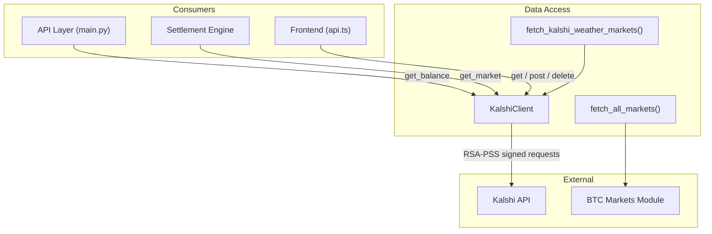

# Data Access

# Data Access Module

The Data Access module provides the interface between the trading bot and external prediction market platforms. It handles authenticated API communication, market data retrieval, and normalization into a unified format consumed by the trading engine, settlement system, and frontend.

## Architecture



---

## KalshiClient (`kalshi_client.py`)

The core async HTTP client for the Kalshi API. It manages:

- **RSA-PSS request signing** — every request is authenticated with a cryptographic signature
- **Connection pooling** — a shared `httpx.AsyncClient` is reused across all requests
- **Exponential backoff** — transient failures (429, 5xx, connection errors) are retried automatically

### Authentication Flow

Each request is signed using the Kalshi RSA-PSS scheme:

1. `_load_private_key()` reads the PEM private key from `settings.KALSHI_PRIVATE_KEY_PATH` (lazy, cached on first access)
2. `_sign_request(method, path)` constructs the message: `{timestamp_ms}{METHOD}{path}` where `path` is the full API path (e.g., `/trade-api/v2/markets`) — **query parameters are not included in the signature**
3. The message is signed with RSA-PSS using SHA-256 and MGF1-SHA256 with `MAX_LENGTH` salt
4. Three headers are attached: `KALSHI-ACCESS-KEY`, `KALSHI-ACCESS-SIGNATURE` (base64-encoded), and `KALSHI-ACCESS-TIMESTAMP`

### Retry Behavior

`_request_with_retry()` wraps every HTTP call with exponential backoff:

| Condition | Action |
|---|---|
| Status < 400 | Return immediately |
| 429 (rate limit) | Wait `backoff + 5s`, then retry. Backoff doubles each attempt |
| 5xx (server error) | Wait `backoff`, then retry. Backoff doubles each attempt |
| 4xx (not 429) | Raise immediately — client errors are not retried |
| `ConnectError` / `TimeoutException` | Wait `backoff`, then retry |

Configuration constants:
- `MAX_RETRIES = 3`
- `INITIAL_BACKOFF_SECONDS = 1.0`
- `MAX_BACKOFF_SECONDS = 30.0`
- `RATE_LIMIT_EXTRA_WAIT = 5.0`

### Public Methods

| Method | Description |
|---|---|
| `get(path, params=None)` | Authenticated GET. `path` is relative to `/trade-api/v2` (e.g., `"/markets"`) |
| `get_markets(params=None)` | Convenience: GET `/markets` with optional filters |
| `get_market(ticker)` | Convenience: GET `/markets/{ticker}` |
| `post(path, json=None)` | Authenticated POST with JSON body |
| `delete(path)` | Authenticated DELETE |
| `get_balance()` | Convenience: GET `/portfolio/balance` — useful for auth verification |
| `close()` | Close the underlying HTTP session. Call during shutdown |

### Connection Management

The `httpx.AsyncClient` is created lazily by `_get_client()` and reused across all requests. It is configured with:
- 15s total timeout, 5s connect timeout
- 20 max connections, 10 max keepalive connections

**Important:** Call `await client.close()` during application shutdown to properly release connections. If the client is closed or `None`, `_get_client()` will recreate it on the next request.

### Credential Check

`kalshi_credentials_present()` returns `True` if both `KALSHI_API_KEY_ID` and `KALSHI_PRIVATE_KEY_PATH` are configured in settings. Use this to gate Kalshi-dependent features.

---

## Kalshi Weather Markets (`kalshi_markets.py`)

Fetches and parses Kalshi high-temperature weather markets for configured cities.

### Supported Cities

| Key | Series Ticker | City Name |
|---|---|---|
| `nyc` | `KXHIGHNY` | New York |
| `chicago` | `KXHIGHCHI` | Chicago |
| `miami` | `KXHIGHMIA` | Miami |
| `los_angeles` | `KXHIGHLAX` | Los Angeles |
| `denver` | `KXHIGHDEN` | Denver |

### Ticker Format

Kalshi weather bracket tickers follow the pattern:

```
KXHIGHNY-26MAR01-B45.5
```

Parsed by `_parse_kalshi_ticker()`:

| Component | Example | Meaning |
|---|---|---|
| Series | `KXHIGHNY` | City-specific high-temp series |
| Date | `26MAR01` | Target date: 2026-03-01 |
| Boundary type | `B` | `B` = bottom boundary (above threshold), `T` = top boundary (below threshold) |
| Threshold | `45.5` | Temperature in °F |

Returns a dict with keys: `target_date`, `threshold_f`, `metric` (always `"high"`), `direction` (`"above"` or `"below"`). Returns `None` if the ticker doesn't match the expected pattern.

### `fetch_kalshi_weather_markets(city_keys=None)`

Main entry point. Returns a list of `WeatherMarket` objects.

**Behavior:**
1. Returns `[]` immediately if `kalshi_credentials_present()` is `False`
2. Creates a new `KalshiClient` instance per call
3. For each city, queries the series with `status=open` and `limit=200`
4. Handles cursor-based pagination — continues fetching until no cursor or no markets returned
5. Filters out:
   - Markets with unparseable tickers
   - Past-date markets (`target_date < today`)
   - Markets with zero `yes_ask` price (no liquidity to buy)
   - Near-resolved markets (`yes_price > 0.98` or `< 0.02`)
6. Computes `no_price` as `1.0 - yes_price` if `no_ask` is missing
7. Logs warnings on per-city failures but continues to other cities

**Price handling note:** The function uses `yes_ask` / `no_ask` (the price you'd actually pay), not `last_price`. Using `last_price` was a previous bug — it reflects the last trade, not the current cost to enter a position.

---

## Market Data Unification (`markets.py`)

Provides a platform-agnostic `MarketData` dataclass and a unified fetch function.

### `MarketData` Dataclass

| Field | Type | Description |
|---|---|---|
| `platform` | `str` | Source platform (e.g., `"polymarket"`) |
| `ticker` | `str` | Market identifier |
| `title` | `str` | Human-readable title |
| `category` | `str` | Broad category (e.g., `"crypto"`) |
| `subcategory` | `Optional[str]` | Narrow category (e.g., `"btc-5m"`) |
| `yes_price` | `float` | Price 0–1 for the "yes" (up) side |
| `no_price` | `float` | Price for the "no" (down) side |
| `volume` | `float` | Trading volume |
| `settlement_time` | `Optional[datetime]` | When the market resolves |
| `threshold` | `Optional[float]` | Threshold value for bracket markets |
| `direction` | `Optional[str]` | `"above"` or `"below"` for bracket markets |
| `event_slug` | `Optional[str]` | Event slug for grouping |
| `window_start` | `Optional[datetime]` | Start of the prediction window |
| `window_end` | `Optional[datetime]` | End of the prediction window |

### `fetch_all_markets(**kwargs)`

Currently fetches only BTC 5-minute markets via `fetch_active_btc_markets()` from the BTC module, converting each `BtcMarket` to `MarketData` using `btc_market_to_market_data()`. This is the single entry point for the trading engine to discover all tradeable markets regardless of platform.

---

## Integration Points

The Data Access module is consumed by several parts of the system:

- **Settlement engine** — calls `get_market(ticker)` via `_fetch_kalshi_resolution()` to check if a market has resolved
- **API status endpoint** — calls `get_balance()` via `get_kalshi_status()` to verify credentials are working
- **Frontend** — calls `get`, `post`, and `delete` for various operations (scan runs, bot control, trade management, signal fetching)
- **Weather trading pipeline** — calls `fetch_kalshi_weather_markets()` to discover tradeable weather markets
- **BTC trading pipeline** — calls `fetch_all_markets()` which delegates to the BTC markets module

### Lifecycle Considerations

`KalshiClient` creates a new instance in `fetch_kalshi_weather_markets()` on each call. For long-running processes that use the client directly (e.g., the API layer), ensure `close()` is called during shutdown to avoid leaking connections. The private key is loaded once and cached on the instance — repeated calls to `_sign_request()` do not re-read the file.