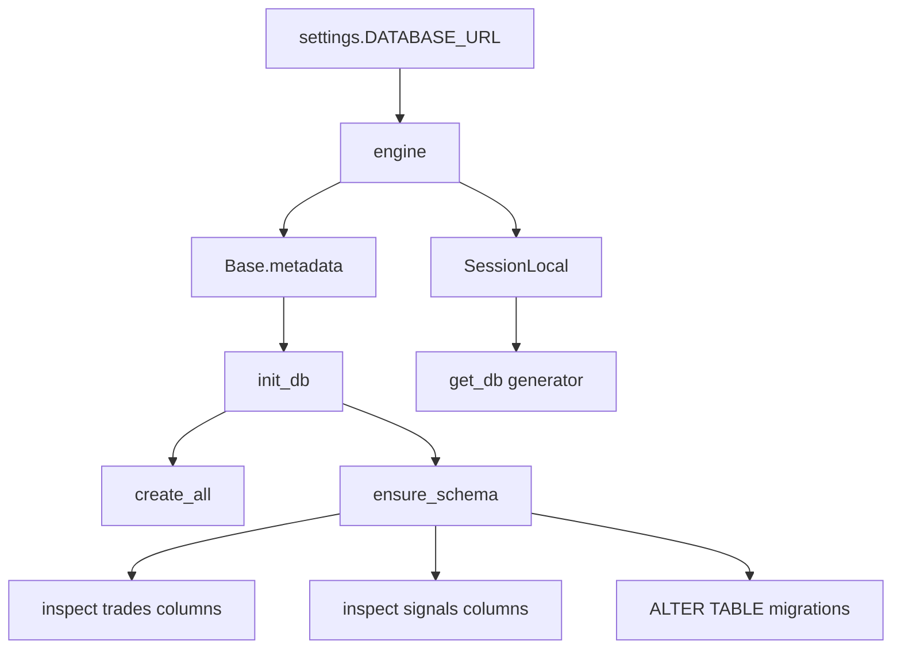

# Database

# Database Module

## Overview

This module defines the SQLAlchemy ORM layer for the Kalshi trading bot. It establishes the database connection, declares all persistent models, and provides utilities for schema initialization and session management. The bot uses this module to record trades, track signals, log AI calls and market scans, and persist runtime state across restarts.

## Architecture



## Connection Setup

The module reads `DATABASE_URL` from `backend.common.config.settings` and creates a SQLAlchemy engine. For SQLite databases, `check_same_thread=False` is passed to allow cross-thread access (required for FastAPI's async request handling).

```python
engine = create_engine(
    settings.DATABASE_URL,
    connect_args={"check_same_thread": False} if "sqlite" in settings.DATABASE_URL else {}
)
SessionLocal = sessionmaker(autocommit=False, autoflush=False, bind=engine)
Base = declarative_base()
```

**Key objects:**
- **`engine`** — The SQLAlchemy engine. Use this for raw SQL or schema operations.
- **`SessionLocal`** — Factory for creating ORM sessions. Call `SessionLocal()` to get a session, or use `get_db()` as a FastAPI dependency.
- **`Base`** — The declarative base class that all models inherit from.

## Models

### Trade

Stores simulated trade records for P&L tracking.

| Column | Type | Description |
|--------|------|-------------|
| `id` | Integer (PK) | Auto-incrementing ID |
| `signal_id` | Integer | FK-like reference to the originating `Signal.id` |
| `market_ticker` | String | Kalshi market ticker symbol |
| `platform` | String | Trading platform identifier |
| `event_slug` | String (nullable) | Event slug for grouping related markets |
| `market_type` | String | `"btc"` or `"weather"` — defaults to `"btc"` |
| `direction` | String | `"up"` or `"down"` |
| `entry_price` | Float | Price at which the trade was entered |
| `size` | Float | Position size in dollars |
| `timestamp` | DateTime | When the trade was placed |
| `settled` | Boolean | Whether the market has resolved |
| `settlement_time` | DateTime (nullable) | When settlement was recorded |
| `settlement_value` | Float (nullable) | `1.0` = Up won, `0.0` = Down won |
| `result` | String | `"pending"`, `"win"`, or `"loss"` |
| `pnl` | Float (nullable) | Profit or loss on the trade |
| `model_probability` | Float | The model's predicted probability at entry |
| `market_price_at_entry` | Float | The market's implied probability at entry |
| `edge_at_entry` | Float | Difference between model and market probability |

**Indexed columns:** `id`, `signal_id`, `market_ticker`, `market_type`

### Signal

Records every trading signal the bot generates, whether or not it was executed.

| Column | Type | Description |
|--------|------|-------------|
| `id` | Integer (PK) | Auto-incrementing ID |
| `market_ticker` | String | Kalshi market ticker |
| `platform` | String | Platform identifier |
| `market_type` | String | `"btc"` or `"weather"` |
| `timestamp` | DateTime | When the signal was generated |
| `direction` | String | Predicted direction |
| `model_probability` | Float | Model's estimated probability |
| `market_price` | Float | Market's current price |
| `edge` | Float | Model probability minus market price |
| `confidence` | Float | Signal confidence score |
| `kelly_fraction` | Float | Kelly criterion optimal fraction |
| `suggested_size` | Float | Recommended position size |
| `sources` | JSON | Raw data sources that fed into the signal |
| `reasoning` | String | Human-readable explanation |
| `executed` | Boolean | Whether a trade was placed on this signal |
| `actual_outcome` | String (nullable) | `"up"` or `"down"` — the real market result |
| `outcome_correct` | Boolean (nullable) | Whether the predicted direction matched reality |
| `settlement_value` | Float (nullable) | `1.0` or `0.0` at resolution |
| `settled_at` | DateTime (nullable) | When the outcome was recorded |

**Indexed columns:** `id`, `market_ticker`, `market_type`, `timestamp`

The calibration columns (`actual_outcome`, `outcome_correct`, `settlement_value`, `settled_at`) are filled after market resolution and are used to evaluate model accuracy over time.

### BtcPriceSnapshot

Caches BTC prices for momentum calculations, avoiding repeated API calls.

| Column | Type | Description |
|--------|------|-------------|
| `id` | Integer (PK) | Auto-incrementing ID |
| `timestamp` | DateTime | When the price was observed |
| `price` | Float | BTC price in USD |
| `source` | String | Data source, defaults to `"coingecko"` |

**Indexed columns:** `id`, `timestamp`

### BotState

Singleton-style row holding the bot's runtime state and cumulative statistics.

| Column | Type | Description |
|--------|------|-------------|
| `id` | Integer (PK) | Always `1` in practice |
| `bankroll` | Float | Current simulated bankroll, defaults to `10000.0` |
| `total_trades` | Integer | Lifetime trade count |
| `winning_trades` | Integer | Lifetime winning trade count |
| `total_pnl` | Float | Cumulative P&L |
| `last_run` | DateTime (nullable) | Timestamp of the last bot cycle |
| `is_running` | Boolean | Whether the bot is currently active |

### AILog

Records every AI API call for cost tracking and debugging.

| Column | Type | Description |
|--------|------|-------------|
| `id` | Integer (PK) | Auto-incrementing ID |
| `timestamp` | DateTime | When the call was made |
| `provider` | String | AI provider (e.g., `"openai"`, `"anthropic"`) |
| `model` | String | Model name (e.g., `"gpt-4o"`) |
| `prompt` | String | Full prompt text |
| `response` | String | Full response text |
| `call_type` | String | Category of the call (e.g., `"signal_generation"`) |
| `latency_ms` | Float | Round-trip time in milliseconds |
| `tokens_used` | Integer | Total tokens consumed |
| `cost_usd` | Float | Estimated cost in USD |
| `related_market` | String (nullable) | Market ticker if applicable |
| `success` | Boolean | Whether the call succeeded |
| `error` | String (nullable) | Error message if the call failed |

**Indexed columns:** `id`, `timestamp`, `provider`, `call_type`

### ScanLog

Records each market scan cycle for observability and debugging.

| Column | Type | Description |
|--------|------|-------------|
| `id` | Integer (PK) | Auto-incrementing ID |
| `run_id` | String (unique) | Unique identifier for the scan run |
| `started_at` | DateTime | When the scan started |
| `completed_at` | DateTime (nullable) | When the scan finished |
| `categories_scanned` | JSON | List of market categories scanned |
| `platforms_scanned` | JSON | List of platforms queried |
| `markets_found` | Integer | Number of markets discovered |
| `signals_generated` | Integer | Number of signals produced |
| `trades_executed` | Integer | Number of trades placed |
| `ai_calls_made` | Integer | Number of AI calls during this scan |
| `ai_cost_usd` | Float | Total AI cost for this scan |
| `success` | Boolean | Whether the scan completed without error |
| `error` | String (nullable) | Error message if the scan failed |

**Indexed columns:** `id`, `run_id`

## Schema Initialization

### `init_db()`

Creates all tables defined by `Base` subclasses, then runs `ensure_schema()` to add any columns introduced in later versions. Call this once at application startup.

```python
from backend.common.models.database import init_db
init_db()
```

### `ensure_schema()`

Performs lightweight online migrations by inspecting existing table columns and adding missing ones via `ALTER TABLE`. This avoids the need for a formal migration tool for the simple column additions the bot has undergone.

**Migrations applied:**

| Table | Column | Type | Notes |
|-------|--------|------|-------|
| `trades` | `event_slug` | VARCHAR | Nullable; added for market grouping |
| `trades` | `market_type` | VARCHAR | Defaults to `'btc'` |
| `signals` | `actual_outcome` | TEXT | Calibration tracking |
| `signals` | `outcome_correct` | BOOLEAN | Calibration tracking |
| `signals` | `settlement_value` | FLOAT | Calibration tracking |
| `signals` | `settled_at` | DATETIME | Calibration tracking |
| `signals` | `market_type` | VARCHAR | Defaults to `'btc'` |

For non-SQLite/non-MySQL dialects, the `IF NOT EXISTS` clause is used. SQLite doesn't support that syntax, so the function wraps individual column additions in try/except to handle the case where a column already exists.

**Important:** This function silently catches exceptions on individual column additions. If a column fails to be added for a reason other than "already exists," it will be silently skipped.

## Session Management

### `get_db()`

A generator function designed for use as a FastAPI dependency. It yields a database session and guarantees cleanup:

```python
from fastapi import Depends
from sqlalchemy.orm import Session
from backend.common.models.database import get_db

@app.get("/trades")
def list_trades(db: Session = Depends(get_db)):
    return db.query(Trade).all()
```

For non-request contexts (scripts, background tasks), create sessions directly:

```python
from backend.common.models.database import SessionLocal

db = SessionLocal()
try:
    trade = Trade(market_ticker="BTC-UP", direction="up", ...)
    db.add(trade)
    db.commit()
finally:
    db.close()
```

## Configuration Dependency

The database URL is sourced from `backend.common.config.settings.DATABASE_URL`. The module supports both SQLite (for local development) and PostgreSQL/other dialects (for production). The `check_same_thread` connect arg is conditionally applied only for SQLite.

## Common Patterns

### Writing a new trade from a signal

```python
trade = Trade(
    signal_id=signal.id,
    market_ticker=signal.market_ticker,
    platform=signal.platform,
    event_slug=signal.event_slug,
    market_type=signal.market_type,
    direction=signal.direction,
    entry_price=signal.market_price,
    size=signal.suggested_size,
    model_probability=signal.model_probability,
    market_price_at_entry=signal.market_price,
    edge_at_entry=signal.edge,
)
db.add(trade)
db.commit()
```

### Settling a trade

```python
trade.settled = True
trade.settlement_time = datetime.utcnow()
trade.settlement_value = 1.0  # Up won
trade.result = "win" if trade.direction == "up" else "loss"
trade.pnl = trade.size if trade.result == "win" else -trade.size
db.commit()
```

### Recording calibration on a signal

```python
signal.actual_outcome = "up"
signal.outcome_correct = (signal.direction == "up")
signal.settlement_value = 1.0
signal.settled_at = datetime.utcnow()
db.commit()
```