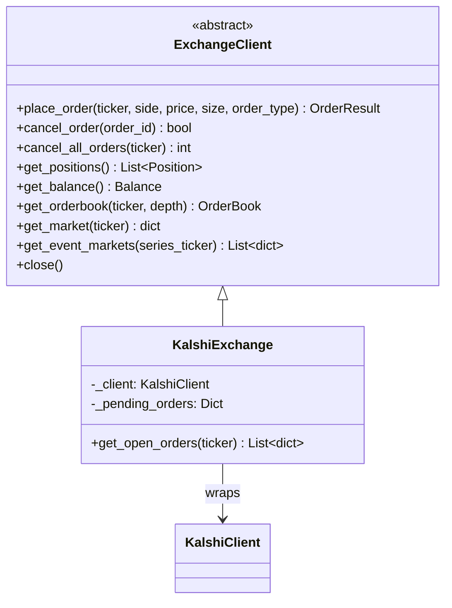

# Exchange Integration

# Exchange Integration Module

## Purpose

The exchange module provides a platform-agnostic trading interface for prediction markets. Strategy code depends exclusively on the `ExchangeClient` abstract class — never on Kalshi-specific APIs — so the system can swap or add exchanges (Polymarket, etc.) without touching strategy logic.

## Architecture

Strategies and the main trading loop (`trade.py`) call `ExchangeClient` methods. `KalshiExchange` translates those calls into Kalshi trade-api/v2 requests via `KalshiClient`, which handles RSA-PSS authentication and HTTP transport.

## Data Models

All models live in `base.py` and are shared across every exchange implementation.

### OrderSide & OrderType

| Enum | Values | Notes |
|------|--------|-------|
| `OrderSide` | `YES`, `NO` | Maps directly to Kalshi's yes/no contract sides |
| `OrderType` | `LIMIT`, `MARKET`, `IOC` | `IOC` = immediate-or-cancel; unfilled portion is cancelled by the exchange |

### OrderResult

Returned by `place_order`. On success, `order_id` is populated and `filled_size`/`filled_price` reflect what was immediately filled. On failure, `success=False` and `error` contains the exception message.

Key fields: `success`, `order_id`, `filled_size`, `filled_price`, `remaining_size`, `error`

### Position

Represents an open contract position. `avg_price` and `unrealized_pnl` are in **dollars** (0.0–1.0 range for price), not cents — the Kalshi implementation converts from the API's cent values.

### OrderBook

Snapshot of bids/asks. `bids` and `asks` are lists of `{price, size}` dicts in dollars. `best_bid`, `best_ask`, `spread`, and `mid_price` are pre-computed for convenience.

### Balance

Account balance with `total`, `available`, and `invested` fields in USD. The Kalshi implementation converts from cents.

## KalshiExchange Implementation

### Price and Size Conversions

Kalshi's API uses **cents** for prices (integer 1–99) and **integer contract counts**. The `place_order` method converts:

- `price` (dollars, e.g. 0.45) → `limit_price` (cents, e.g. 45) via `int(round(price * 100))`
- `size` (float) → `count` (int) via `int(size)`

All read methods (`get_positions`, `get_balance`, `get_orderbook`) perform the reverse conversion, returning dollar values to callers.

### Order Placement Flow

1. Validate price (1–99 cents) and size (≥1 contract). Return `OrderResult(success=False)` on invalid input.
2. Map `OrderType.IOC` → `"ioc"`, everything else → `"limit"`.
3. POST to `/portfolio/orders` with the converted payload.
4. On success, store `order_id → ticker` in `_pending_orders` for tracking.
5. On exception, log the error and return `OrderResult(success=False, error=...)`.

### Order Cancellation

- `cancel_order(order_id)` — DELETE `/portfolio/orders/{order_id}`. Removes the order from `_pending_orders` on success.
- `cancel_all_orders(ticker)` — Fetches open orders via `get_open_orders(ticker)`, then calls `cancel_order` for each. Returns the count of successfully cancelled orders.

### Market Data

- `get_orderbook(ticker, depth)` — Fetches `/markets/{ticker}/orderbook`. Computes `best_bid`, `best_ask`, `spread`, and `mid_price` from the raw cent-denominated response.
- `get_market(ticker)` — Returns the raw Kalshi market dict from `/markets/{ticker}`.
- `get_event_markets(series_ticker)` — Paginates through `/markets?series_ticker=...&status=open` using cursor-based pagination (limit=200 per page). Critical for Strategy B, which checks whether `sum(YES prices) < $1.00` across all brackets in a weather event.

### Error Handling Convention

All read methods (`get_positions`, `get_balance`, `get_orderbook`, `get_market`, `get_event_markets`, `get_open_orders`) catch exceptions, log them, and return **empty/default values** rather than raising. This keeps the trading loop running even if a single API call fails. Write methods (`place_order`, `cancel_order`) return `OrderResult(success=False)` or `bool` to signal failure.

## Integration Points

| Caller | Method | Context |
|--------|--------|---------|
| `trade.py` → `run_status` | `get_balance()` | Periodic status reporting |
| `trade.py` → `run_status` | `get_positions()` | Periodic status reporting |
| `strategy_b.py` → `scan_strategy_b` | `get_event_markets()` | Cross-bracket arbitrage scan |

## Adding a New Exchange

1. Create `backend/common/exchange/<name>.py` with a class extending `ExchangeClient`.
2. Implement all abstract methods, performing the same dollar↔cents or unit conversions as needed for the new platform's API.
3. Register the new class in whatever factory/DI mechanism the trading loop uses to select the exchange backend.

Strategy code requires zero changes — it continues calling `ExchangeClient` methods.