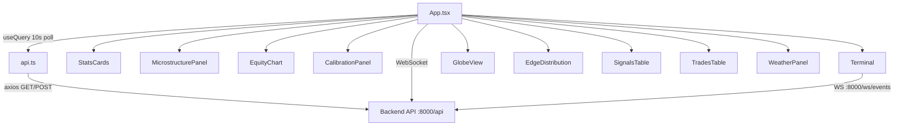

# Frontend

# Frontend Module

## Overview

The frontend is a real-time trading terminal dashboard built with React and TypeScript. It provides a single-screen view of the bot's operational state — BTC microstructure, weather-based prediction signals, active trades, equity performance, and calibration metrics. Data is fetched from the backend API and streamed via WebSocket for live event logging.

## Architecture



## Tech Stack

| Layer | Library |
|-------|---------|
| Framework | React 18 + TypeScript |
| Data fetching | TanStack Query v5 (React Query) |
| HTTP client | Axios |
| Animations | Framer Motion |
| Charts | Recharts (AreaChart, BarChart) |
| Globe | react-globe.gl (three-globe) |
| Styling | Tailwind CSS |
| Icons | Lucide React |
| Dates | date-fns |

## File Structure

```
frontend/src/
├── main.tsx              # Entry point, QueryClient config
├── App.tsx               # Root component, layout, query/mutation orchestration
├── api.ts                # All backend API calls
├── types.ts              # TypeScript interfaces
├── utils.ts              # Formatting helpers, platform styles
├── index.css             # Global styles, Tailwind directives, custom CSS
└── components/
    ├── StatsCards.tsx         # Bankroll, P&L, win rate, trade count
    ├── MicrostructurePanel.tsx # RSI gauge, momentum/VWAP/SMA bars
    ├── EquityChart.tsx        # P&L area chart over time
    ├── CalibrationPanel.tsx   # Accuracy, Brier score, predicted vs actual edge
    ├── Terminal.tsx           # WebSocket event log with bot controls
    ├── GlobeView.tsx          # 3D globe with city weather markers
    ├── EdgeDistribution.tsx   # Stacked bar chart of signal edge buckets
    ├── SignalsTable.tsx       # Sortable signal list (BTC + weather)
    ├── TradesTable.tsx        # Sortable trade history
    ├── WeatherPanel.tsx       # City forecast cards with signal edges
    └── FilterBar.tsx          # Reusable search/status filter (currently unused in App)
```

## Data Flow

### Polling

`App.tsx` uses a single `useQuery` hook with `refetchInterval: 10000` (10 seconds) that calls `fetchDashboard()`. This returns the full `DashboardData` payload:

```
GET /api/dashboard → DashboardData
```

The `DashboardData` interface aggregates all state the UI needs:

- `stats` — bot running state, bankroll, P&L, win rate
- `btc_price` — current BTC price with 24h/7d change
- `microstructure` — RSI, momentum, VWAP deviation, SMA crossover, volatility
- `windows` — active/upcoming BTC 5-minute market windows
- `active_signals` — BTC signals with edge, confidence, suggested size
- `weather_signals` — weather-based signals with ensemble data
- `weather_forecasts` — city temperature forecasts with ensemble agreement
- `recent_trades` — trade history with settlement status
- `equity_curve` — P&L over time for the equity chart
- `calibration` — model accuracy, Brier score, predicted vs actual edge

### Mutations

Four mutations are wired in `App.tsx`, each invalidating the `['dashboard']` query key on success:

| Mutation | API Call | Action |
|----------|----------|--------|
| `scanMutation` | `POST /api/run-scan` | Trigger a manual signal scan |
| `tradeMutation` | `POST /api/simulate-trade?signal_ticker=` | Simulate a trade on a signal |
| `startMutation` | `POST /api/bot/start` | Start the bot loop |
| `stopMutation` | `POST /api/bot/stop` | Stop the bot loop |

### WebSocket

The `Terminal` component connects to `ws://<API_URL>/ws/events` for real-time event streaming. It falls back to polling `GET /api/events?limit=30` every 5 seconds if WebSocket fails. Heartbeat messages are filtered out. The connection auto-reconnects with a 5-second delay on close.

## Layout

The app uses a full-viewport (`h-screen`) three-column grid layout:

```
┌──────────────────────────────────────────────────────────┐
│ Header: Status | BTC Price | StatsCards | Scan | Clock  │
├──────────┬─────────────────────────┬────────────────────┤
│ Left     │ Center                  │ Right              │
│          │                         │                    │
│ Micro-   │ Globe (58%)            │ Signals (50%)      │
│ struct.  │                         │                    │
│          ├─────────┬───────┬───────┤                    │
│ Equity   │ Edge    │ BTC   │ WX    │────────────────────│
│ Chart    │ Dist.   │ Wins  │ Panel │ Trades (50%)       │
│          │         │       │       │                    │
│ Calibr.  │         │       │       │                    │
│          │         │       │       │                    │
│ Terminal │         │       │       │                    │
├──────────┴─────────┴───────┴───────┴────────────────────┤
│ Footer: Sources | RefreshBar | Connection status        │
└──────────────────────────────────────────────────────────┘
```

Grid definition: `grid-cols-[300px_1fr_340px]`

## Key Components

### App.tsx

Root component that:
- Sets up all React Query hooks (`useQuery`, `useMutation`)
- Manages the 3-column layout
- Renders header with `LiveClock`, `RefreshBar`, `StatsCards`, and scan button
- Passes data slices to child components
- Handles loading and error states with full-screen fallbacks

Helper components defined inline:
- **`LiveClock`** — Updates every second, displays `HH:MM:SS`
- **`WindowPill`** — Renders a BTC market window with up/down prices and countdown timer
- **`RefreshBar`** — Animated progress bar showing time until next dashboard refresh

### Terminal.tsx

The most complex component. It:
- Connects to the backend WebSocket at `/ws/events`
- Falls back to HTTP polling at `/api/events?limit=30`
- Maintains a log buffer (capped at 100 entries)
- Auto-scrolls to newest entries
- Renders a blinking cursor line
- Provides Start/Pause/Scan control buttons that call parent callbacks
- Displays WS vs POLL connection indicator

### GlobeView.tsx

Lazy-loaded 3D globe using `react-globe.gl`. It:
- Maps 5 US cities (NYC, Chicago, Miami, LA, Denver) to lat/lng coordinates
- Overlays HTML markers showing city name, forecast temperature, and best signal edge
- Color-codes markers: green for actionable signals, amber for non-actionable, gray for no signal
- Auto-rotates and centers on the continental US
- Pauses auto-rotation for 5 seconds on user interaction

### SignalsTable.tsx

Unified table for both BTC and weather signals. It:
- Merges `Signal[]` and `WeatherSignal[]` into a `UnifiedSignal[]` array
- Supports sorting by edge, model probability, or suggested size
- Actionable signals sort to the top; non-actionable are dimmed
- Expanding rows (via `expandedKey`) is wired but the detail view is not yet rendered
- The "Trade" button triggers `tradeMutation.mutate(ticker)` for BTC signals only

### MicrostructurePanel.tsx

Renders BTC market microstructure with:
- **RsiGauge** — SVG circular gauge, green below 30, red above 70
- **MeterBar** — Horizontal bars for momentum, VWAP deviation, SMA crossover, and volatility, each with color-coded values (green positive, red negative)

### CalibrationPanel.tsx

Displays model calibration metrics:
- Large accuracy percentage with color coding (≥55% green, <50% red)
- Brier score with quality label (≤0.20 Good, ≤0.25 OK, else Poor)
- Predicted vs actual edge comparison bars

### EquityChart.tsx

Recharts `AreaChart` rendering the P&L curve. Features:
- Starts at P&L = 0 with a dashed reference line
- Green fill for positive P&L, red for negative
- Custom tooltip showing dollar amounts
- Falls back to "No trade history" message when empty

### EdgeDistribution.tsx

Stacked bar chart bucketing signals by edge magnitude (0–2%, 2–5%, 5–10%, 10–20%, 20%+). BTC signals shown in amber, weather signals in cyan.

### TradesTable.tsx

Sortable trade history table. Sortable columns: status, size, P&L, timestamp. Uses `date-fns` `formatDistanceToNow` for relative timestamps.

### WeatherPanel.tsx

Compact list of city forecasts. Each row shows:
- City name
- Mean high temperature with standard deviation
- Ensemble agreement bar and percentage
- Best signal edge for that city
- Platform badge (Kalshi)
- Green left-border highlight for cities with actionable signals

## API Client

`api.ts` creates an Axios instance pointing at `VITE_API_URL` (defaults to `http://localhost:8000`) with the `/api` base path.

Available functions:

| Function | Method | Endpoint | Returns |
|----------|--------|----------|---------|
| `fetchDashboard` | GET | `/dashboard` | `DashboardData` |
| `fetchSignals` | GET | `/signals` | `Signal[]` |
| `fetchBtcPrice` | GET | `/btc/price` | `BtcPrice \| null` |
| `fetchBtcWindows` | GET | `/btc/windows` | `BtcWindow[]` |
| `fetchTrades` | GET | `/trades` | `Trade[]` |
| `fetchStats` | GET | `/stats` | `BotStats` |
| `runScan` | POST | `/run-scan` | `{ total_signals, actionable_signals }` |
| `simulateTrade` | POST | `/simulate-trade?signal_ticker=` | `{ trade_id, size }` |
| `startBot` | POST | `/bot/start` | `{ status, is_running }` |
| `stopBot` | POST | `/bot/stop` | `{ status, is_running }` |
| `settleTradesApi` | POST | `/settle-trades` | `{ settled_count }` |
| `resetBot` | POST | `/bot/reset` | `{ status, trades_deleted, new_bankroll }` |
| `fetchWeatherForecasts` | GET | `/weather/forecasts` | `WeatherForecast[]` |
| `fetchWeatherSignals` | GET | `/weather/signals` | `WeatherSignal[]` |

Note: `fetchDashboard` is the primary data source used by `App.tsx`. The individual fetch functions (`fetchSignals`, `fetchStats`, etc.) are available but not currently called from the main component — the dashboard endpoint aggregates all of them.

## Type Definitions

All interfaces live in `types.ts`. The key types:

- **`DashboardData`** — Union of all data the dashboard needs
- **`Signal`** — BTC market signal with edge, probability, confidence, direction
- **`WeatherSignal`** — Weather-based signal with ensemble statistics
- **`BtcWindow`** — A 5-minute BTC market window with prices and countdown
- **`Microstructure`** — RSI, momentum, VWAP deviation, SMA crossover, volatility
- **`CalibrationSummary`** — Model accuracy, Brier score, predicted vs actual edge
- **`Trade`** — Executed trade with settlement status and P&L
- **`BotStats`** — Running state, bankroll, win rate, total P&L
- **`EquityPoint`** — Timestamped P&L and bankroll for charting
- **`WeatherForecast`** — City temperature forecast with ensemble agreement

## Utility Functions

`utils.ts` provides:

- **`getMarketUrl(platform, ticker, eventSlug?)`** — Generates Polymarket or Kalshi market URLs
- **`formatCurrency(value, showSign)`** — Intl-based USD formatting with optional sign
- **`formatPercent(value, decimals)`** — Converts decimal to percentage string
- **`getPnlColorClass(pnl)`** — Returns Tailwind text color class based on P&L sign
- **`formatCountdown(seconds)`** — Converts seconds to `M:SS` format, returns "Ended" for ≤0
- **`debounce(func, wait)`** — Standard debounce wrapper
- **`platformStyles`** — Map of platform name → badge CSS classes and icon letter (`P` for Polymarket, `K` for Kalshi)

## Styling

The app uses a dark terminal aesthetic:

- **Background**: Pure black (`#000000`)
- **Cards**: `#0a0a0a` with `#1a1a1a` borders
- **Font**: System UI stack for body, JetBrains Mono for all numeric/tabular content
- **Scrollbars**: Custom thin scrollbars (5px wide, dark track)
- **Glow effects**: CSS text-shadow classes for green/red/cyan/amber glows
- **Animations**: Scan-line overlay on header, pulsing live indicator dot, blinking terminal cursor

The `RefreshBar` component uses a CSS transition (`width` over 1s linear) to animate a green progress bar that depletes over the 10-second polling interval.

## Configuration

| Environment Variable | Default | Purpose |
|---------------------|---------|---------|
| `VITE_API_URL` | `http://localhost:8000` | Backend API base URL |

The WebSocket URL is derived by replacing `http` with `ws` in `VITE_API_URL` and appending `/ws/events`.

## Query Client Setup

`main.tsx` configures `QueryClient` with:
- `staleTime: 10000` (10 seconds) — data considered fresh for 10s
- `refetchInterval: 30000` (30 seconds) — global default, overridden in `App.tsx` to 10s for the dashboard query

## Adding a New Data Panel

1. Define the type in `types.ts` and add it to `DashboardData` (or create a separate fetch in `api.ts`)
2. If adding to the dashboard endpoint, destructure the new field in `App.tsx` and pass it as a prop
3. Create the component in `components/`
4. Add it to the grid layout in `App.tsx` — adjust `grid-cols` or `grid-rows` as needed
5. If the component needs its own polling or mutation, add a `useQuery`/`useMutation` hook within it