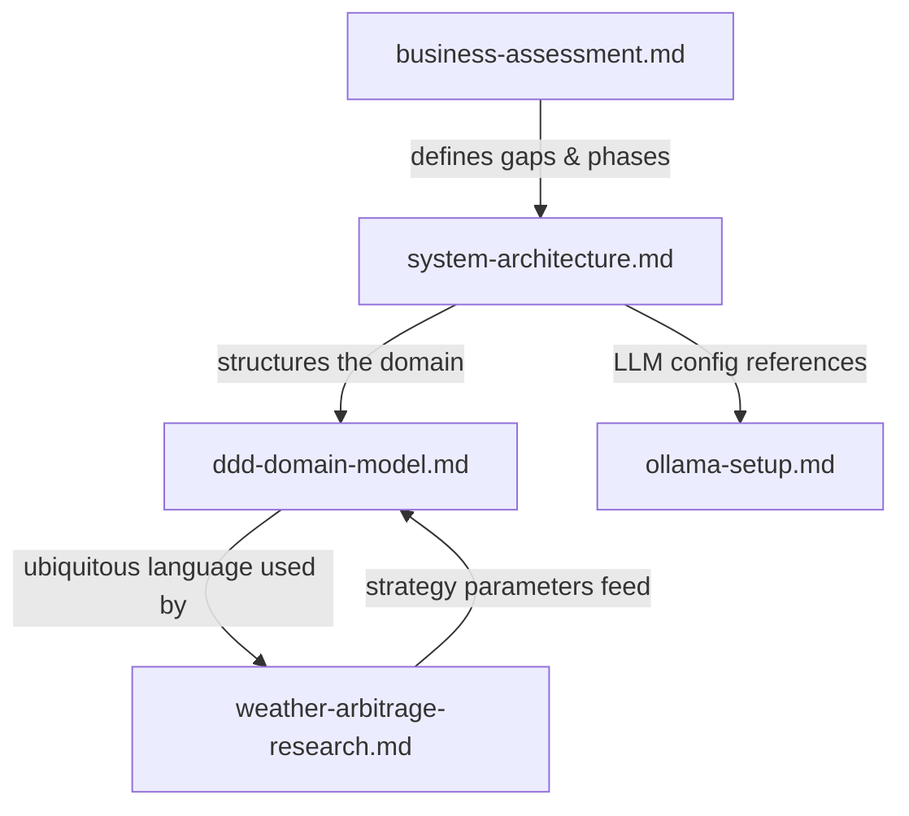

# Other — docs

# Documentation Module — Polymarket AI Arbitrage System

## Purpose

The `docs/` module contains the foundational design documents that define what this system is, why it exists, how it's structured, and how to operate it. These are not passive reference files — they are the source of truth for domain concepts, architectural decisions, and strategy parameters. Every implementation choice in the codebase traces back to a specification here.

## Document Inventory

| Document | Role | When to Read It |
|----------|------|-----------------|
| `system-architecture.md` | Canonical architecture reference. Defines the Go/Python split, data flows, tech stack, and configuration schema. | Before writing any code. Before adding a new component. |
| `ddd-domain-model.md` | Domain model specification. Defines aggregates, value objects, domain events, services, and the ubiquitous language. | Before creating or modifying domain types, events, or service interfaces. |
| `business-assessment.md` | Business context and opportunity sizing. Defines the five arbitrage gaps, TAM, and phased product roadmap. | When evaluating feature priority or deciding what strategy to implement next. |
| `weather-arbitrage-research.md` | Deep-dive on the weather arbitrage vertical. Strategies, implementation plan, API references, risk parameters. | When working on weather-specific features or evaluating new market verticals. |
| `ollama-setup.md` | LLM provider configuration. Covers Ollama Pro cloud and local GPU deployment. | When setting up or debugging the LLM signal pipeline. |

## How the Documents Relate



`business-assessment.md` establishes *what* we're building and why. `system-architecture.md` translates that into *how* it's built — the Go/Python split, the data flows, the tech stack. `ddd-domain-model.md` defines the *language and types* that both codebases share. `weather-arbitrage-research.md` applies the domain model to a specific vertical. `ollama-setup.md` is the operational companion for the LLM layer referenced in the architecture.

## Key Architectural Concepts

### Dual-Language Split

The system is partitioned along a clear boundary:

- **Go Engine** — data ingestion, spread calculation, execution routing, temporal orchestration, risk management, event persistence. This is the performance-critical path that must operate within the 2.7-second arbitrage window.
- **Python AI Bridge** — LLM signal generation, LangChain agents, signal ranking, gRPC server. This is the reasoning path where latency tolerance is higher but interpretive quality matters more.

The two communicate via **gRPC streaming**. The Go engine calls the Python bridge for signal generation; the Python bridge pushes structured `Signal` aggregates back.

### Arbitrage Window Constraint

The entire execution pipeline — from price ingestion through spread detection, risk check, order routing, and fill confirmation — must complete within **2.5 seconds** (configured as `opportunity_ttl_ms: 2500`). This number comes from the business assessment's observation that arbitrage windows collapsed from 12.3s to 2.7s between 2024 and 2026. The LLM call must return within `timeout_seconds: 8.0` for reasoning-gap strategies, but for speed-gap strategies the LLM is not in the critical path.

### Temporal Workflows for Trade Settlement

Cross-venue execution is a saga pattern managed by Temporal. If leg 1 fills on Polymarket but leg 2 fails on Binance, Temporal orchestrates the reversal. This is not optional — partial fills without reversal are the primary source of unplanned exposure.

## Domain Model Summary

The domain model in `ddd-domain-model.md` defines three aggregate roots that form the core of the system:

### Aggregates

**Opportunity** — represents a detected arbitrage window. Key fields: `marketId`, `type` (SpeedArbitrage | ReasoningGap | FragmentationGap), `state` (OPEN → EXECUTING → FILLED | EXPIRED | FAILED), `spread`, `confidence`, `expiresAt`. The `expiresAt` field enforces the TTL constraint — opportunities that aren't acted on before expiry are discarded.

**Trade** — represents an executed or in-flight trade. Contains `legs` (one per venue side), tracks `state` (PENDING → EXECUTED → SETTLED | FAILED), and records `PnL` and `commission` on settlement.

**Signal** — represents an LLM-generated interpretation of external information. Key fields: `source` (LLM_MODEL | NEWS_FEED | FED_STATEMENT), `interpretation`, `confidence` ∈ [0.0, 1.0], `actionableMarkets`, `validUntil`. Signals hydrate into Opportunities via the `SignalInterpreter` domain service.

### Value Objects

| Value Object | Invariants | Used By |
|--------------|-----------|----------|
| `Spread` | `spread > 0; percentage >= 0` | Opportunity, SpreadCalculator |
| `Money` | `currency ∈ [USDC, ETH, BTC]` | Trade, PnL calculation |
| `MarketID` | `source ∈ [POLYMARKET, BINANCE, OKX]` | Opportunity, all venue clients |
| `ConfidenceScore` | `score ∈ [0, 1]` | Signal, OpportunityScreener |

### Domain Events

Events flow through the system in this order:

1. `OpportunityDetected` — emitted by SpreadCalculator or SignalInterpreter when an edge is found
2. `SignalReceived` — emitted when the Python bridge pushes a new Signal
3. `TradeLegExecuted` — emitted per leg as fills come back from venues
4. `TradeSettled` — emitted when all legs complete and PnL is realized
5. `ArbitrageWindowClosed` — emitted when an opportunity expires or is invalidated

### Domain Services

| Service | Responsibility | Package |
|---------|---------------|---------|
| `OpportunityScreener` | Rank opportunities by EV/Sharpe ratio, filter by threshold | `domain/service` |
| `SpreadCalculator` | Cross-market fair-value computation, fee-adjusted | `domain/service` |
| `ExecutionRouter` | Best-execution logic across venues, latency-weighted | `domain/service` |
| `RiskManager` | Position sizing, max drawdown, correlation limits | `domain/service` |
| `SignalInterpreter` | Hydrate raw LLM output into structured Signal aggregate | `domain/service` |

### Anti-Corruption Layers

External APIs never touch domain types directly. Each venue and data source has an ACL that normalizes into domain events:

- `Polymarket API → ACL → Domain Events`
- `Binance API → ACL → Domain Events`
- `OpenRouter LLM → ACL → Signal Interpreter`

When adding a new venue (e.g., Kalshi, OKX), implement a new ACL in `infrastructure/` that translates the venue's API into the same domain events. The core domain logic remains unchanged.

## Codebase Mapping

The architecture document maps documentation concepts to concrete packages:

### Go Engine Packages

| Package | Maps To | Key Contents |
|---------|---------|-------------|
| `interfaces/http` | Application layer entry point | REST handlers, SignalR hub |
| `application/command` | Command side of CQRS | `RegisterOpportunity`, `ExecuteTrade`, `SettleTrade` |
| `application/query` | Query side of CQRS | `GetOpenOpportunities`, `GetPnL` |
| `domain/aggregate` | Aggregate roots | `Opportunity`, `Trade`, `Signal` structs with invariants |
| `domain/event` | Domain events | `OpportunityDetected`, `TradeLegExecuted`, etc. |
| `domain/valueobject` | Value objects | `Spread`, `Money`, `ConfidenceScore`, `MarketID` |
| `domain/service` | Domain services | `OpportunityScreener`, `ExecutionRouter`, `RiskManager` interfaces |
| `domain/repository` | Repository ports | Interfaces only — no implementations |
| `infrastructure/polymarket` | Polymarket ACL | REST/WS client, rate limiter |
| `infrastructure/binance` | Binance ACL | API client |
| `infrastructure/temporal` | Temporal integration | Worker registration, activities, workflow implementations |
| `infrastructure/db` | Persistence | Postgres repository implementations, Redis state store |
| `infrastructure/llmclient` | Python bridge client | gRPC client to `grpc_server.py` |
| `pkg/config` | Configuration | Viper-based, env + YAML |
| `pkg/logger` | Logging | Zerostructured JSON logger |

### Python AI Bridge Modules

| Module | Maps To | Key Contents |
|--------|---------|-------------|
| `agents/arbitrage_agent.py` | Reasoning Gap strategy | LangChain agent for detecting reasoning/fragmentation gaps |
| `strategies/signal_ranker.py` | Signal quality ranking | XGBoost/LightGBM model for ranking signal quality |
| `llm/client.py` | LLM provider interface | OpenRouter/Anthropic proxy with retry and circuit breaker |
| `infrastructure/grpc_server.py` | gRPC transport | Server implementing `SignalGeneration` service |
| `api/main.py` | Health & metrics | FastAPI app for `/health`, `/metrics` |

## Data Flow Reference

Two primary data flows are specified in the architecture document:

### Speed Gap Flow (Go-only, no LLM)

```
Polymarket WS + Binance WS
  → Go Price Consumer
  → Normalized Book (domain object)
  → SpreadCalculator
  → Opportunity (value object)
  → Temporal Workflow: StartOpportunityExecution
    → RiskManager.Check()
    → ExecutionRouter.BestVenue()
    → TradeExecutor (2 legs)
    → TradeLegExecuted events
    → Temporal Saga (reverse leg 1 if leg 2 fails)
    → OrderSettledEvent → Postgres
```

### Reasoning Gap Flow (Python → Go)

```
Feed scraper (Fed, X, News)
  → Python FastAPI endpoint
  → LLM Signal Interpreter (LangChain agent)
  → Signal aggregate (structured + confidence)
  → gRPC stream to Go Engine
  → OpportunityScreener (EV > threshold?)
  → Temporal Workflow (same execution pipeline as speed gap)
```

## Strategy Reference

### The Five Arbitrage Gaps

Defined in `business-assessment.md`:

| Gap | Mechanism | Critical Path |
|-----|-----------|---------------|
| Speed Gap | Pricing lag between Polymarket and CEX spot | Go-only, sub-second |
| Reasoning Gap | LLM interprets public info faster than market | Python → Go, seconds |
| Fragmentation Gap | Cross-market data aggregation | Go + Python, seconds |
| Discipline Gap | Automated execution replaces emotional trading | Go execution engine |
| Knowledge Asymmetry | AI arbitrage SaaS, API-first | Full platform |

### Weather Arbitrage Strategies

Defined in `weather-arbitrage-research.md`:

**Strategy A — ColdMath Ultra-Low Bracket**: Buy YES on temperature brackets priced at 0.1¢–2¢ where the weather model implies a significantly higher probability. Expected hit rate: 4–6%. Average return on hit: 50x–1000x. This is the high-variance, high-EV strategy.

**Strategy B — Spread Arbitrage**: When YES + NO < $1.00 on a guaranteed binary outcome, buy both sides and pocket the spread at resolution. Win rate: 100%. Lower variance, lower per-dollar return. This is the consistent daily income strategy.

The recommended portfolio combines both: Strategy B provides consistent income to cover Strategy A's losses, while Strategy A drives total profit.

### Risk Parameters

| Parameter | Value | Source |
|-----------|-------|--------|
| `min_spread_bps` | 5 (0.05%) | `system-architecture.md` config |
| `max_position_usd` | 10,000 | `system-architecture.md` config |
| `max_drawdown_pct` | 5 | `system-architecture.md` config |
| `opportunity_ttl_ms` | 2,500 | `system-architecture.md` config |
| Max position per weather trade | $10–$25 | `weather-arbitrage-research.md` |
| Daily loss limit (weather) | $50–$100 | `weather-arbitrage-research.md` |
| ColdMath entry threshold | YES < 2¢ | `weather-arbitrage-research.md` |
| Spread arb minimum | > $0.003 | `weather-arbitrage-research.md` |
| LLM `temperature` | 0.1 | `system-architecture.md` config |
| LLM `timeout_seconds` | 8.0 | `system-architecture.md` config |

## LLM Configuration

The system uses Ollama as its LLM provider, configured in `ollama-setup.md`:

**Production (Ollama Pro Cloud)**:
- Model: `kimi-k2.6:cloud`
- Host: `OLLAMA_HOST` environment variable (cloud endpoint)
- Auth: `OLLAMA_API_KEY` required
- Latency requirement: total round-trip + inference < 1.5s (leaving 1.2s for execution within the 2.7s window)

**Local Development (WSL)**:
- Model: `qwen2.5:14b` (open-weight surrogate)
- Host: `http://localhost:11434`
- No API key required

If Ollama Pro cloud latency is too high from the AWS region hosting the Go engine, the fallback is to run Ollama locally on a GPU box in the same VPC, using Pro only for model updates and research.

## Product Roadmap

From `business-assessment.md`:

- **Phase 1 (Alpha)**: Self-funded execution bot for Polymarket + CEX spread capture. Own capital at risk.
- **Phase 2 (Signal-as-a-Service)**: API-first. Sell real-time alpha signals to quant funds, hedge funds, prop shops.
- **Phase 3 (Platform)**: White-label arbitrage agent factory. Let others configure and deploy bots on the infrastructure.

## Contributing to This Module

When adding or modifying documentation:

1. **Architecture changes** must update `system-architecture.md` — the component table, data flow diagrams, and config schema must stay in sync with the codebase.
2. **New domain concepts** must be added to `ddd-domain-model.md` — new aggregates, value objects, events, or services go through the ubiquitous language table.
3. **New strategies** should follow the pattern in `weather-arbitrage-research.md` — include the mechanism, the math, the risk parameters, and the implementation plan.
4. **Configuration changes** must update the YAML schema in `system-architecture.md` and any relevant setup guides.
5. **Ubiquitous language** is the single source of truth for terminology. If a term appears in code and docs differently, the docs win — and the code should be updated to match.