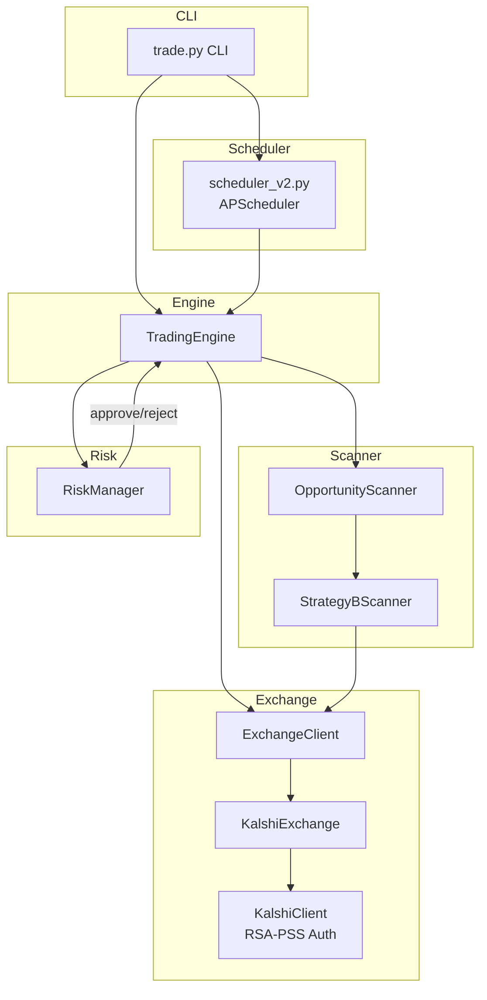

# Other — python

# Kalshi Trading Bot

A selective prediction market trading bot that exploits pricing inefficiencies in weather temperature contracts on Kalshi. The primary strategy (Strategy B) targets cross-bracket sum arbitrage — when the sum of YES prices across all brackets in an event falls below $1.00, creating a risk-free profit opportunity.

## Architecture



## Trading Cycle

Each cycle follows a three-phase pipeline:

1. **Scan** — `OpportunityScanner.scan_all()` delegates to `StrategyBScanner.scan_strategy_b()`, which fetches bracket markets for each city series, groups them by event, and detects arbitrage via `check_cross_bracket_arb()`.
2. **Approve** — `RiskManager.approve_opportunity()` runs every opportunity through a filter chain (daily loss limit, drawdown, consecutive losses, fee-adjusted edge, concentration, liquidity, spread). Approved opportunities get a position size.
3. **Execute** — `TradingEngine` places orders concurrently via `asyncio.gather()` for Strategy B (all brackets must fill), or sequentially for single-market strategies. Orders are registered with `RiskManager` for auto-cancellation on halt.

## Strategy B: Cross-Bracket Sum Arbitrage

Kalshi weather markets use bracket contracts. For a given city and date, the event is divided into mutually exclusive and exhaustive brackets (e.g., NYC high temp: below 32.5°F, 32.5–45.5°F, 45.5–58.5°F, etc.). Exactly one bracket will settle YES.

**The arbitrage**: If `sum(YES_ask_prices) < $1.00`, buying one YES contract in every bracket guarantees a $1.00 payout for a cost below $1.00.

### Detection Logic

`check_cross_bracket_arb(brackets, series_ticker, city_key)` in `backend/weather/scanner/strategy_b`:

1. Filters out brackets with volume below `MIN_BRACKET_VOLUME` or prices below a dust threshold
2. Requires at least 4 qualifying brackets
3. Computes `yes_sum = sum(bracket.yes_price for bracket in brackets)`
4. Calculates `edge = 1.0 - yes_sum`
5. Adjusts edge for fees: `fee_adjusted_edge = edge - (num_brackets × fee_rate_per_contract)`
6. Returns an `Opportunity` if `fee_adjusted_edge >= MIN_STRATEGY_B_EDGE` (default 2%)

### Bracket Grouping

`_group_brackets_by_event(brackets)` parses ticker strings like `KXHIGHNY-26MAY01-B58.5` to group brackets belonging to the same event (same series + date). Each group is evaluated independently.

### Execution

Strategy B orders are placed **concurrently** using `asyncio.gather()` — all bracket legs must be submitted near-simultaneously to avoid partial exposure. The engine tracks fill status:

| Status | Condition |
|--------|-----------|
| `COMPLETE` | All brackets filled |
| `PARTIAL` | Some brackets filled (logged as warning) |
| `CANCELLED` | Zero brackets filled (logged as error) |

## Risk Management

`RiskManager` (in `backend/common/risk`) enforces multiple circuit breakers. All checks must pass for a trade to proceed.

### Trading Halt Conditions

`is_trading_allowed()` checks these in order:

| Check | Default Threshold | Config Key |
|-------|-------------------|------------|
| Kill switch | Manual toggle | — |
| Daily loss limit | $300 | `daily_loss_limit` |
| Drawdown from peak | 10% | `max_drawdown_pct` |
| Consecutive losses | 3 | `max_consecutive_losses` |
| Rolling window loss | $50 over 4 hours | `rolling_loss_limit`, `rolling_loss_window_hours` |
| Daily trade count | Configurable | `max_daily_trades` |

When any halt condition triggers, `TradingEngine` calls `auto_cancel_on_halt()` to cancel all registered orders.

### Opportunity Approval

`approve_opportunity(opp, positions)` applies:

1. **Fee-adjusted edge** — Edge after subtracting per-contract fees must exceed `min_edge`
2. **Liquidity filter** — Each bracket must have sufficient volume
3. **Spread filter** — Bid-ask spread must be reasonable
4. **Concentration** — Single event cannot exceed a percentage of bankroll
5. **Portfolio exposure** — Total open positions capped
6. **Position sizing** — Kelly-derived size, capped by `max_trade_size`; sizes below 1 contract are rejected

### Auto-Cancel on Halt

```python
rm.register_order_for_cancel("order-123")  # Track placed orders
rm.kill_switch(True)                         # Trigger halt
order_ids = rm.get_orders_to_cancel()        # Returns ["order-123", ...]
rm.clear_cancelled_orders(["order-123"])     # Mark as cancelled
```

## Exchange Layer

`ExchangeClient` (in `backend/common/exchange/base`) defines the interface:

| Method | Purpose |
|--------|---------|
| `place_order(ticker, side, price, size, order_type)` | Submit an order |
| `cancel_order(order_id)` | Cancel a specific order |
| `cancel_all_orders(ticker)` | Cancel all orders for a ticker |
| `get_positions()` | Fetch current positions |
| `get_balance()` | Fetch account balance |
| `get_orderbook(ticker, depth)` | Get order book |
| `get_market(ticker)` | Get market metadata |
| `get_event_markets(series_ticker)` | Get all markets in a series |
| `close()` | Clean up connections |

`KalshiExchange` implements this interface using `KalshiClient`, which handles:
- **RSA-PSS authentication** — Signs each request with a private key
- **Shared httpx session** — Connection pooling for efficiency
- **Exponential backoff** — Retries on transient failures

`PolymarketExchange` exists as a Phase 2 stub.

## Data Models

### BracketMarket

Represents a single bracket contract within a temperature event:

| Field | Type | Description |
|-------|------|-------------|
| `ticker` | `str` | e.g., `KXHIGHNY-26MAY01-B58.5` |
| `yes_price` | `float` | Current YES ask price (0.0–1.0) |
| `no_price` | `float` | Current NO ask price |
| `yes_bid` | `float` | Current YES bid price |
| `no_bid` | `float` | Current NO bid price |
| `threshold_f` | `float` | Temperature threshold in °F |
| `direction` | `str` | `"above"` or `"below"` |
| `volume` | `float` | 24h trading volume |

### Opportunity

Represents a tradeable arbitrage opportunity:

| Field | Type | Description |
|-------|------|-------------|
| `opportunity_type` | `OpportunityType` | `STRATEGY_B`, `STRATEGY_A`, or `STRATEGY_C` |
| `series_ticker` | `str` | e.g., `KXHIGHNY` |
| `city_key` | `str` | e.g., `nyc` |
| `city_name` | `str` | e.g., `New York` |
| `target_date` | `date` | Settlement date |
| `edge` | `float` | Raw edge (1.0 - yes_sum) |
| `edge_dollars` | `float` | Edge in dollar terms |
| `total_cost` | `float` | Sum of YES prices (cost to buy all brackets) |
| `suggested_size` | `int` | Number of contracts per bracket |
| `confidence` | `float` | 0.0–1.0, higher for pure arb |
| `direction` | `str` | `"yes"` for Strategy B |
| `brackets` | `list[BracketMarket]` | All bracket legs |
| `skip_reasons` | `list[str]` | Why markets were filtered out |

## AI Integration

AI is used sparingly — deterministic math drives all trading decisions. The `backend/common/ai` module provides:

| Provider | Class | Use Case |
|----------|-------|----------|
| Ollama | `OllamaClient` | Signal analysis (`glm-5.1:cloud`), market classification (`minimax-m2.7:cloud`) |
| Claude | `ClaudeAnalyzer` | Legacy signal analysis |
| Groq | `GroqClassifier` | Legacy market classification |

Key functions:
- `analyze_signal_with_ollama()` — Sends signal context for anomaly detection
- `classify_market_with_ollama()` — Parses contract text when regex fails
- `create_signal_prompt()` / `create_classification_prompt()` — Build structured prompts

All AI calls are logged via `AICallLogger` for auditability.

## Configuration

All settings live in `backend/config.py`, overridable via environment variables:

### Strategy B Thresholds

| Setting | Default | Description |
|---------|---------|-------------|
| `MIN_STRATEGY_B_EDGE` | 0.02 | Minimum fee-adjusted edge (2%) |
| `MIN_BRACKET_VOLUME` | 50 | Minimum volume per bracket |
| `FEE_RATE_PER_CONTRACT` | 0.01 | Kalshi fee per contract leg |

### Risk Limits (`RiskLimits`)

| Setting | Default | Description |
|---------|---------|-------------|
| `daily_loss_limit` | 300.0 | Max daily loss before halt |
| `max_drawdown_pct` | 0.10 | Drawdown from peak before halt |
| `max_consecutive_losses` | 3 | Consecutive losses before halt |
| `rolling_loss_limit` | 50.0 | Max loss in rolling window |
| `rolling_loss_window_hours` | 4 | Window size for rolling loss |
| `max_trade_size` | 100.0 | Max dollars per trade |
| `min_edge` | 0.03 | Minimum fee-adjusted edge |
| `fee_rate_per_contract` | 0.01 | Fee per contract |
| `max_daily_trades` | None | Optional daily trade cap |

### Weather Markets

| Setting | Default | Description |
|---------|---------|-------------|
| `WEATHER_CITIES` | nyc,chicago,miami,los_angeles,denver | Cities to scan |
| `WEATHER_SCAN_INTERVAL_SECONDS` | 300 | Scan frequency |
| `WEATHER_MIN_EDGE_THRESHOLD` | 0.08 | Min edge for weather signals |

### Kalshi Auth

| Setting | Default | Description |
|---------|---------|-------------|
| `KALSHI_API_KEY_ID` | None | API key ID |
| `KALSHI_PRIVATE_KEY_PATH` | None | Path to RSA private key PEM |

## Running

```bash
# Start backend
uvicorn backend.api.main:app --reload --port 8000

# Start frontend
cd frontend && npm run dev

# Or use the CLI
python trade.py --sim          # Simulation mode
python trade.py --once         # Single cycle
python trade.py --strategy-b   # Strategy B only
python trade.py --status       # Check status
```

The scheduler runs three jobs:
- **Strategy B scan** — every 2 minutes
- **Full scan** — every 5 minutes
- **Heartbeat** — every 60 seconds (checks `is_trading_allowed()`)

## Testing

Tests validate the core pipeline without Kalshi API keys:

```bash
pytest tests/
```

Key test classes:

| Class | File | What It Tests |
|-------|------|---------------|
| `TestCheckCrossBracketArb` | `test_strategy_b.py` | Arb detection: sum=1.0, sum<1.0, edge too small, too few brackets, low volume, ROI calculation |
| `TestGroupBracketsByEvent` | `test_strategy_b.py` | Correct grouping of brackets by series+date |
| `TestRiskManager` | `test_strategy_b.py` | Kill switch, drawdown halt, consecutive loss halt, rolling window halt, fee-adjusted edge rejection, daily trade limit, auto-cancel |
| `TestTradingEnginePipeline` | `test_trading_pipeline.py` | End-to-end: mock scan, simulation mode, live mode, concurrent order placement, auto-cancel on risk halt |

`MockExchange` in `test_trading_pipeline.py` implements `ExchangeClient` with fake data, enabling full pipeline tests without network access.

## Project Structure

```
backend/
├── api/main.py                  # FastAPI routes + dashboard
├── common/
│   ├── ai/                      # Ollama, Claude, Groq providers
│   ├── exchange/                 # ExchangeClient interface + KalshiExchange
│   ├── risk.py                   # RiskManager, RiskLimits, TradeRecord
│   └── trader.py                 # TradingEngine orchestrator
├── weather/
│   ├── core/                     # Weather signal generation
│   ├── data/                     # Open-Meteo ensemble, NWS observations
│   └── scanner/
│       ├── opportunity.py         # BracketMarket, Opportunity, OpportunityType
│       └── strategy_b.py          # check_cross_bracket_arb, scan_strategy_b
├── btc/                          # BTC 5-minute strategy (separate pipeline)
└── config.py                     # All settings

frontend/
└── src/components/               # React dashboard (GlobeView, EdgeDistribution, etc.)
```

## Data Sources

| Source | Data | Auth | Cost |
|--------|------|------|------|
| Kalshi API | Weather bracket markets, order books | RSA-PSS key | Free |
| Open-Meteo | GFS 31-member ensemble forecasts | None | Free |
| NWS API | Observed temperatures (settlement source) | User-Agent header | Free |
| Polymarket Gamma API | Weather markets (Phase 2) | None for read | Free |

**Key insight**: Kalshi settles on NWS Daily Climate Report. Using NWS data means trading against the actual settlement source, not third-party forecasts.