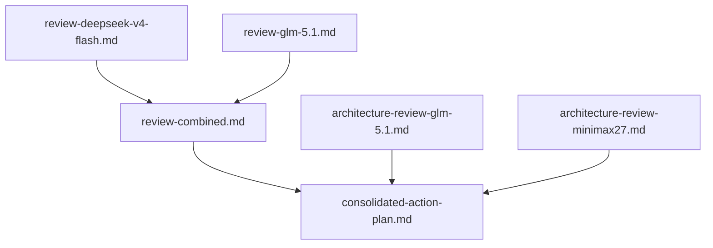

# Other — reviews

# Reviews Module

The `docs/reviews/` directory contains code and architecture review artifacts for the SpeedGap-Prototype project. These reviews were produced by multiple LLM-based reviewers on 2026-04-25, then consolidated into a single prioritized action plan.

## Document Inventory

| Document | Type | Reviewer | Scope |
|----------|------|----------|-------|
| `review-deepseek-v4-flash.md` | Code review | deepseek-v4-flash | 5 critical, 9 warnings, 10 suggestions |
| `review-glm-5.1.md` | Code review | glm-5.1 | 4 critical, 11 warnings, 13 suggestions |
| `review-combined.md` | Merged code review | deepseek + glm-5.1 | Deduplicated findings from both code reviews |
| `architecture-review-glm-5.1.md` | Architecture review | glm-5.1 | 6 architectural issues, 7 improvements, 5 ideas |
| `architecture-review-minimax27.md` | Architecture review | minimax-m2.7 | 7 critical issues, 6 improvements, 5 ideas |
| `consolidated-action-plan.md` | Action plan | merged from all 5 sources | Prioritized, deduplicated, actionable items only |

## How the Documents Relate

The two code reviews were first merged into `review-combined.md`, which deduplicates overlapping findings and assigns consensus labels. The two architecture reviews operate at a different level (semantic correctness, execution model, latency) and were not merged with each other. All five sources feed into `consolidated-action-plan.md`, which is the single authoritative reference for what to fix and in what order.

## Reading Guide

**Start with `consolidated-action-plan.md`.** It contains every actionable finding, deduplicated across all five source reviews, with priority levels and specific file/line references. The source reviews are preserved for their detailed reasoning and code excerpts.

### Priority Levels in the Action Plan

| Priority | Meaning |
|----------|---------|
| **P0** | System is semantically broken. Without these fixes, detected spreads are phantom or garbage data flows through the system. |
| **P1** | System cannot function as intended. The strategy is non-functional without these. |
| **P2** | Code quality, safety, and correctness. Not immediately dangerous but will cause problems. |
| **P3** | Nice-to-have improvements for observability, configuration, and future scale. |

### Key Findings Across All Reviews

**All reviewers agree on these issues:**

1. **The core pricing model is semantically wrong (P0).** The system compares an OKX BTC spot price (~$78,000) against a Polymarket YES token price (0.0–1.0) as if they represent the same asset. The `0.52 * 78000` scaling heuristic produces phantom spreads. The correct comparison is implied probability vs. actual probability (Black-Scholes N(d2)).

2. **No HTTP status code checks (P0).** Both OKX and Polymarket clients decode response bodies without checking status codes. A 429/500 response silently becomes a zero-value struct, producing garbage prices.

3. **Zero-price guards are missing (P0).** Parse failures in `strconv.ParseFloat` and `fmt.Sscanf` silently return 0, which propagates into division-by-near-zero in spread calculations.

4. **LLM signal never connects to execution (P1).** The LLM fires every 20s and logs a signal, but the signal has zero influence on the screener or execution loop. The "reasoning-gap" strategy described in the README is non-functional.

5. **Risk manager is inert (P1).** `currentUSD` starts at 0 and is never incremented, so the position limit check always passes.

6. **Zero test coverage (P2).** No `_test.go` files exist. The domain layer is pure functions with no dependencies — trivially testable.

7. **REST polling is too slow for the strategy (P1).** 2–3 second polling intervals are incompatible with a system named "speed-gap." WebSocket streaming is needed for sub-second latency.

### Items Explicitly Excluded

The action plan includes a table of findings that were considered but deliberately excluded, with rationale. Notable exclusions:

- **"Data race on stats struct"** — all writes happen in the same goroutine; not a real race
- **"Race condition on okxP/polyP pointers"** — values are copied under the lock; the reviewer themselves noted it's "actually safe"
- **"No WaitGroup for goroutine cleanup"** — goroutines exit on `ctx.Done()`; adding a WaitGroup would be cosmetic
- **"Channel buffer size 1 may cause stale prices"** — intentional design; keeps latest price, drops stale ones

## Execution Phases

The action plan defines four phases:

1. **Phase 1 (P0):** Fix the core pricing model, add HTTP status checks, add zero-price guards. Without P0-1, all detected spreads are phantom.
2. **Phase 2 (P1):** WebSocket streaming, LLM signal connection, executor interface, risk manager fix.
3. **Phase 3 (P2):** Unit tests, dead code cleanup, bug fixes (Binance struct, `AssetID[:8]` panic, `extractJSON`, `seen` map growth, state transitions, `time.Sleep` removal).
4. **Phase 4 (P3):** Config extraction, structured logging, multi-market watchlist, latency measurement.

## Architecture Review Scores

The minimax-5.1 architecture review gave these dimension scores:

| Dimension | Score | Notes |
|-----------|-------|-------|
| Architecture shape | 7/10 | DDD layering, interfaces, channels — correct structure |
| Semantic correctness | 2/10 | Probability vs. price comparison is fundamentally broken |
| Latency | 2/10 | 2–3s polling incompatible with the strategy |
| Execution model | 1/10 | Paper only, no abstraction, `fmt.Printf` everywhere |
| Testability | 0/10 | Zero tests |
| LLM integration | 1/10 | Fires but never connects to anything |
| Production readiness | 1/10 | No error handling, no structured logging, dead code |

## Conventions Used in the Reviews

- **File references** use paths relative to the project root (e.g., `internal/domain/valueobject/spread.go`)
- **Line numbers** reference the codebase as of 2026-04-25
- **Consensus labels** in `review-combined.md` indicate whether both reviewers agreed on a finding ("Both") or only one flagged it ("deepseek only" / "glm only")
- **Priority labels** in the action plan (P0–P3) supersede the per-reviewer severity ratings