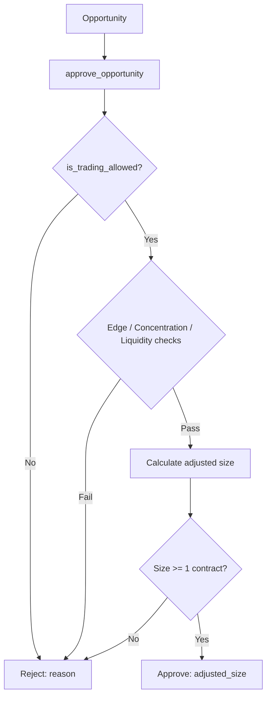

# Risk Management

# Risk Management Module

## Overview

The risk manager is the gatekeeper between opportunity discovery and order execution. Every opportunity must pass through `RiskManager.approve_opportunity()` before a trade is placed. The manager can **approve** (possibly with a reduced size), **reject**, or **halt all trading** depending on portfolio-level constraints.



## Core Classes

### `RiskLimits`

Dataclass holding all configurable thresholds. Default values are tuned for weather markets on Kalshi (thin liquidity, small contract sizes).

| Field | Default | Purpose |
|---|---|---|
| `daily_loss_limit` | $300 | Flat cap on daily realized loss |
| `max_trade_size` | $100 | Max dollars per single trade |
| `max_event_concentration` | 15% | Max bankroll allocation to one event (city + date) |
| `max_portfolio_exposure` | 50% | Max bankroll across all open positions |
| `max_daily_trades` | 50 | Trade count cap per day |
| `max_pending_trades` | 20 | Max simultaneous open positions |
| `min_edge` | 2% | Minimum edge to justify a trade |
| `kelly_fraction_cap` | 0.25 | Quarter-Kelly cap for Strategies A & C |
| `max_drawdown_pct` | 10% | Drawdown from high-water mark triggers halt |
| `max_consecutive_losses` | 5 | Consecutive loss streak triggers halt |
| `rolling_loss_window_hours` | 4 | Lookback window for rolling loss |
| `rolling_loss_limit` | $200 | Max loss within the rolling window |
| `min_market_volume` | $100 | Skip illiquid markets |
| `max_position_pct_of_liquidity` | 5% | Max share of order book depth |
| `max_bracket_spread` | $0.10 | Skip wide-spread brackets |
| `fee_rate_per_contract` | $0 | Kalshi per-contract fee (placeholder) |

### `TradeRecord`

Immutable record of a single trade. The `is_loss` flag and `timestamp` are auto-populated in `__post_init__`.

### `DailyStats`

Accumulates all trading activity for the current day. Tracks:
- Trade count and dollars traded
- Realized P&L (updated on each `record_trade` call)
- Open position tickers
- Full list of `TradeRecord` entries (used for rolling window calculations)
- High-water mark (`peak_bankroll`) and consecutive loss count

The `date` field defaults to today in UTC.

## `RiskManager` — Main Entry Point

### Initialization

```python
risk_mgr = RiskManager(limits=RiskLimits(), bankroll=5000.0)
```

- `limits`: Override defaults with a custom `RiskLimits` instance.
- `bankroll`: Optional override for the initial bankroll. If omitted, reads `settings.INITIAL_BANKROLL`. Useful for testing.

The `bankroll` property always returns the override value if set, otherwise falls back to `settings.INITIAL_BANKROLL`.

### Pre-Trade Approval Flow

#### `is_trading_allowed() → Tuple[bool, str]`

Checks whether any trading should occur at all, regardless of the specific opportunity. Returns `(False, reason)` if any circuit breaker is triggered:

1. **Kill switch** — manual emergency halt
2. **Daily loss limit** — realized P&L has reached the negative cap
3. **Daily trade count** — number of executed trades hit the cap
4. **Drawdown from peak** — current bankroll has fallen more than `max_drawdown_pct` from the high-water mark
5. **Consecutive losses** — streak of losing trades hit the limit
6. **Rolling window loss** — realized P&L over the last N hours exceeds the rolling cap

#### `approve_opportunity(opp, current_positions) → Tuple[bool, float, str]`

The primary pre-trade gate. Returns `(approved, adjusted_size, reason)`.

**Execution order:**

1. Call `is_trading_allowed()`. If halted, reject immediately.
2. Check `max_pending_trades` against open position count.
3. **Edge check** — For Strategy B, subtract per-contract fees from edge before comparing to `min_edge`. For other strategies, compare raw edge.
4. **Concentration check** — Build an `event_key` from `city_key` + `target_date`. If any position matching that key already exceeds `max_event_concentration` of bankroll, reject.
5. **Portfolio exposure** — Sum all position values. If total exceeds `max_portfolio_exposure` of bankroll, reject.
6. **Liquidity filter** (Strategy B only) — Each bracket must have volume ≥ `min_market_volume` and bid-ask spread ≤ `max_bracket_spread`.
7. **Position sizing:**
   - **Strategy B**: Compute max sets by concentration and by trade size, then take the minimum of those two and the suggested size.
   - **Strategies A & C**: Apply Kelly fraction cap (`suggested_size * kelly_fraction_cap`), then cap at `max_trade_size`.
8. **Minimum size** — If adjusted size rounds below 1 contract, reject. The size is **not** floored to 1, because that would bypass the risk sizing logic.

### Trade Recording

#### `record_trade(ticker, size, cost, pnl=0.0)`

Call after every trade execution (both opening and settlement). This method:
- Creates a `TradeRecord` and appends it to daily stats
- Increments trade count and dollars traded
- Updates realized P&L
- Tracks consecutive losses (resets to 0 on any non-loss)
- Updates the high-water mark if current bankroll exceeds the previous peak

### Kill Switch & Auto-Cancel

The risk manager supports an emergency halt with automatic order cancellation:

```python
# Activate — immediately blocks all trading
risk_mgr.kill_switch(activate=True)

# Retrieve orders that should be cancelled
order_ids = risk_mgr.get_orders_to_cancel()

# After cancelling, clean up
risk_mgr.clear_cancelled_orders(cancelled_ids)

# Resume trading
risk_mgr.kill_switch(activate=False)
```

- `register_order_for_cancel(order_id)` — Call when placing an order so the risk manager can track it for potential cancellation.
- `get_orders_to_cancel()` — Returns a copy of all tracked order IDs. Call this after activating the kill switch.
- `clear_cancelled_orders(cancelled_ids)` — Removes successfully cancelled IDs from the tracking list.

### Stats Access

#### `get_daily_stats() → DailyStats`

Returns the current `DailyStats` object for inspection or reporting.

## Integration Points

The risk manager sits between the opportunity scanner and the order executor:

```
Opportunity Scanner → RiskManager.approve_opportunity() → Order Executor
                          ↓
                    record_trade() (after execution)
```

**Incoming calls** come from test suites exercising the approval pipeline, kill switch, and daily limits. In production, the trading loop calls `approve_opportunity` before placing any order, and `record_trade` after execution.

**No outgoing calls** — the module is self-contained, reading only from `settings` and the `Opportunity` dataclass.

## Common Patterns

### Approving and executing a trade

```python
approved, size, reason = risk_mgr.approve_opportunity(opp, current_positions)
if not approved:
    logger.info(f"Rejected: {reason}")
    return

# Place order for `size` contracts...
risk_mgr.register_order_for_cancel(order_id)

# After fill
risk_mgr.record_trade(opp.ticker, size, cost)
```

### Handling a settlement

```python
# When a market settles with P&L
risk_mgr.record_trade(ticker="WEATHER-NYC-90-20240715", size=5, cost=3.50, pnl=1.50)
```

### Emergency halt

```python
risk_mgr.kill_switch(activate=True)
# All subsequent approve_opportunity calls return (False, 0.0, "Kill switch activated")
# Cancel tracked orders
for oid in risk_mgr.get_orders_to_cancel():
    exchange_client.cancel_order(oid)
risk_mgr.clear_cancelled_orders(risk_mgr.get_orders_to_cancel())
```

## Design Decisions

- **No flooring to 1 contract**: If risk sizing produces a value below 1, the trade is rejected rather than rounded up. This prevents bypassing the position sizing logic.
- **High-water mark is persistent**: The peak bankroll updates on every winning trade but never decreases, ensuring drawdown calculations always reference the historical maximum.
- **Rolling window uses trade timestamps**: `_compute_rolling_window_loss` parses ISO timestamps from `TradeRecord` entries, making it resilient to clock skew across processes.
- **Strategy B fee adjustment**: Fees are subtracted from edge *before* the minimum edge check, because Strategy B involves multiple contracts per bracket set. The total fee scales with the number of brackets.
- **Event concentration uses string matching**: Positions are matched to events by checking if the `event_key` (city + date) appears as a substring in the position dictionary key. This is intentionally loose to accommodate varying ticker formats.