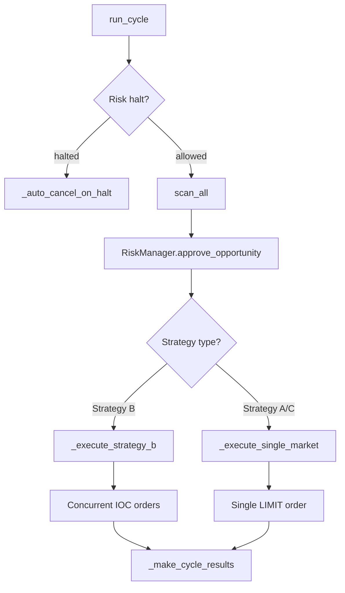
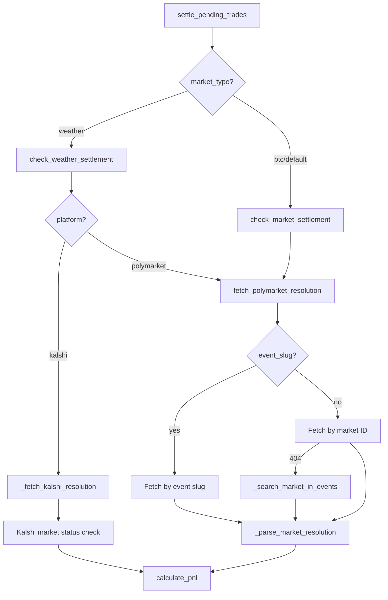

# Trading Engine

# Trading Engine

The trading engine orchestrates the full lifecycle from market scanning through order execution and trade settlement. It consists of two cooperating modules: `TradingEngine` handles the real-time scan→approve→execute loop, while the settlement module resolves completed trades against actual market outcomes.

## Architecture Overview



## TradingEngine

**File:** `backend/common/trader.py`

### Initialization

```python
engine = TradingEngine(
    exchange=None,          # Defaults to KalshiExchange
    risk_manager=None,      # Defaults to RiskManager with settings-derived limits
    simulation_mode=None,   # Defaults to settings.SIMULATION_MODE
)
```

All parameters are optional. When `simulation_mode=True`, the engine logs every decision but places no real orders. This is the default when `settings.SIMULATION_MODE` is `True`.

The default `RiskManager` is constructed with:
- `daily_loss_limit` from `settings.DAILY_LOSS_LIMIT`
- `max_trade_size` from `settings.MAX_TRADE_SIZE`
- `max_event_concentration` of 0.15
- `min_edge` of 0.02

### run_cycle

```python
results: List[dict] = await engine.run_cycle(strategies=["strategy_b", "strategy_a", "strategy_c"])
```

This is the primary entry point, called by APScheduler at regular intervals or manually via CLI/API. It executes one complete trading cycle through five steps:

**Step 0 — Risk gate.** Calls `risk_manager.is_trading_allowed()`. If trading is halted (e.g., daily loss limit breached), all tracked orders are auto-cancelled via `_auto_cancel_on_halt` and the cycle returns immediately with empty results.

**Step 1 — Scan.** Calls `scan_all(self.exchange)` to discover opportunities across all strategies. If the scan throws or returns nothing, the cycle ends early.

**Step 2 — Position lookup.** Fetches current positions from the exchange to support concentration checks in the risk manager.

**Step 3 — Risk approval.** Each opportunity is passed through `risk_manager.approve_opportunity(opp, current_positions)`. Approved opportunities get their `suggested_size` adjusted by the risk manager and their status set to `VALIDATED`. Rejected opportunities are marked `CANCELLED`.

**Step 4 — Execution.** Each approved opportunity is executed via `_execute_opportunity`. Before each individual execution, `is_trading_allowed()` is re-checked — if a risk halt triggers mid-cycle, remaining opportunities are skipped and open orders are cancelled.

**Step 5 — Summary.** Logs counts of found/approved/executed/simulated opportunities and total expected edge.

The return value is a list of dicts, one per opportunity, containing fields like `cycle_id`, `opportunity_type`, `series_ticker`, `edge`, `status`, `execution` (nested dict with order details), etc. These results are also stored in memory (up to 1000 entries, trimmed to 500) and accessible via `get_recent_results()`.

### Execution Strategies

`_execute_opportunity` dispatches based on `opp.opportunity_type`:

#### Strategy B — Cross-Bracket Arbitrage

`_execute_strategy_b` buys YES on every bracket in the event concurrently. This is the core arbitrage: if the sum of YES prices across all brackets is less than $1.00, buying all of them locks in a profit.

- All bracket orders are placed **concurrently** using `asyncio.gather` for speed
- Orders use **IOC (Immediate-or-Cancel)** type to avoid lingering unfilled orders
- Each order has a timeout of `ORDER_TIMEOUT_SECONDS` (10s)
- Partial fills are logged as warnings; the strategy can complete with partial fills
- Order IDs are registered with the risk manager for potential auto-cancellation on halt
- Final status is set to `COMPLETE` (all brackets filled), `PARTIAL` (some filled), or `CANCELLED` (none filled)

#### Strategy A/C — Single Market

`_execute_single_market` places a single LIMIT order using the opportunity's `direction` field (`"yes"` or `"no"`). The `direction` is converted to an `OrderSide` enum. Like Strategy B, order IDs are registered with the risk manager and trades are recorded.

### Simulation Mode

When `simulation_mode=True`, `_execute_opportunity` logs what it *would* do but places no orders. For Strategy B, it logs each bracket order. For Strategy A/C, it logs the single order. The result dict has `simulated=True` and `executed=False`.

### Auto-Cancel on Risk Halt

`_auto_cancel_on_halt` is called whenever a risk halt is detected (either at the start of a cycle or mid-execution). It:

1. Retrieves order IDs from `risk_manager.get_orders_to_cancel()`
2. Cancels each order with a 5-second timeout
3. Calls `risk_manager.clear_cancelled_orders()` with the successfully cancelled IDs
4. Logs success/failure counts

### Position Reconciliation

```python
state = await engine.reconcile_positions()
```

Fetches current balance and positions from the exchange. Useful on restart to verify no stale orders remain. Returns a dict with `balance` (total/available) and `positions` (list of ticker, side, size, avg_price, unrealized_pnl).

### Kill Switch

```python
engine.kill_switch(activate=True)   # Pause all trading
engine.kill_switch(activate=False)   # Resume trading
```

Delegates to `risk_manager.kill_switch()`. When activated, `is_trading_allowed()` will return `False`, causing `run_cycle` to skip execution and auto-cancel orders.

---

## Settlement

**File:** `backend/common/settlement.py`

The settlement module resolves completed trades against actual market outcomes and calculates P&L. It supports both Polymarket and Kalshi markets.

### Settlement Flow



### settle_pending_trades

```python
settled: List[Trade] = await settle_pending_trades(db_session)
```

Queries all `Trade` records where `settled == False`, then checks each for market resolution. Routes to `check_weather_settlement` or `check_market_settlement` based on `trade.market_type`.

For each settled trade:
- Sets `trade.settled = True`, `trade.settlement_value`, `trade.pnl`, `trade.settlement_time`
- Sets `trade.result` to `"win"`, `"loss"`, or `"push"`
- Updates the linked `Signal` record with `actual_outcome` and `outcome_correct` for calibration tracking

After processing, calls `update_bot_state_with_settlements` to update `BotState.total_pnl`, `BotState.bankroll`, and `BotState.winning_trades`.

### Market Resolution

#### Polymarket

`fetch_polymarket_resolution(market_id, event_slug)` resolves Polymarket outcomes:

1. If `event_slug` is provided, queries `gamma-api.polymarket.com/events?slug=...` first
2. Falls back to direct market ID lookup at `gamma-api.polymarket.com/markets/{market_id}`
3. If that returns 404, calls `_search_market_in_events` which paginates through both closed and active events

`_parse_market_resolution` determines the outcome from `outcomePrices`:
- `outcomePrices[0] > 0.99` → first outcome won (Up/Yes) → settlement value `1.0`
- `outcomePrices[0] < 0.01` → second outcome won (Down/No) → settlement value `0.0`
- Otherwise → market not yet resolved

#### Kalshi

`_fetch_kalshi_resolution(ticker)` checks Kalshi market status:
- Status `"finalized"` or `"determined"` with `result == "yes"` → settlement value `1.0`
- `result == "no"` → settlement value `0.0`
- Otherwise → not yet resolved

Requires Kalshi API credentials (`kalshi_credentials_present()`). Returns `(False, None)` if credentials are missing.

### P&L Calculation

```python
pnl: float = calculate_pnl(trade, settlement_value)
```

Maps `up`→`yes` and `down`→`no` for direction normalization. Then:

| Direction | Settlement | P&L |
|-----------|------------|-----|
| YES | 1.0 (won) | `size × (1.0 - entry_price)` |
| YES | 0.0 (lost) | `-size × entry_price` |
| NO | 0.0 (won) | `size × (1.0 - entry_price)` |
| NO | 1.0 (lost) | `-size × entry_price` |

Returns a value rounded to 2 decimal places.

---

## Integration Points

### Incoming Calls

`run_cycle` is invoked from:
- `trade.py` → `run_once` (manual/CLI execution)
- `weather/core/weather_scheduler.py` → `weather_arbitrage_job` (scheduled execution)
- Various test functions in `test_trading_pipeline.py`

### Dependencies

| Component | Purpose |
|-----------|---------|
| `RiskManager` | Approves/rejects opportunities, tracks orders for auto-cancel, provides kill switch |
| `ExchangeClient` / `KalshiExchange` | Places orders, fetches positions/balance, cancels orders |
| `scan_all` / `scan_strategy_b` | Discovers trading opportunities from market data |
| `Opportunity`, `BracketMarket` | Data models representing tradeable opportunities |
| `Trade`, `BotState`, `Signal` | SQLAlchemy models for persistence and P&L tracking |
| `KalshiClient` | Used by settlement to fetch Kalshi market resolution data |

### Configuration

All trading engine behavior is controlled through `settings`:

| Setting | Affects |
|---------|---------|
| `SIMULATION_MODE` | Whether orders are actually placed or just logged |
| `DAILY_LOSS_LIMIT` | Risk halt threshold |
| `MAX_TRADE_SIZE` | Maximum contracts per trade |
| `ORDER_TIMEOUT_SECONDS` | Per-order timeout (hardcoded to 10s) |

### Error Handling

- Scan failures: logged, cycle returns empty results
- Position fetch failures: logged as warning, concentration checks proceed without data
- Individual order failures: logged, other orders in the cycle continue
- Order timeouts: caught via `asyncio.wait_for`, result recorded as failed
- Settlement failures: individual trade errors are caught and skipped, database commit is wrapped in try/except with rollback