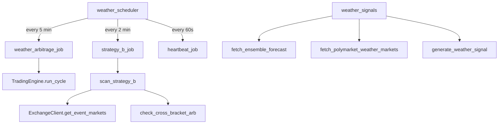

# Weather Trading

# Weather Trading Module

## Overview

The Weather Trading module implements automated trading on weather temperature prediction markets. It scans markets on Kalshi and Polymarket, compares ensemble weather forecasts against market prices, and executes trades when it detects mispricings. The system runs as a single-process asyncio application scheduled via APScheduler.

The module supports three strategies:

| Strategy | Type | Frequency | Status |
|---|---|---|---|
| **B** — Cross-bracket sum arbitrage | Pure price arb (no weather data) | Every 2 min | Active |
| **A** — Ultra-low bracket with ensemble | Model-assisted | Every 5 min | Phase 2 (stub) |
| **C** — Ensemble edge (model vs market) | Model-assisted | Every 5 min | Phase 2 (stub) |

Strategy B is the core strategy: if the sum of all YES ask prices across a weather event's bracket markets is less than $1.00, buying YES on every bracket guarantees a $1.00 payout regardless of outcome. This is near-risk-free arbitrage.

## Architecture



## Data Models

### Opportunity

The `Opportunity` dataclass (`backend/weather/scanner/opportunity.py`) is the unified output of all scanner strategies. The risk manager and execution layer operate on `Opportunity` objects, never on raw market data.

Key fields:

- `opportunity_type` — Which strategy detected this (`STRATEGY_A`, `STRATEGY_B`, or `STRATEGY_C`)
- `series_ticker` — Kalshi series identifier (e.g., `"KXHIGHNY"`)
- `edge` — Expected edge as a decimal (0.06 = 6%)
- `total_cost` — Capital required (sum of all YES/NO prices)
- `brackets` — List of `BracketMarket` objects for this event
- `status` — Lifecycle state (`DETECTED` → `VALIDATED` → `EXECUTING` → `COMPLETE`)

Computed properties:

- `yes_sum` — Sum of all YES prices across brackets. Should be ~$1.00; below $1.00 signals Strategy B arbitrage.
- `is_actionable` — True if edge > 0 and status is `DETECTED` or `VALIDATED`
- `net_edge_after_fees` — Edge minus Kalshi fees
- `roi_pct` — Return on investment as a percentage

### BracketMarket

A single bracket within a weather event. For example, NYC high temperature on 2026-03-01 might have brackets like:

```
KXHIGHNY-26MAR01-B32.5  (≤32.5°F)
KXHIGHNY-26MAR01-B45.5  (>32.5 and ≤45.5)
KXHIGHNY-26MAR01-B58.5  (>45.5 and ≤58.5)
KXHIGHNY-26MAR01-B71.5  (>58.5 and ≤71.5)
KXHIGHNY-26MAR01-B84.5  (>71.5 and ≤84.5)
KXHIGHNY-26MAR01-T84.5  (>84.5°F)
```

Exactly one bracket resolves YES, so all YES prices should sum to ~$1.00. Uses **ask prices** (what you'd pay to buy), never mid or last.

### EnsembleForecast

Holds per-member daily high/low temperatures from the Open-Meteo 31-member GFS ensemble. Provides probability methods:

- `probability_high_above(threshold_f)` — Fraction of members with daily high above threshold
- `probability_high_below(threshold_f)` — Complement of above
- `probability_low_above(threshold_f)` / `probability_low_below(threshold_f)` — Same for lows
- `ensemble_agreement` — How one-sided the ensemble is (0.5 = split, 1.0 = unanimous)

### WeatherMarket

A parsed prediction market from Polymarket with fields like `city_key`, `threshold_f`, `metric` (`"high"` or `"low"`), `direction` (`"above"` or `"below"`), and `yes_price`/`no_price`.

## Strategy B: Cross-Bracket Sum Arbitrage

This is the active strategy. The logic is:

1. **Fetch markets** — For each configured city, call `exchange.get_event_markets(series)` to get all bracket markets for that city's weather series.
2. **Extract brackets** — `_extract_bracket_markets()` converts raw API data into `BracketMarket` objects using ask prices. Filters out:
   - Markets with no ask price (zero volume)
   - Near-certain outcomes (YES ask > 0.98 or < 0.02)
   - Wide spreads (ask - bid > 10 cents)
3. **Group by event** — `_group_brackets_by_event()` groups brackets sharing the same series + date prefix (e.g., all `KXHIGHNY-26MAR01-*` brackets together).
4. **Check arbitrage** — `check_cross_bracket_arb()` computes `sum(yes_ask)` for each event. If the sum is below $1.00 minus fees and above the minimum edge threshold, an `Opportunity` is created.
5. **Filter** — Opportunities with edge after fees below `MIN_STRATEGY_B_EDGE` (2 cents) or any bracket with dangerously low volume are rejected.

The function `scan_strategy_b()` in `opportunity_scanner.py` is the public entry point that delegates to `strategy_b.scan_strategy_b()`.

## Signal Generation (Strategies A & C)

`scan_for_weather_signals()` in `weather_signals.py` generates `WeatherTradingSignal` objects for Polymarket (and Kalshi when enabled) markets:

1. Fetch available weather markets from Polymarket and Kalshi
2. For each market, fetch the ensemble forecast for that city and date
3. Compute model probability (fraction of ensemble members above/below the threshold)
4. Clip to [0.05, 0.95] to avoid overconfidence
5. Calculate edge as `model_probability - market_probability`
6. Apply entry price filter (zero out edge if price exceeds `WEATHER_MAX_ENTRY_PRICE`)
7. Size using Kelly criterion via `calculate_kelly_size()`
8. Persist signals to the database for calibration tracking

Signals have a `passes_threshold` property checking `abs(edge) >= WEATHER_MIN_EDGE_THRESHOLD`.

## Weather Data

### Ensemble Forecasts

`fetch_ensemble_forecast()` calls the Open-Meteo Ensemble API (`ensemble-api.open-meteo.com/v1/ensemble`) with the GFS seamless model, returning 31-member ensemble forecasts with per-member daily high/low temperatures in Fahrenheit.

Results are cached in-memory for 15 minutes (`_CACHE_TTL = 900`).

### NWS Observations

`fetch_nws_observed_temperature()` retrieves observed temperatures from the National Weather Service API for settlement verification. Returns the daily high and low in Fahrenheit.

### City Configuration

Five cities are configured in `CITY_CONFIG` with lat/lon coordinates and NWS station identifiers:

| Key | City | NWS Station |
|---|---|---|
| `nyc` | New York City | KNYC |
| `chicago` | Chicago | KORD |
| `miami` | Miami | KMIA |
| `los_angeles` | Los Angeles | KLAX |
| `denver` | Denver | KDEN |

Active cities are controlled by `settings.WEATHER_CITIES` (comma-separated).

## Market Discovery

`fetch_polymarket_weather_markets()` searches Polymarket's Gamma API for weather-tagged events. Each market's title is parsed by `_parse_weather_market_title()` which extracts:

- **City** — matched against `CITY_ALIASES` (handles variants like "NYC", "New York", "LA")
- **Threshold** — temperature in °F via regex
- **Metric** — `"high"` or `"low"` (defaults to high)
- **Direction** — `"above"` or `"below"` (defaults to above)
- **Date** — parsed from patterns like "March 5, 2026" or "3/5/2026"

Markets for past dates or with extreme prices (YES > 0.98 or < 0.02) are filtered out.

## Scheduler

`weather_scheduler.py` manages the trading loop lifecycle using APScheduler:

| Job | Interval | Function |
|---|---|---|
| Strategy B scan | 120 seconds | `strategy_b_job()` |
| Full scan (A + B + C) | `WEATHER_SCAN_INTERVAL_SECONDS` | `weather_arbitrage_job()` |
| Heartbeat | 60 seconds | `heartbeat_job()` |

The full scan is only scheduled when `settings.WEATHER_ENABLED` is true. On startup, `start_scheduler()` runs an initial scan immediately via `asyncio.create_task()`.

### Event Log

The module maintains an in-memory `event_log` (last 200 events) for terminal display. `log_event()` appends typed events (`"error"`, `"warning"`, `"success"`, `"info"`, `"data"`, `"trade"`) with timestamps and optional data payloads. `get_recent_events(limit)` retrieves the most recent entries.

### Lifecycle

- `start_scheduler()` — Initializes the `TradingEngine`, creates the `AsyncIOScheduler`, registers jobs, starts the scheduler, and fires initial scans.
- `stop_scheduler()` — Shuts down the scheduler without waiting for running jobs.
- `is_scheduler_running()` — Returns whether the scheduler is active.

The `engine` global holds the `TradingEngine` instance, lazily initialized on first use if not created during `start_scheduler()`.

## Configuration

Key settings from `backend.common.config.settings`:

| Setting | Purpose |
|---|---|
| `WEATHER_ENABLED` | Enable full scan (strategies A + C) |
| `WEATHER_CITIES` | Comma-separated city keys to scan |
| `WEATHER_SCAN_INTERVAL_SECONDS` | Interval for the full scan job |
| `WEATHER_MIN_EDGE_THRESHOLD` | Minimum edge for signals to be actionable |
| `WEATHER_MAX_ENTRY_PRICE` | Maximum price to enter a trade |
| `WEATHER_MAX_TRADE_SIZE` | Maximum position size |
| `SIMULATION_MODE` | Run without placing real orders |
| `KALSHI_ENABLED` | Enable Kalshi market fetching |
| `INITIAL_BANKROLL` | Bankroll for Kelly sizing |
| `KALSHI_FEE_RATE` | Fee per contract (currently 0) |

Strategy B internal thresholds (in `strategy_b.py`):

| Constant | Value | Purpose |
|---|---|---|
| `MIN_STRATEGY_B_EDGE` | 0.02 | Minimum profit per event after fees |
| `MIN_BRACKET_VOLUME` | 50.0 | Skip brackets below this volume |
| `MAX_BRACKET_SPREAD` | 0.10 | Maximum bid-ask spread |
| `MIN_MARKET_VOLUME` | 1000.0 | Minimum total market volume |

## Database Persistence

`_persist_weather_signals()` saves signals to the `Signal` table via SQLAlchemy. It deduplicates by market ticker and timestamp (minute granularity), storing model probability, market price, edge, confidence, Kelly fraction, suggested size, sources, and reasoning.