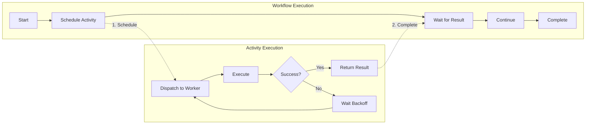
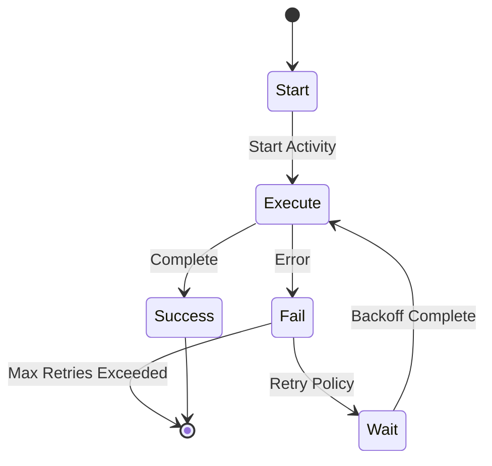

# Activity

An Activity is a function in Temporal designed to handle failure-prone logic, such as calling third-party APIs, with built-in automatic retries.

## Purpose

Activities handle the unreliable parts of distributed systems:
- External API calls
- Database operations
- File I/O
- Network requests

## Key Features

### Automatic Retries
Activities automatically retry on failure with configurable:
- Retry policies (backoff, max attempts)
- Timeouts (start-to-close, schedule-to-start)
- Heartbeats for long-running operations

### Timeout Handling
- **Schedule-to-Start**: Max time before activity starts
- **Start-to-Close**: Max time for activity to complete
- **Heartbeat**: Timeout for activity progress reporting

### Idempotency
Activities should be idempotent since they may execute multiple times due to retries.

## Relationship to Workflows

Workflows orchestrate activities:

### Retry Flow

If activity fails, it's retried automatically. If workflow fails, it replays from last checkpoint and re-calls activities (which may have already succeeded).

## Related

- [[workflow]] - Calls activities to execute business logic
- [[durable-execution]] - Overall execution model
- [[temporal]] - Platform providing activity infrastructure
- [[compensation]] - Handling partial failures with Saga pattern