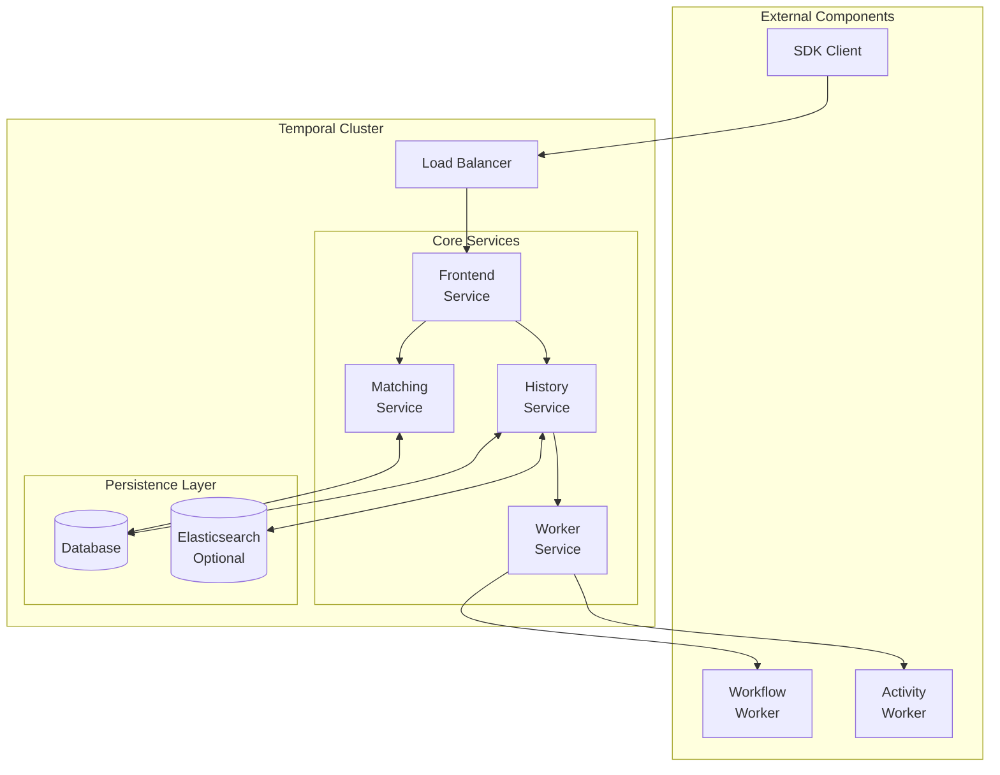

# Temporal Cluster

A Temporal cluster is the backend service deployment that stores workflow histories, manages task queues, and coordinates workers. It is the operational foundation behind self-hosted Temporal.

## Architecture

## Responsibilities

- Persist workflow histories and metadata
- Schedule work onto task queues
- Serve the Temporal API for workers and clients

## Services

| Service | Responsibility |
|---------|---------------|
| Frontend | Handle API requests, authentication, rate limiting |
| History | Manage workflow execution state and event history |
| Matching | Match tasks to workers, poll management |
| Worker | Register workers, manage task queues |

## Related

- [[self-hosted-temporal]] - Running a cluster yourself
- [[persistence]] - Storage layer behind workflow durability
- [[temporal]] - Product that exposes the cluster model
