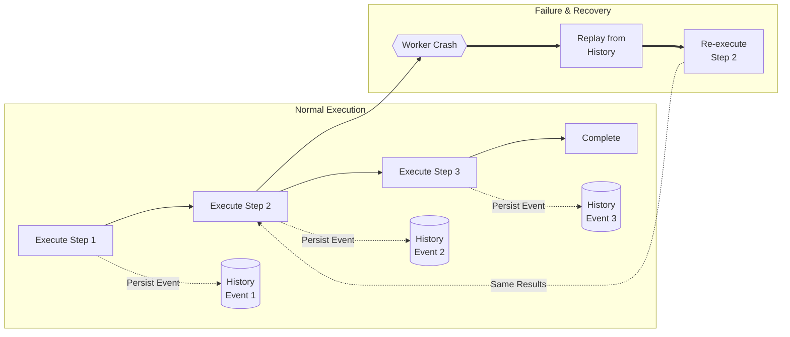

# Durable Execution

Durable Execution is a programming model where the platform automatically captures the state of application code at every step, enabling automatic recovery from failures without manual intervention.

## Core Benefits

1. **Automatic Recovery**: Workflows pick up exactly where they left off after any failure
2. **No Manual Recovery**: Eliminates complex reconciliation logic
3. **Full Visibility**: Complete insight into the exact state of every execution

## How It Works

The platform persists:
- Progress of each workflow execution
- All variables and local state
- Timer states and signals
- Activity results and retry history

When a failure occurs (process crash, network partition, timeout), the system replays the workflow from the last checkpoint, restoring exact state.

## How Replay Works

## Comparison to Traditional Approaches

| Approach | Recovery | State Management | Visibility |
|----------|----------|------------------|------------|
| Durable Execution | Automatic | Platform-managed | Built-in |
| Manual Checkpointing | Developer-coded | Developer-coded | Logs |
| Event Sourcing | Replay events | Custom | Custom |

## Related Concepts

- [[workflow]] - Durable code that defines business logic
- [[activity]] - Failure-prone functions with retries
- [[replay]] - Re-executing workflow from last checkpoint
- [[temporal]] - Platform implementing durable execution