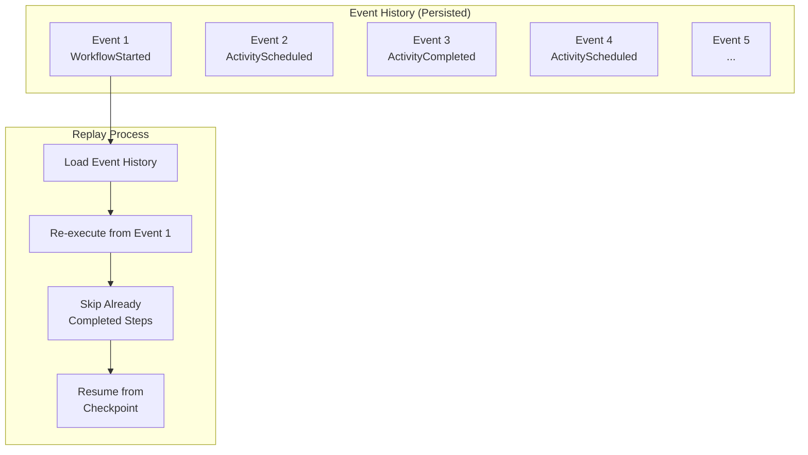

# Replay

Replay is the mechanism Temporal uses to rebuild workflow state after a worker restarts or fails. The runtime re-executes deterministic workflow code against the persisted event history so the workflow resumes with the same logical state.

## How Replay Works

### Key Points

1. **Deterministic Code**: Workflow code must be deterministic for replay to work correctly
2. **Event Sourcing**: All state changes are stored as events, not just final state
3. **Idempotent Activities**: Activities should be idempotent since they may be re-executed

## Why It Matters

- Preserves workflow progress without manual checkpoint logic
- Lets workers recover from crashes and redeployments
- Enforces deterministic workflow code as part of the programming model

## Related

- [[durable-execution]] - The higher-level model that depends on replay
- [[workflow]] - Workflow code must be replay-safe
- [[activity]] - Side effects are kept outside workflow replay
