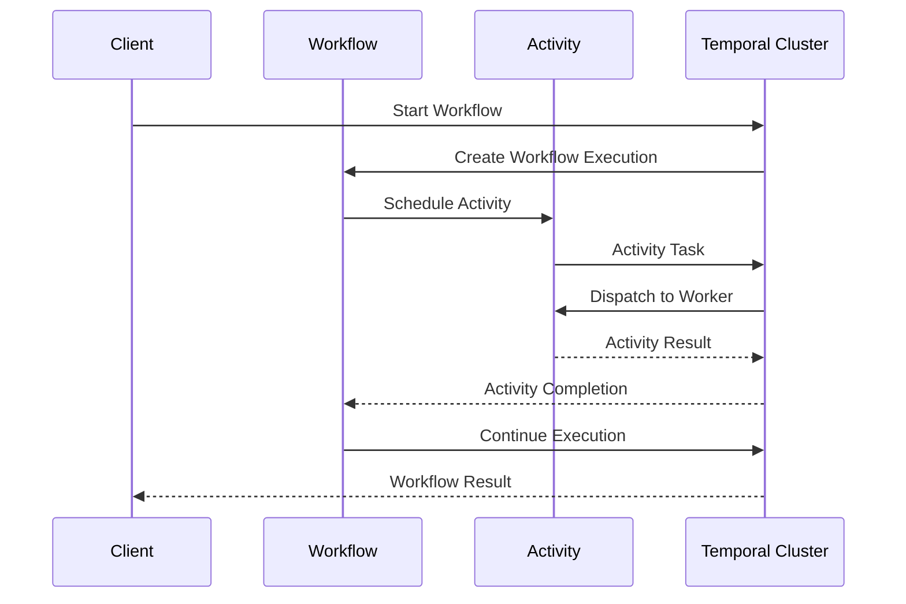
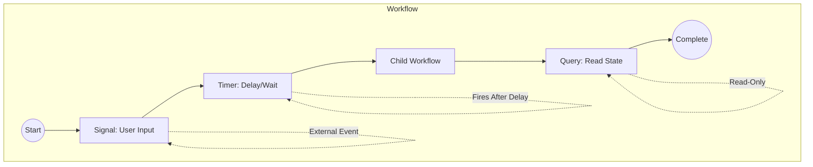

# Workflow

A Workflow in Temporal is durable, fault-tolerant code that defines business logic. Workflows are the core execution unit that maintains state across failures.

## Characteristics

- **Durable**: Survives process crashes, restarts, and failures
- **Idempotent**: Can safely replay from checkpoints
- **Deterministic**: Same inputs produce same outputs (required for replay)

## Workflow Types

### Long-Running Workflows
Continuous processes that may run for days or weeks, such as:
- Order processing pipelines
- AI model training orchestration
- Human-in-the-loop approvals

### Periodic Workflows
Scheduled tasks that run on intervals:
- Data synchronization jobs
- Report generation
- Cleanup tasks

## Key Features

### Execution Flow

### Signals, Timers, and Child Workflows

### Workflow Types

### Long-Running Workflows

## Related

- [[durable-execution]] - The execution model
- [[activity]] - Failure-prone operations called by workflows
- [[temporal]] - Platform hosting workflows
- [[replay]] - Recovery mechanism