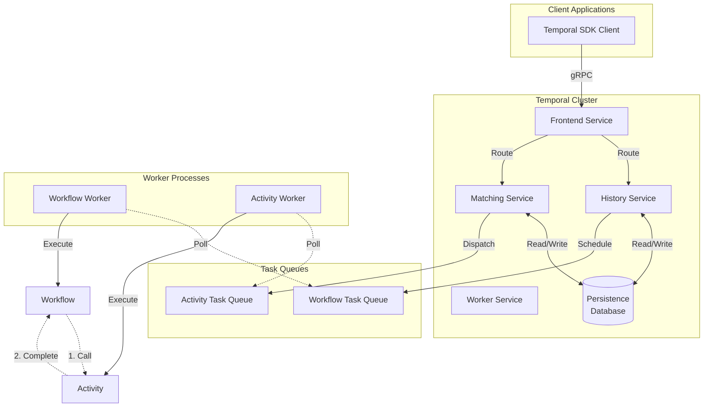
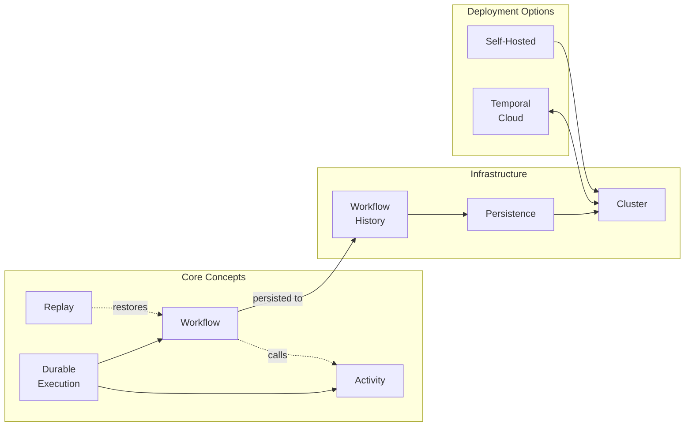

# Temporal

Temporal is an open-source platform that enables **Durable Execution**, allowing developers to build applications that maintain state and recover automatically from failures in distributed systems.

## Overview

Temporal solves the problem of building reliable distributed applications by capturing the state of code at every step, making infrastructure failures (network flakes, service crashes, API timeouts) irrelevant.

## Key Facts

| Property | Value |
|----------|-------|
| License | MIT (open source) |
| GitHub Stars | 19,600+ |
| Founded by | Creators of AWS SQS, AWS SWF, Uber's Cadence |

## Products

- **Temporal Cloud**: Managed service offering
- **Self-Hosted**: 100% open source deployment

## SDK Support

Temporal provides native SDKs for: Python, Go, TypeScript, Ruby, C#, Java, and PHP.

## Use Cases

- AI agents - Reliable orchestration for multi-step LLM systems
- Fintech - Durable ledgers and multi-step transaction handling
- Infrastructure - CI/CD, cloud deployment, and fleet management
- E-commerce - Order fulfillment and customer onboarding

## Notable Users

Companies using Temporal include OpenAI, NVIDIA, Salesforce, Netflix, Snap, Cloudflare, and DoorDash.

## Architecture Overview

## Concepts Map

## Related

- [[durable-execution]] - The core concept behind Temporal
- [[temporal-cloud]] - Managed deployment option
- [[self-hosted-temporal]] - Self-hosted deployment option
