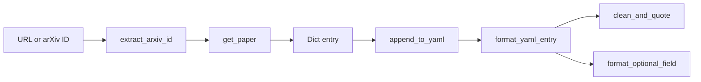

# ArXiv Integration

# ArXiv Integration

Fetches paper metadata from arXiv and appends it as a formatted entry to a curated YAML file. Designed to maintain a hand-curated paper list (e.g., an Awesome-style repository) where new arXiv papers need to be added without breaking existing formatting.

## Architecture



The pipeline is linear: a URL or raw ID goes in, gets normalized, the arXiv API is queried, a dictionary is built, and that dictionary is formatted and appended to the YAML file. `format_yaml_entry` delegates the tricky quoting work to `clean_and_quote` and `format_optional_field`.

## Class: `ArxivIntegration`

### `__init__(self)`

Creates an `arxiv.Client` instance used for all API requests. No configuration is required; the client uses the default arxiv API endpoint.

### `extract_arxiv_id(self, url_or_id: str) -> str`

Normalizes user input into a bare arXiv identifier. Accepts:

- Full URLs: `https://arxiv.org/abs/2401.12345`, `https://arxiv.org/pdf/2401.12345v2.pdf`
- Bare IDs: `2401.12345`, `2401.12345v2`
- Partial URLs without scheme: `arxiv.org/abs/2401.12345`

The method strips `.pdf` suffixes, extracts the last path segment from `/abs/` or `/pdf/` paths, and validates the result against the pattern `\d{4}\.\d{4,5}(?:v\d+)?`. Raises `ValueError` if the ID doesn't match.

### `get_paper(self, url_or_id: str) -> Optional[Dict[str, Any]]`

Fetches a paper from arXiv and returns a dictionary ready for YAML serialization. Returns `None` if the paper is not found or an error occurs.

**ID generation.** The `id` field is constructed as `{last_name}{year}{first_title_word}` — for example, a 2024 paper by Jane Smith titled "Novel Gaussian Splatting..." produces `smith2024novel`. This convention matches the naming scheme used in the target YAML file.

**Returned fields:**

| Field | Source | Notes |
|---|---|---|
| `id` | Derived | `{author_lastname}{year}{first_title_word}` |
| `title` | arXiv API | Raw title string |
| `authors` | arXiv API | Comma-separated names |
| `year` | arXiv API | Publication year as string |
| `abstract` | arXiv API | Full abstract text |
| `project_page` | — | Always `None` (set manually later) |
| `paper` | Derived | `https://arxiv.org/pdf/{arxiv_id}.pdf` |
| `code` | — | Always `None` (set manually later) |
| `video` | — | Always `None` (set manually later) |
| `tags` | Derived | `["Year {year}"]` |
| `thumbnail` | Derived | `assets/thumbnails/{paper_id}.jpg` |

Fields left as `None` (`project_page`, `code`, `video`) are placeholders the curator fills in after the initial fetch.

### `append_to_yaml(self, entry: Dict[str, Any], filename: str = "awesome_3dgs_papers.yaml") -> bool`

Appends a formatted entry to the YAML file. Returns `True` on success, `False` on failure or duplicate.

**Duplicate detection.** Before writing, the entire file is loaded with `yaml.safe_load` and scanned for an existing entry with the same `id`. If found, the write is skipped and `False` is returned.

**Formatting.** The entry is serialized by `format_yaml_entry` rather than `yaml.dump`, preserving the hand-tuned indentation and quoting style that the file relies on. A trailing newline is ensured before appending so entries don't run together.

### `format_yaml_entry(entry: Dict[str, Any]) -> str` *(static)*

Produces a single YAML list item as a multi-line string. Key behaviors:

- **Title quoting** is handled by `clean_and_quote`, which adds single quotes if the title contains YAML-special characters (`:`, `[`, `]`, `{`, `}`, `,`, newlines).
- **Abstract wrapping** uses a fold-like block scalar indicator (`>`) with lines broken at ~80 characters for readability.
- **Optional fields** (`project_page`, `code`, `video`) go through `format_optional_field`, which renders `None` as the bare string `null`.
- **Tags** are sorted alphabetically before output.

## Module-level Functions

### `clean_and_quote(text: str) -> str`

Returns the text as-is if it contains no YAML-special characters. Otherwise wraps it in single quotes. Returns `'null'` for empty input.

### `format_optional_field(value) -> str`

Returns `'null'` for falsy values, otherwise returns the value unchanged. Used for fields that may or may not have a URL.

## Typical Usage

```python
from src.arxiv_integration import ArxivIntegration

integration = ArxivIntegration()

# Fetch and add a paper
entry = integration.get_paper("https://arxiv.org/abs/2401.12345")
if entry:
    success = integration.append_to_yaml(entry, "papers.yaml")
    if success:
        print(f"Added {entry['id']}")
    else:
        print("Paper already exists or write failed")
```

After running this, manually edit the YAML file to fill in `project_page`, `code`, and `video` links, and place a thumbnail image at the path specified in the `thumbnail` field.