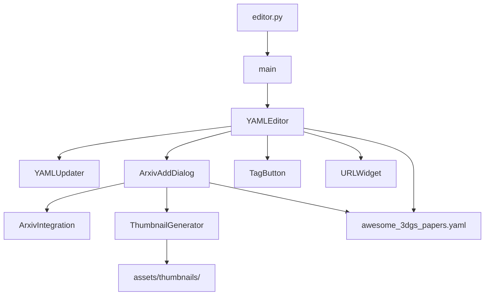

# Editor Application

# Editor Application

A PyQt6 desktop application for browsing, editing, and managing entries in the Awesome 3D Gaussian Splatting Papers YAML database. The editor provides a form-based interface with auto-save, tag management, arXiv integration, and thumbnail generation.

## Architecture Overview



## Entry Point

**`editor.py`** — Minimal launcher that calls `main()` from `src.yaml_editor`. This is the script to run the application:

```bash
python editor.py
```

`main()` creates the `QApplication`, instantiates `YAMLEditor`, and starts the Qt event loop.

---

## YAMLEditor (`src/yaml_editor.py`)

The central `QMainWindow` subclass. Manages the full lifecycle: loading YAML data, rendering the current entry, handling edits, and persisting changes.

### Initialization Flow

1. Creates a `YAMLUpdater` instance (from `src.fix_date`) for date processing
2. Initializes state: `fields`, `url_widgets`, `tag_buttons` dictionaries; `original_entry_state`; `search_results` list
3. Defines the 55 available tags (from "2DGS" through "World Generation")
4. Calls `load_yaml()` to read and sort the data file
5. Calls `setup_ui()` to build the interface
6. Calls `show_current_entry()` to display the first entry

### Data Loading and Sorting

**`load_yaml()`** reads `awesome_3dgs_papers.yaml` from the working directory. The file must contain a YAML list of paper dictionaries. Entries are sorted descending by `safe_sort_key()`, which produces a tuple of:

| Priority | Field | Default if missing |
|----------|-------|--------------------|
| 1 | `publication_date` | `'9999'` |
| 2 | `date_source` priority (`arxiv`=0, `estimated`=1, `unknown`=2) | 2 |
| 3 | First author's last name (lowercase) | `'z'` |
| 4 | `title` (lowercase) | `'z'` |

This ensures newest papers appear first, with ties broken by author then title.

### UI Layout

The window is divided into three horizontal regions:

**Navigation bar (top)**
- Previous / Next buttons
- Delete Entry button (red-styled)
- Add from arXiv button
- Go-to-page input (1-based index, press Enter to jump)
- Entry counter label (`Entry N of M`)
- Search input (matches title, authors, or tags; Enter cycles through results)

**Form panel (left, scrollable)**
- Basic text fields: `id`, `title`, `authors`, `year`, `publication_date` (read-only)
- URL fields using `URLWidget`: `project_page`, `paper`, `code`, `video` — each with an "Open" button that launches the system browser
- Abstract: multi-line `QTextEdit`
- Current Tags: `QListWidget` showing the entry's active tags

**Tag grid (right)**
- 4-column `QGridLayout` of `TagButton` toggleable pills
- Clicking a tag calls `update_tags()` → `auto_save()`

### Auto-Save System

Every edit to a text field, URL field, or tag triggers `auto_save()`. The method:

1. Reads all widget values into the current `self.data[self.current_index]` entry
2. If `publication_date` is missing, calls `self.yaml_updater.process_paper(entry)` to populate it
3. Re-sorts the entire dataset using `self.yaml_updater.safe_sort_key`
4. Locates the current entry by `id` after re-sorting and updates `self.current_index`
5. Writes the full dataset to `awesome_3dgs_papers.yaml` with `yaml.dump(sort_keys=False, allow_unicode=True)`
6. Updates `original_entry_state` and the entry counter
7. Shows a status bar indicator: "✓ Changes saved" (green) or "⚠ Save failed" (red), cleared after 1.5 seconds

Because sorting happens on every save, the entry's position may shift. The method tracks the entry by its `id` field to maintain the correct `current_index`.

### Automatic Tag Inference

`update_automatic_tags()` is called whenever a URL field changes. It enforces three tag rules:

| URL field populated | Tag auto-applied |
|---------------------|-----------------|
| `project_page` | `Project` |
| `code` | `Code` |
| `video` | `Video` |

If the URL is non-empty, the tag is added; if empty, the tag is removed. These tags cannot be manually removed while their corresponding URL is present.

### Navigation

| Method | Behavior |
|--------|----------|
| `prev_entry()` | Decrements `current_index`, clears search, shows entry |
| `next_entry()` | Increments `current_index`, clears search, shows entry |
| `go_to_page()` | Parses 1-based page number from input, jumps to that index |
| `search_entry()` | Searches all entries for a case-insensitive substring match in `title`, `authors`, or `tags`. If the current entry is already a result, advances to the next result (wrapping). Status bar shows result position. |

### Entry Display

`show_current_entry()` populates all widgets from `self.data[self.current_index]`. It uses `blockSignals(True)` on every widget before setting values to prevent `auto_save()` from firing during population. After setting values, it calls `blockSignals(False)` to re-enable auto-save.

`get_entry_state()` captures a snapshot of the current entry's field values and tags — used by `auto_save()` to track dirty state.

### Deleting Entries

`delete_current_entry()` prompts for confirmation, then:

1. Deletes the thumbnail file at `assets/thumbnails/{id}.jpg` if it exists
2. Removes the entry from `self.data`
3. Writes the updated list to YAML
4. Adjusts `current_index` if it now exceeds the list length
5. Closes the window if no entries remain

### Adding Papers from arXiv

`show_arxiv_dialog()` opens an `ArxivAddDialog`. After the dialog is accepted:

1. Re-reads the YAML file to get the newly appended entry
2. Calls `self.yaml_updater.process_paper()` to populate date fields
3. Re-sorts and saves the data
4. Reloads via `load_yaml()`
5. Locates the new entry by `id` and navigates to it

### Refresh

`refresh_ui()` reloads the YAML file, attempts to preserve the current position by matching the entry's `id`, and re-displays. Used after external modifications to the data file.

---

## ArxivAddDialog (`src/components/dialogs.py`)

A `QDialog` for adding papers by arXiv URL or ID.

### Workflow

1. User enters an arXiv URL (e.g., `https://arxiv.org/abs/2412.21206`) or bare ID (`2412.21206`)
2. Clicking "Add Paper" calls `add_paper()`, which:
   - Disables the button and shows status
   - Calls `self.arxiv.get_paper(url_or_id)` to fetch metadata via `ArxivIntegration`
   - Shows a confirmation dialog with the paper title
   - On confirmation, calls `self.arxiv.append_to_yaml(entry)` to add to the YAML file
   - Calls `generate_thumbnail(entry)` to create a preview image
3. On success, calls `self.accept()` (dialog result = 1), which signals the parent `YAMLEditor` to reload

### Thumbnail Generation

`generate_thumbnail()` downloads the PDF from the entry's `paper` URL and calls `ThumbnailGenerator.create_thumbnail()`. The status label updates during the process. Failure to generate a thumbnail is non-fatal — the paper is still added with a warning.

---

## ThumbnailGenerator (`src/components/thumbnail.py`)

Converts the first page of a PDF to a JPEG thumbnail.

| Property | Value |
|----------|-------|
| Output directory | `assets/thumbnails/` |
| Dimensions | 360 × 300 px |
| Format | JPEG, quality 85, optimized |
| Naming | `{paper_id}.jpg` |

### Methods

- **`download_pdf(url)`** — Fetches PDF bytes with a browser-like `User-Agent` header. Raises on HTTP errors; 30-second timeout.
- **`create_thumbnail(pdf_content, paper_id)`** — Uses `pdf2image.convert_from_bytes` to render page 1, composites it onto a white background centered within the target dimensions, and saves. Returns `True` on success.

Dependencies: `pdf2image` (requires `poppler` installed on the system), `Pillow`, `requests`.

---

## Custom Widgets (`src/components/widgets.py`)

### TagButton

A `QPushButton` subclass with `checkable` behavior. Styled as a rounded pill — white with a border when unchecked, blue with white text when checked. Used in the tag grid to toggle paper categories.

### URLWidget

A composite widget containing a `QLabel`, `QLineEdit` (for the URL), and a `QPushButton` ("Open"). The label has a fixed 100px minimum width. The open button's `clicked` signal is connected externally by `YAMLEditor` to `open_url()`, which calls `webbrowser.open()`.

---

## External Dependencies

| Module | Purpose |
|--------|---------|
| `src.fix_date.YAMLUpdater` | Date extraction and `safe_sort_key` for consistent sorting |
| `src.arxiv_integration.ArxivIntegration` | Fetches paper metadata from arXiv API and appends to YAML |
| `arxiv` (pip) | arXiv API client used by `ArxivAddDialog` |
| `pdf2image` + `poppler` | PDF-to-image conversion for thumbnails |
| `Pillow` | Image compositing for thumbnails |
| `requests` | HTTP downloads |
| `PyQt6` | GUI framework |

## Data File Contract

The editor reads and writes `awesome_3dgs_papers.yaml` in the current working directory. The file must be a YAML list of dictionaries. Each entry is expected to have these fields (though the editor handles missing ones gracefully):

```
id, title, authors, year, publication_date, date_source,
project_page, paper, code, video, abstract, tags
```

The `tags` field is a list of strings drawn from the 55 predefined tag names. The `publication_date` field is read-only in the editor and is populated by `YAMLUpdater.process_paper()`.