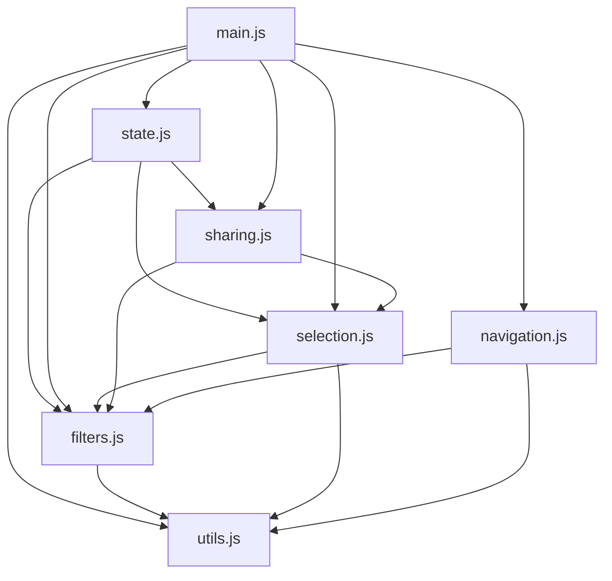

# Other

# Awesome 3D Gaussian Splatting — Web Frontend

## Overview

This module is the client-side web application that powers the [Awesome 3DGS paper database](https://mrnerf.github.io/awesome-3D-gaussian-splatting/). It renders a searchable, filterable, and shareable catalog of 3D Gaussian Splatting research papers. The page is server-rendered from templates with placeholder substitution (`${paper_cards}`, `${year_options}`, etc.), then enriched on the client with interactive filtering, multi-select, and deep-linking via URL parameters.

## Architecture

All JavaScript modules share a global `state` object and communicate through direct function calls. There is no event bus or pub/sub layer — modules call each other explicitly.

## Application State

**File:** `src/static/js/state.js`

The single source of truth for the UI. Exposed as a global `const state`:

| Property | Type | Purpose |
|---|---|---|
| `selectedPapers` | `Set<string>` | IDs of papers currently selected in selection mode |
| `isSelectionMode` | `boolean` | Whether selection mode is active (checkboxes visible, preview bar shown) |
| `includeTags` | `Set<string>` | Tags that must be present on a paper for it to appear |
| `excludeTags` | `Set<string>` | Tags that must *not* be present on a paper for it to appear |
| `onlyShowSelected` | `boolean` | When true, only selected papers are visible regardless of other filters |

## Initialization Flow

**File:** `src/static/js/main.js`

`DOMContentLoaded` bootstraps the application:

1. Caches DOM references (`paperCards`, `searchInput`, `yearFilter`, `tagFilters`) on `window`.
2. Creates a `LazyLoad` instance for thumbnail images with fallback support.
3. Calls `initializeFilters()` to wire search, year, and tag click handlers.
4. Attaches click handlers to `.paper-card` elements for selection-mode toggling.
5. Calls `applyURLParams()` to restore any persisted filter/selection state from the URL.
6. Runs `filterPapers()` and `updatePaperNumbers()` for the initial render.
7. Exposes key functions on `window` for inline `onclick` handlers in the HTML template.

## Filtering

**File:** `src/static/js/filters.js`

### `filterPapers()`

The central visibility function. It iterates every `.paper-row` element and toggles the `visible` class based on the current state:

- **Selection-only mode** (`state.onlyShowSelected`): Only rows whose `data-id` is in `state.selectedPapers` are shown; all other filters are bypassed.
- **Normal mode**: A paper is visible only when *all* of the following match:
  - **Search** — `data-title` or `data-authors` contains the search term (case-insensitive).
  - **Year** — `data-year` equals the selected year, or year filter is `"all"`.
  - **Include tags** — Every tag in `state.includeTags` appears in the paper's `data-tags` JSON array (or the set is empty).
  - **Exclude tags** — No tag in `state.excludeTags` appears in the paper's `data-tags` array (or the set is empty).

After toggling visibility, it calls `updatePaperNumbers()` to renumber visible cards and `updateURL()` to persist the filter state.

### `initializeFilters()`

Binds event listeners:

- **Tag filters**: Three-state click cycle — neutral → `include` (blue) → `exclude` (red) → neutral. Each transition updates `state.includeTags` / `state.excludeTags` and calls `filterPapers()`.
- **Search input**: Debounced (150 ms) call to `filterPapers()`.
- **Year dropdown**: `change` event calls `filterPapers()` directly.

### `clearSearch()`

Resets the search input and re-runs `filterPapers()`.

## Selection Mode

**File:** `src/static/js/selection.js`

Selection mode lets users pick specific papers and share a URL that pre-selects them.

### Entering / Exiting

`toggleSelectionMode()` toggles `state.isSelectionMode` and the `selection-mode` class on `<body>`. The CSS class reveals checkboxes on each card and the sticky selection preview bar. Exiting also resets `onlyShowSelected` if it was active.

### Selecting Papers

`togglePaperSelection(paperId, checkbox)` is called when a checkbox changes or a card is clicked in selection mode:

- **Checked**: Adds `paperId` to `state.selectedPapers`, adds the `selected` class to the card, and appends a preview item (title + authors) to `#selectionPreview`.
- **Unchecked**: Delegates to `removeFromSelection()`.

`handleCheckboxClick(ev, paperId, checkbox)` is the inline handler that stops event propagation and calls `togglePaperSelection`.

### Removing Papers

`removeFromSelection(paperId)` unchecks the checkbox, deletes from `state.selectedPapers`, removes the `selected` class, removes the preview item, and if `onlyShowSelected` is active, re-runs `filterPapers()`.

### Show Selected Only

`toggleSelectedOnly()` flips `state.onlyShowSelected`, updates the button label, sets/clears the `show_selected` URL parameter, and calls `filterPapers()`.

### Clearing

`clearSelection()` empties `state.selectedPapers`, unchecks all checkboxes, removes `selected` classes, clears the preview bar, resets `onlyShowSelected`, strips `selected` and `show_selected` from the URL, and re-filters.

### Navigation

`scrollToPaper(paperId)` scrolls the target `.paper-row` into view and briefly highlights it with a light-blue background flash (1.5 s).

## Sharing & URL Persistence

**File:** `src/static/js/sharing.js`

### `showShareModal()` / `hideShareModal()`

Opens a modal containing a URL that encodes the current selection and `show_selected` flag. The URL is built from `window.location.href` with `selected` and `show_selected` query parameters.

### `copyShareLink()`

Writes the share URL to the clipboard with a brief "Copied!" confirmation on the button.

### `applyURLParams()`

Called during initialization to restore state from the URL:

1. Reads `selected` → enters selection mode and checks each listed paper.
2. Reads `show_selected` → activates show-selected-only mode.
3. Reads `search` → populates the search input.
4. Reads `year` → sets the year dropdown.
5. Reads `include` / `exclude` → populates `state.includeTags` / `state.excludeTags` and applies the corresponding CSS classes to tag buttons.
6. Calls `filterPapers()` to apply everything.

### `copyBitcoinAddress()`

Copies the donation Bitcoin address to the clipboard with a brief confirmation.

## Navigation & Filter Status

**File:** `src/static/js/navigation.js`

### Scroll Controls

- `scrollToTop()` / `scrollToBottom()` — smooth scroll to page boundaries.
- `updateScrollProgress()` — updates the percentage indicator in the floating nav.

### Filter Status Bar

`updateFilterStatus()` populates the sticky "Active Filters" bar:

- Updates visible/total paper counts.
- Creates removable filter tags for active search, year, and tag filters using `createFilterTag(type, title, info)`.
- Each tag's remove button clears the corresponding filter and re-runs `filterPapers()`.

`clearAllFilters()` resets search input, year dropdown, and all tag filter states, then calls `filterPapers()` and `updateFilterStatus()`.

On `DOMContentLoaded`, the module wraps the existing `filterPapers` so that every call also triggers `updateFilterStatus()`.

## Utilities

**File:** `src/static/js/utils.js`

### `debounce(fn, delay)`

Standard debounce. Used for the search input to avoid filtering on every keystroke.

### `updateURL()`

Serializes the current filter and selection state into URL search parameters (`search`, `year`, `include`, `exclude`, `selected`, `show_selected`) and calls `history.replaceState`. This enables bookmarkable and shareable filter states without page reloads.

### `updatePaperNumbers()`

Re-numbers visible `.paper-row` elements sequentially, updating the `.paper-number` badge on each card.

## CSS Structure

| File | Scope |
|---|---|
| `src/static/css/base.css` | Root variables, layout, donation box, search/filter controls, floating nav, filter status bar, print styles |
| `src/static/css/components.css` | Paper cards, selection mode UI, selection preview bar, share modal, control buttons |
| `src/static/css/responsive.css` | Breakpoint overrides for 1024 px, 768 px, and 480 px |

Key CSS conventions:

- **CSS custom properties** in `:root` (`--primary-color`, `--hover-color`, `--border-color`, etc.) for theming.
- **`selection-mode` class on `<body>`** gates visibility of checkboxes and the preview bar.
- **`paper-row.visible`** controls whether a card is displayed; cards are hidden by default (`display: none`) and shown via the `visible` class.
- **`paper-card.selected`** adds a blue border and shadow to indicate selection.
- **Dark mode** is handled via `@media (prefers-color-scheme: dark)` for floating nav elements only.

## HTML Templates

### `src/templates/index.html`

The main page template. Server-side rendering replaces these placeholders before serving:

| Placeholder | Content |
|---|---|
| `${styles}` | Concatenated CSS from the three stylesheets |
| `${scripts}` | Concatenated JavaScript from all JS modules |
| `${year_options}` | `<option>` elements for each publication year |
| `${tag_filters}` | `<button class="tag-filter">` elements for each tag |
| `${paper_cards}` | Rendered paper card HTML |

### `src/templates/paper_card.html`

Template for a single paper. Substitution variables:

| Variable | Source |
|---|---|
| `$id` | Unique paper identifier |
| `$title`, `$authors`, `$year` | Paper metadata |
| `$tags_json` | JSON-escaped tag array for `data-tags` |
| `$tags_html` | Rendered tag badges |
| `$thumbnail` | Thumbnail image URL (lazy-loaded) |
| `$fallback_url` | Fallback image if thumbnail fails |
| `$links_html` | Paper/ArXiv/project page links |

Each card stores its metadata in `data-*` attributes on the `.paper-row` wrapper, which the JavaScript reads during filtering.

## Data Flow Summary

1. **Page load** → server renders HTML with paper data embedded in `data-*` attributes.
2. **`main.js` init** → caches DOM, wires events, restores URL state, runs initial filter.
3. **User interaction** (search, tag click, year change) → updates `state` → `filterPapers()` → toggles `.visible` classes → `updatePaperNumbers()` + `updateURL()`.
4. **Selection mode** → checkbox/card click → `togglePaperSelection()` → updates `state.selectedPapers` + preview bar → `updateSelectionCount()` + `updateURL()`.
5. **Share** → `showShareModal()` → builds URL from current state → user copies link.
6. **Deep link** → `applyURLParams()` on load → restores all state from URL → `filterPapers()`.