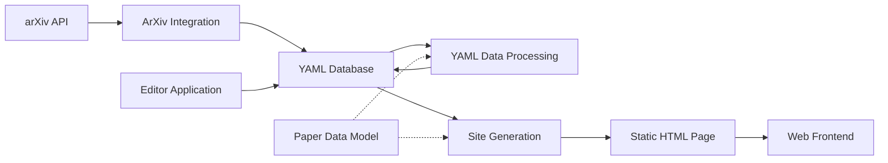

# awesome-3D-gaussian-splatting — Wiki

# Awesome 3D Gaussian Splatting

Welcome! This repository is a curated, searchable catalog of research papers and resources focused on **3D Gaussian Splatting (3DGS)** and related technologies. It powers the live paper database at [mrnerf.github.io/awesome-3D-gaussian-splatting](https://mrnerf.github.io/awesome-3D-gaussian-splatting/) and provides tooling to keep that database accurate, enriched, and easy to manage.

## What This Project Does

At its core, the project maintains a hand-curated YAML file (`awesome_3dgs_papers.yaml`) that serves as the single source of truth for paper metadata. Around that YAML file, several systems work together:

- **Ingestion** — Pull new papers from arXiv and append them to the YAML database without breaking existing formatting.
- **Enrichment & Validation** — Backfill missing publication dates, validate tags and URLs, and enforce data integrity on every pull request.
- **Editing** — A desktop GUI for browsing, editing, tagging, and adding papers.
- **Publishing** — Generate a self-contained static HTML page from the YAML data, complete with filtering, search, and deep-linking.

## Architecture

The **YAML Database** is the central artifact. Everything either writes to it or reads from it. The [Paper Data Model](paper-data-model.md) sits one step removed — it defines the validated `Paper` dataclass that [Site Generation](site-generation.md) and [YAML Data Processing](yaml-data-processing.md) use to enforce structure at the boundary between raw YAML and the rest of the codebase.

## Key End-to-End Flows

### Adding a New Paper from arXiv

A contributor supplies an arXiv URL or ID. The [ArXiv Integration](arxiv-integration.md) module extracts the ID, fetches metadata from the arXiv API, formats it as a YAML entry, and appends it to the database. The pipeline is linear: URL → extract ID → fetch metadata → format → append.

### Validating a Pull Request

When a PR changes the YAML file, [YAML Data Processing](yaml-data-processing.md) runs its validation pipeline — checking tags against an allow-list and verifying that URLs are live. This keeps the database clean without requiring manual review of every field.

### Publishing the Site

[Site Generation](site-generation.md) reads the YAML file, converts each entry into a validated `Paper` object via the [Paper Data Model](paper-data-model.md), generates HTML fragments for filter controls and paper cards, inlines all CSS and JS, and writes a single self-contained HTML file. The [Web Frontend](web-frontend.md) then handles client-side interactivity — filtering by tag/year, multi-select, URL-based deep-linking, and paper count updates.

### Editing Papers via the Desktop App

The [Editor Application](editor-application.md) is a PyQt6 desktop tool that loads the YAML database into a form-based interface. It supports auto-save, tag management, thumbnail generation, and one-click arXiv imports through the same [ArXiv Integration](arxiv-integration.md) backend.

## Getting Started

1. **Clone the repository** and install Python dependencies as listed in the project's requirements.
2. **Browse or edit the database** — open `awesome_3dgs_papers.yaml` directly, or launch the [Editor Application](editor-application.md) for a GUI workflow.
3. **Add a paper** — use the ArXiv integration script or the editor's built-in arXiv dialog to fetch and append entries.
4. **Generate the site** — run the [Site Generation](site-generation.md) CLI to produce the static HTML.
5. **Validate before committing** — run the YAML validation pipeline to catch tag or URL issues before opening a PR.

For contribution guidelines, see `CONTRIBUTING.md` in the repository root.