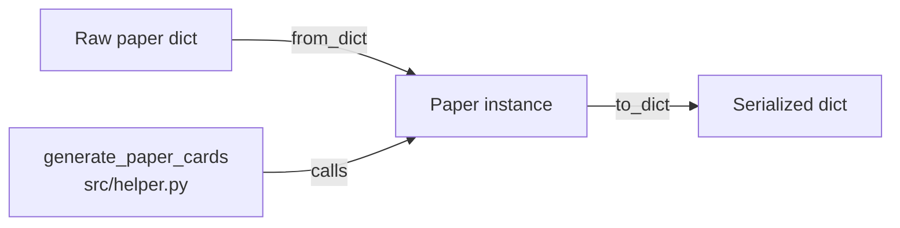

# Paper Data Model

# Paper Data Model

## Overview

The `paper_schema` module defines the canonical data structure for research papers across the application. It provides a validated, typed `Paper` dataclass along with serialization methods that enforce data integrity at the boundary between raw input (dictionaries) and the rest of the codebase.

## The `Paper` Dataclass

`Paper` is a `@dataclass` with five required fields and eight optional fields. The split is intentional: required fields represent the minimum viable paper record, while optional fields capture enrichment data that may not be available at ingestion time.

### Required Fields

| Field | Type | Description |
|-------|------|-------------|
| `id` | `str` | Unique identifier for the paper |
| `title` | `str` | Paper title |
| `authors` | `str` | Author names (stored as a single string, not a list) |
| `year` | `int` | Publication year |
| `tags` | `List[str]` | Category or topic tags |

### Optional Fields

| Field | Type | Default | Description |
|-------|------|---------|-------------|
| `publication_date` | `Optional[str]` | `None` | Full publication date (e.g., "2024-03-15") |
| `date_source` | `Optional[str]` | `None` | Origin of the publication date metadata |
| `thumbnail` | `Optional[str]` | `None` | URL to a preview/thumbnail image |
| `abstract` | `Optional[str]` | `None` | Paper abstract text |
| `project_page` | `Optional[str]` | `None` | URL to the project's website |
| `paper` | `Optional[str]` | `None` | URL to the paper PDF or publisher page |
| `code` | `Optional[str]` | `None` | URL to the source code repository |
| `video` | `Optional[str]` | `None` | URL to a video presentation or demo |

## Construction and Validation

### `Paper.from_dict(data: dict) -> Paper`

The primary entry point for creating `Paper` instances. It performs three layers of validation before construction:

1. **Required field check** — Raises `ValueError` if any of `id`, `title`, `authors`, `year`, or `tags` is missing from the input dictionary.

2. **Year normalization and range check** — Accepts `int`, `float`, or `str` types for `year`:
   - `str`: strips non-digit characters, then converts to `int` (e.g., `"2024"` or `"published: 2024"` → `2024`)
   - `float`: truncates to `int` (e.g., `2024.0` → `2024`)
   - `int`: used directly
   - Any other type raises `ValueError`
   
   After conversion, the year must fall within `[1900, current_year + 1]`. The upper bound accommodates preprints dated ahead of the current calendar year.

3. **Tags type check** — Ensures `tags` is a `list`. Does not validate individual tag contents.

After validation, all values are coerced to their target types via `str()`, `int()`, or `list()` constructors. Missing optional fields default to empty strings internally.

```python
# Minimal valid input
paper = Paper.from_dict({
    'id': 'paper-001',
    'title': 'Attention Is All You Need',
    'authors': 'Vaswani et al.',
    'year': 2017,
    'tags': ['transformers', 'nlp']
})

# Year as string with noise characters
paper = Paper.from_dict({
    'id': 'paper-002',
    'title': 'Another Paper',
    'authors': 'Smith',
    'year': 'published: 2023',
    'tags': ['cv']
})
# paper.year == 2023
```

### `Paper.to_dict() -> dict`

Serializes a `Paper` instance back to a dictionary. Optional fields that are empty strings are converted to `None` in the output, providing a clean representation where absent data is explicitly `None` rather than `""`.

```python
paper.to_dict()
# {
#   'id': 'paper-001',
#   'title': 'Attention Is All You Need',
#   'authors': 'Vaswani et al.',
#   'year': 2017,
#   'tags': ['transformers', 'nlp'],
#   'publication_date': None,
#   'date_source': None,
#   'thumbnail': None,
#   'abstract': None,
#   'project_page': None,
#   'paper': None,
#   'code': None,
#   'video': None
# }
```

## Integration Point

The module is consumed by `generate_paper_cards` in `src/helper.py`, which calls `Paper.from_dict` to transform raw paper data into validated `Paper` objects before rendering. This makes `from_dict` the de facto ingestion boundary for paper data flowing into the application.



## Design Notes

- **`authors` is a `str`, not a `List[str]`** — Author data arrives in varied formats (comma-separated, "et al.", etc.). The model stores it as-is rather than imposing a parsing structure that may not fit all sources.

- **Empty string vs. `None` asymmetry** — Internally, `from_dict` stores missing optional fields as `""` for simpler default handling. The `to_dict` method normalizes these back to `None` for external consumers. Code working with `Paper` attributes directly should account for both `None` and `""` as "absent" values.

- **No tag content validation** — `from_dict` only checks that `tags` is a list. It does not validate that individual tags are strings or non-empty. Downstream code should not assume well-formed tag entries.

- **Year string parsing is permissive** — The digit-stripping approach (`''.join(filter(str.isdigit, year_value))`) means strings like `"CVPR 2024"` resolve to `2024`, but also that `"2024a"` or `"12024"` would produce `2024` and `12024` respectively. The range check catches the latter; the former is a known edge case.