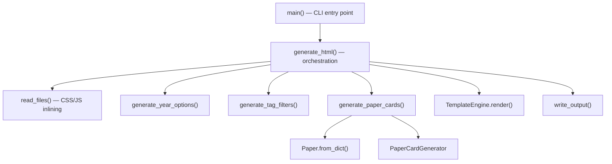

# Site Generation

# Site Generation Module

## Overview

This module generates a static HTML page from a YAML data source containing paper entries. It reads raw paper data, validates and converts it to domain objects, produces HTML fragments for filters and paper cards, inlines all CSS and JavaScript assets, and writes a single self-contained HTML file as output.

## Architecture



## Generation Pipeline

The full pipeline runs in this order:

1. **CLI invocation** — `main()` in `generate.py` receives `<input_yaml>` and `<output_html>` paths.
2. **YAML loading** — The input file is parsed with `yaml.safe_load`, producing a list of dictionaries.
3. **Asset inlining** — `read_files()` reads all CSS and JS files from `static/` and returns their contents as strings.
4. **HTML fragment generation** — Three helper functions produce HTML snippets:
   - `generate_year_options()` — `<option>` elements for the year dropdown filter.
   - `generate_tag_filters()` — `<div>` elements for the tag filter panel.
   - `generate_paper_cards()` — The complete set of paper card HTML (see [Paper Card Generation](#paper-card-generation)).
5. **Template rendering** — `TemplateEngine.render()` substitutes all context variables into `templates/index.html`.
6. **Output** — `write_output()` writes the final HTML string to disk.

## Key Components

### `generate.py` — Entry Point and Orchestrator

The CLI entry point. `main()` validates arguments (exactly two: input YAML path and output HTML path), loads the YAML data, and delegates to `generate_html()`.

`generate_html(entries, output_file)` is the core orchestration function. It:

- Resolves the base directory relative to the module's own location (`Path(__file__).parent`), making paths work regardless of working directory.
- Reads three CSS files and seven JS files (listed below) via `read_files()`.
- Builds a context dictionary and passes it to `TemplateEngine.render()`.
- Writes the result via `write_output()`.

**Inlined assets:**

| Type | Files |
|------|-------|
| CSS | `static/css/base.css`, `static/css/components.css`, `static/css/responsive.css` |
| JS | `static/js/state.js`, `static/js/utils.js`, `static/js/filters.js`, `static/js/selection.js`, `static/js/sharing.js`, `static/js/navigation.js`, `static/js/main.js` |

### `helper.py` — HTML Fragment Generators

Three functions that produce HTML fragments injected into the page template. All accept the raw list of entry dictionaries (not `Paper` objects).

**`generate_year_options(entries)`** — Extracts unique year values, sorts them descending, and produces `<option value="{y}">{y}</option>` elements.

**`generate_tag_filters(entries)`** — Collects all unique tags across entries, filters out any tag starting with `"Year "` (these are internal categorization tags not shown to users), sorts alphabetically, and produces `<div class="tag-filter" data-tag="{t}">{t}</div>` elements.

**`generate_paper_cards(entries)`** — The most complex fragment generator. It:
1. Converts each dictionary entry to a `Paper` object via `Paper.from_dict()`, skipping invalid entries with a warning printed to stdout.
2. Sorts papers (see [Sorting Logic](#sorting-logic)).
3. Delegates to `PaperCardGenerator.generate_cards()` for HTML output.

**`format_publication_date(date_str, date_source)`** — Formats an ISO date string as `"%B %d, %Y"` (e.g., "March 15, 2024"). Appends ` (est.)` when `date_source == 'estimated'`. Returns the raw string on parse failure. This function is available but not called within the current generation pipeline.

### `paper_generator.py` — `PaperCardGenerator`

Generates individual paper card HTML using the `templates/paper_card.html` template.

**Initialization:**

```python
card_generator = PaperCardGenerator(Path(__file__).parent / 'templates')
```

A module-level instance is created in `helper.py` and reused across calls.

**`generate_card(paper)`** — Renders a single card. The template context includes:

| Context Key | Source |
|-------------|--------|
| `id` | `paper.id` |
| `title` | `paper.title` |
| `authors` | `paper.authors` |
| `year` | `paper.year` |
| `tags_json` | `json.dumps(paper.tags)` — serialized for client-side JS consumption |
| `thumbnail` | `paper.thumbnail` or fallback `assets/thumbnails/{paper.id}.jpg` |
| `fallback_url` | Always `"None"` (string) |
| `tags_html` | Output of `_generate_tags()` |
| `links_html` | Output of `_generate_links()` |
| `abstract_html` | `paper.abstract` or empty string |

**`_generate_links(paper)`** — Produces link HTML in a fixed order:

1. **Paper** link (📄) — from `paper.paper`
2. **Project** link (🌐) — from `paper.project_page`
3. **Code** link (💻) — from `paper.code`
4. **Video** link (🎥) — from `paper.video`
5. **Abstract toggle** (📖) — a `<button>` and hidden `<div>` if `paper.abstract` exists

Any URL that is missing or has the string value `"None"` (case-insensitive) is omitted entirely. The abstract toggle is always last when present.

**`_generate_tags(paper)`** — Produces `<span class="paper-tag">` elements. Tags starting with `"Year "` are excluded (consistent with `generate_tag_filters`).

**`_generate_link(url, icon, text, emoji)`** — Low-level helper that produces an `<a>` tag with `target="_blank"` and `rel="noopener"`. Returns an empty string if the URL is falsy or equals `"None"` (case-insensitive).

### `template_engine.py` — `TemplateEngine`

A thin wrapper around Python's `string.Template`. Initialized with a template file path, which is read at construction time. The `render(context)` method calls `template.substitute(context)`, performing `$variable` substitution.

Because `string.Template.substitute` is used (not `safe_substitute`), any missing key in the context will raise a `KeyError`. All expected variables must be present.

### `utils.py` — File I/O Utilities

**`read_files(base_dir, file_paths)`** — Reads a list of relative file paths under `base_dir` and returns their contents as a list of strings. Used to inline CSS and JS assets.

**`write_output(output_file, content)`** — Writes a string to the specified output file with UTF-8 encoding.

## Sorting Logic

Papers are sorted in both `helper.generate_paper_cards()` and `PaperCardGenerator.generate_cards()` using the same three-level key (descending/reverse order):

1. **Publication date** — `paper.publication_date or '9999'`. Papers without a date sort to the end.
2. **First author's last name** — Extracted as `paper.authors.split(',')[0].strip().split()[-1].lower()`.
3. **Title** — `paper.title.lower()` for alphabetical tiebreaking.

Because `reverse=True` is applied, newer papers appear first, and within the same date, authors are sorted Z→A, titles Z→A.

## CLI Usage

```bash
python generate.py <input_yaml> <output_html>
```

- `<input_yaml>` — Path to a YAML file containing a list of paper entry dictionaries.
- `<output_html>` — Path where the generated HTML file will be written.

On success, prints `Successfully generated <output_html>` and exits with code 0. On invalid arguments or any exception during generation, prints an error message and exits with code 1.

## Data Flow and Validation

Raw YAML entries (dictionaries) flow through two paths:

- **Filter fragments** (`generate_year_options`, `generate_tag_filters`) consume raw dictionaries directly, using `.get("year")` and `entry["tags"]`.
- **Paper cards** (`generate_paper_cards`) validates each entry through `Paper.from_dict()`. Invalid entries are skipped with a warning that includes the entry's `id` and `title`. This means the card output may contain fewer papers than the YAML input if validation fails.

## Template Requirements

The `templates/index.html` template must define the following `$variables`:

| Variable | Content |
|----------|---------|
| `$styles` | Concatenated CSS from all three stylesheet files |
| `$scripts` | Concatenated JS from all seven script files |
| `$year_options` | HTML `<option>` elements for year filter |
| `$tag_filters` | HTML `<div>` elements for tag filter panel |
| `$paper_cards` | Full HTML for all paper cards |

The `templates/paper_card.html` template must define the variables listed in the `PaperCardGenerator` context table above.