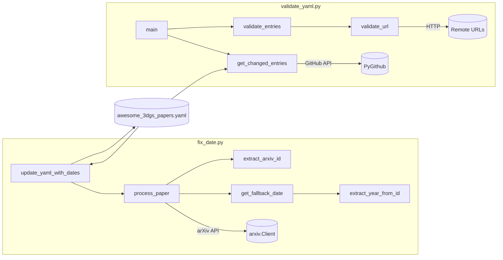

# YAML Data Processing

# YAML Data Processing Module

## Overview

This module manages the integrity and enrichment of a curated YAML database of 3D Gaussian Splatting papers (`awesome_3dgs_papers.yaml`). It provides two independent pipelines:

- **Date enrichment** (`fix_date.py`) — backfills missing `publication_date` fields by querying the arXiv API or estimating from paper metadata, then re-sorts the entire dataset.
- **Entry validation** (`validate_yaml.py`) — runs as a CI check on pull requests, validating tags and liveness of URLs for changed entries only.

Both scripts operate on the same YAML schema where each entry is a dictionary with keys like `id`, `title`, `authors`, `paper`, `tags`, `publication_date`, `date_source`, `project_page`, `code`, and `video`.

## Architecture



---

## `fix_date.py` — Publication Date Enrichment

### `YAMLUpdater`

The central class that orchestrates date resolution and file I/O.

#### Constructor

```python
YAMLUpdater()
```

Initializes an `arxiv.Client` instance and an empty `failed_papers` list to track entries that could not be resolved.

#### Date Resolution Pipeline

`process_paper(entry)` applies a two-tier strategy for each entry that lacks a `publication_date` key:

1. **arXiv lookup** — `extract_arxiv_id(url)` parses the paper URL for an arXiv identifier (pattern `\d{4}\.\d{4,5}(?:v\d+)?`). If found, the arXiv API is queried and `entry['publication_date']` is set to the paper's `published` timestamp in ISO format. `date_source` is set to `'arxiv'`.

2. **Fallback estimation** — `get_fallback_date(entry)` attempts to derive a year from:
   - The `id` field via `extract_year_from_id` (regex `20\d{2}`)
   - The `year` field (cast to `int`)
   
   If a year is found, `publication_date` is set to `YYYY-07-01T00:00:00` (mid-year approximation) and `date_source` is set to `'estimated'`.

If neither source yields a date, the paper ID and reason are appended to `self.failed_papers`.

#### Sorting

`safe_sort_key(x)` produces a tuple for deterministic sorting:

```
(publication_date, source_priority, last_name, title)
```

- `source_priority` ranks `'arxiv'` (0) above `'estimated'` (1) above `'unknown'` (2), so verified dates sort before estimated ones when dates are equal.
- `last_name` is extracted from the first comma-separated author.
- All string components are lowercased; missing values default to `'z'` or `'9999'` to push incomplete entries to the end.

#### `update_yaml_with_dates(filename)`

Main entry point. Execution flow:

1. Loads the YAML file via `yaml.safe_load`.
2. Filters entries missing `publication_date`.
3. Dispatches `process_paper` across a `ThreadPoolExecutor(max_workers=5)`.
4. Sorts the full dataset newest-first (`reverse=True`).
5. Writes back with `yaml.dump(sort_keys=False, allow_unicode=True)`.
6. Prints a summary of arXiv-sourced, estimated, and failed updates.

**Usage:**

```bash
python src/fix_date.py
```

This runs `YAMLUpdater().update_yaml_with_dates()` against the default file `awesome_3dgs_papers.yaml`.

### Rate Limiting Consideration

The arXiv API has rate limits. With `max_workers=5`, the script can hit these quickly on large datasets. If you encounter `HTTP 429` errors, reduce `max_workers` or add a `time.sleep()` call inside `process_paper` before the API query.

---

## `validate_yaml.py` — PR Entry Validation

Designed to run as a GitHub Actions check. It validates only entries that were added or modified in the current pull request, keeping CI fast and reviews focused.

### HTTP Session Configuration

A module-level `requests.Session` is configured with:

- **Retry policy** — 3 total retries, exponential backoff (factor 1), retrying on status codes `408`, `429`, `500`, `502`, `503`, `504`.
- **User-Agent header** — set to avoid blocks from academic sites.

### `validate_url(url, required=False)`

Checks URL reachability with a two-step strategy:

1. **HEAD request** — lightweight check for a valid response (status in `{200, 301, 302, 303, 307, 308}`).
2. **GET fallback** — if HEAD returns `405`, `400`, or `403`, a streaming GET is attempted and immediately closed.

Returns `None` on success, or an error string on failure (timeout, network error, bad status). The `required` flag controls whether a missing/empty URL is treated as an error.

### `get_changed_entries()`

Compares the current YAML against the PR base branch:

1. Reads `GITHUB_TOKEN`, `REPO`, and `PR_NUMBER` from environment variables.
2. Fetches the base version of the YAML from the repo at `pr.base.sha`.
3. Indexes base entries by `id`.
4. Returns entries that are new (`id` not in base) or modified (dict inequality).

If the file doesn't exist on the base branch, all entries are treated as new.

### `validate_entries(entries)`

Performs two categories of checks per entry:

**Tag validation:**
- At least one non-`Year ` tag must be present.
- Every tag must either start with `"Year "` or appear in the `allowed_tags` list (a module-level constant of ~60 curated categories like `"2DGS"`, `"SLAM"`, `"Meshing"`, etc.).

**URL validation:**
- `paper` — required. Must be reachable.
- `project_page`, `code`, `video` — optional, but if present must be reachable.
- A 1-second delay is inserted between URL checks to avoid rate-limiting.

Returns a list of error strings. An empty list means all entries passed.

### `main()`

Orchestrates the CI flow:

1. Calls `get_changed_entries()`.
2. If no changes, exits `0`.
3. Calls `validate_entries()`.
4. On errors, prints each one and exits `1`.
5. On success, prints confirmation and exits `0`.

**Required environment variables:**

| Variable | Purpose |
|---|---|
| `GITHUB_TOKEN` | Authenticate with the GitHub API |
| `REPO` | Full repository name (e.g., `owner/repo`) |
| `PR_NUMBER` | Pull request number to diff against |

**Usage:**

```bash
export GITHUB_TOKEN=ghp_...
export REPO=owner/awesome-3dgs
export PR_NUMBER=42
python src/validate_yaml.py
```

---

## YAML Entry Schema

Both scripts expect entries conforming to this structure:

| Field | Type | Required | Notes |
|---|---|---|---|
| `id` | `str` | Yes | Unique identifier, often `author2024keyword` format |
| `title` | `str` | Yes | Paper title |
| `authors` | `str` | Yes | Comma-separated author names |
| `paper` | `str` (URL) | Yes | Link to paper (arXiv or other) |
| `tags` | `list[str]` | Yes | Must use values from `allowed_tags` or `"Year YYYY"` |
| `publication_date` | `str` (ISO 8601) | No | Added by `fix_date.py` if missing |
| `date_source` | `str` | No | `'arxiv'` or `'estimated'`; set by `fix_date.py` |
| `project_page` | `str` (URL) | No | Validated if present |
| `code` | `str` (URL) | No | Validated if present |
| `video` | `str` (URL) | No | Validated if present |
| `year` | `int` or `str` | No | Used as fallback by `get_fallback_date` |

---

## Dependencies

| Package | Used In | Purpose |
|---|---|---|
| `arxiv` | `fix_date.py` | Query arXiv metadata API |
| `yaml` (PyYAML) | Both | Parse and serialize YAML |
| `requests` | `validate_yaml.py` | HTTP URL liveness checks |
| `urllib3` | `validate_yaml.py` | Retry configuration for requests |
| `github` (PyGithub) | `validate_yaml.py` | Fetch base branch content from GitHub |
| `concurrent.futures` | `fix_date.py` | Parallel arXiv lookups |

---

## Common Workflows

### Adding a new paper to the YAML

1. Add the entry with `id`, `title`, `authors`, `paper`, and `tags`. Omit `publication_date`.
2. Run `fix_date.py` to backfill the date and re-sort.
3. Commit the updated YAML. The PR validation will check your new entry's tags and URLs.

### Fixing a validation failure

- **Invalid tags** — replace with values from `allowed_tags` or use a `"Year YYYY"` tag.
- **URL returns 4xx/5xx** — verify the URL is correct and the site is up. Some academic sites block automated HEAD requests; the GET fallback handles most of these.
- **URL timed out** — may be transient; re-run the check. If persistent, the URL may be behind a restrictive firewall or geo-block.