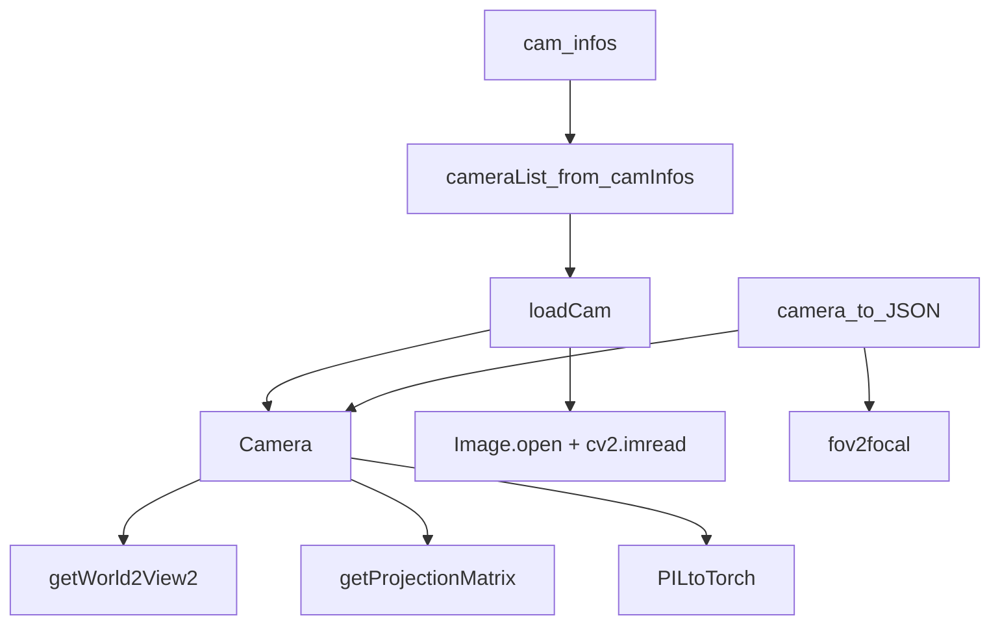

# Camera System

# Camera System

## Overview

The Camera System provides the geometric and photometric representation of input viewpoints for 3D Gaussian Splatting. It handles loading, resizing, and preprocessing of images and depth maps, and computes the coordinate transforms required for projection and rendering.

The module is split across two files:

- **`scene/cameras.py`** — Core camera data structures (`Camera`, `MiniCam`)
- **`utils/camera_utils.py`** — Factory functions and serialization helpers

## Architecture



## Core Classes

### `Camera` (`scene/cameras.py`)

An `nn.Module` that encapsulates a single training or test viewpoint with its full image, optional depth, and all derived geometric transforms.

**Constructor signature:**

```python
Camera(resolution, colmap_id, R, T, FoVx, FoVy, depth_params, image, invdepthmap,
       image_name, uid, trans=[0,0,0], scale=1.0, data_device="cuda",
       train_test_exp=False, is_test_dataset=False, is_test_view=False)
```

**Key parameters:**

| Parameter | Type | Description |
|---|---|---|
| `resolution` | `(int, int)` | Target `(width, height)` after resizing |
| `R` | `np.ndarray` | 3×3 world-to-camera rotation (COLMAP convention) |
| `T` | `np.ndarray` | 3×1 world-to-camera translation |
| `FoVx` / `FoVy` | `float` | Horizontal and vertical field of view in radians |
| `depth_params` | `dict` or `None` | Contains `scale`, `offset`, `med_scale` for depth normalization |
| `image` | `PIL.Image` | Input RGB(A) image |
| `invdepthmap` | `np.ndarray` or `None` | Inverse depth map (disparity) |
| `trans` | `np.ndarray` | Additional translation offset applied to the camera pose |
| `scale` | `float` | Uniform scale factor applied to the camera pose |
| `train_test_exp` | `bool` | Enables exposure-comparison masking (half-image masking) |

**Derived attributes (computed at construction):**

| Attribute | Shape | Description |
|---|---|---|
| `original_image` | `(3, H, W)` | Resized, clamped [0,1] RGB tensor on `data_device` |
| `alpha_mask` | `(1, H, W)` | Alpha channel or all-ones fallback |
| `invdepthmap` | `(1, H, W)` | Scaled/offset inverse depth on `data_device`, or `None` |
| `depth_mask` | `(1, H, W)` | Binary reliability mask for depth supervision |
| `depth_reliable` | `bool` | Whether this camera's depth is trustworthy |
| `world_view_transform` | `(4, 4)` | World-to-view matrix (transposed, on CUDA) |
| `projection_matrix` | `(4, 4)` | Perspective projection matrix (transposed, on CUDA) |
| `full_proj_transform` | `(4, 4)` | `world_view_transform @ projection_matrix` (on CUDA) |
| `camera_center` | `(3,)` | Camera position in world space, extracted from inverse W2V |

#### Image processing pipeline

1. The PIL image is converted via `PILtoTorch(image, resolution)` → `(C, H, W)` tensor.
2. Channels 0–2 become `original_image` (clamped to [0, 1]).
3. Channel 3 (if present) becomes `alpha_mask`; otherwise a ones mask is synthesized.
4. If `train_test_exp` is enabled and this is a test view, half the alpha mask is zeroed to support exposure evaluation — left half for `is_test_dataset`, right half otherwise.

#### Depth processing pipeline

1. The raw inverse depth map is resized to `resolution` via `cv2.resize`.
2. Negative values are clamped to 0.
3. If `depth_params` is provided, the scale is checked against `med_scale`: if `scale < 0.2 * med_scale` or `scale > 5 * med_scale`, the depth is marked unreliable and `depth_mask` is zeroed.
4. If `scale > 0`, the map is affine-transformed: `invdepthmap = invdepthmap * scale + offset`.
5. The result is squeezed to 2D, then unsqueezed to `(1, H, W)` and moved to `data_device`.

#### Transform conventions

All 4×4 matrices are stored **transposed** (column-major) to match CUDA/gsplat expectations. The `full_proj_transform` is computed as a batched matrix multiply of the (transposed) world-view and projection matrices. The `camera_center` is extracted from the last row, first three columns of the *inverse* of the (transposed) world-view transform.

---

### `MiniCam` (`scene/cameras.py`)

A lightweight, non-`nn.Module` camera representation that carries only geometric data — no images or depth. Used during the CUDA rasterization pass where only projection parameters are needed.

**Constructor signature:**

```python
MiniCam(width, height, fovy, fovx, znear, zfar, world_view_transform, full_proj_transform)
```

All transform arguments are expected to already be in the transposed convention. `camera_center` is derived identically to `Camera`: `view_inv[3][:3]`.

## Factory Functions (`utils/camera_utils.py`)

### `loadCam`

```python
loadCam(args, id, cam_info, resolution_scale, is_nerf_synthetic, is_test_dataset) -> Camera
```

Constructs a `Camera` from a `cam_info` dataclass and CLI arguments. Responsibilities:

1. **Image loading** — Opens `cam_info.image_path` as a PIL Image.
2. **Depth loading** — If `cam_info.depth_path` is non-empty, reads the 16-bit inverse depth map. For NeRF synthetic datasets the values are divided by 512; otherwise by 2¹⁶.
3. **Resolution computation** — Determined by `args.resolution` and `resolution_scale`:
   - **Integer mode** (`1`, `2`, `4`, `8`): `resolution = (orig_w / (resolution_scale × args.resolution), orig_h / ...)`
   - **Auto mode** (`-1`): If width > 1600px, a global downscale factor is applied with a one-time warning. Otherwise no downscale.
   - **Float mode**: `global_down = orig_w / args.resolution`, then `scale = global_down × resolution_scale`.
4. **Camera construction** — Passes all parameters through to the `Camera` constructor.

### `cameraList_from_camInfos`

```python
cameraList_from_camInfos(cam_infos, resolution_scale, args, is_nerf_synthetic, is_test_dataset) -> list[Camera]
```

Iterates over `cam_infos` and calls `loadCam` for each, returning a list of `Camera` objects indexed by enumeration order.

### `camera_to_JSON`

```python
camera_to_JSON(id, camera: Camera) -> dict
```

Serializes a `Camera` into a JSON-compatible dictionary containing:

| Key | Source |
|---|---|
| `id` | Passed-in `id` |
| `img_name` | `camera.image_name` |
| `width` / `height` | `camera.width` / `camera.height` |
| `position` | Camera-to-world translation from `R⁻¹` and `T` |
| `rotation` | Camera-to-world rotation (3×3 list-of-lists) |
| `fy` / `fx` | Computed via `fov2focal(FoVy, height)` / `fov2focal(FoVx, width)` |

Note: this function reconstructs the camera-to-world transform independently from `R` and `T` rather than using `camera_center` or `world_view_transform`, so it can serve as a cross-check.

## Integration Points

The Camera System is consumed by:

- **`scene/__init__.py`** — Calls `cameraList_from_camInfos` during scene construction and `camera_to_JSON` for export.
- **CUDA rasterizer** — Receives `MiniCam` instances (or `Camera` attributes) for frustum culling and projection during forward rendering.
- **Loss computation** — Reads `Camera.original_image`, `alpha_mask`, `invdepthmap`, and `depth_mask` for RGB, mask, and depth supervision losses.

## Common Patterns

**Adding a new camera attribute:** Add the parameter to `Camera.__init__`, store it, and update `loadCam` to pass it from `cam_info` or `args`.

**Custom depth normalization:** Modify the depth processing block in `Camera.__init__` or adjust the `depth_params` dict before it reaches the constructor.

**Changing resolution strategy:** Edit the branching logic in `loadCam`. The integer-mode path is used for explicit downscaling; the auto-mode path guards against excessively large inputs.