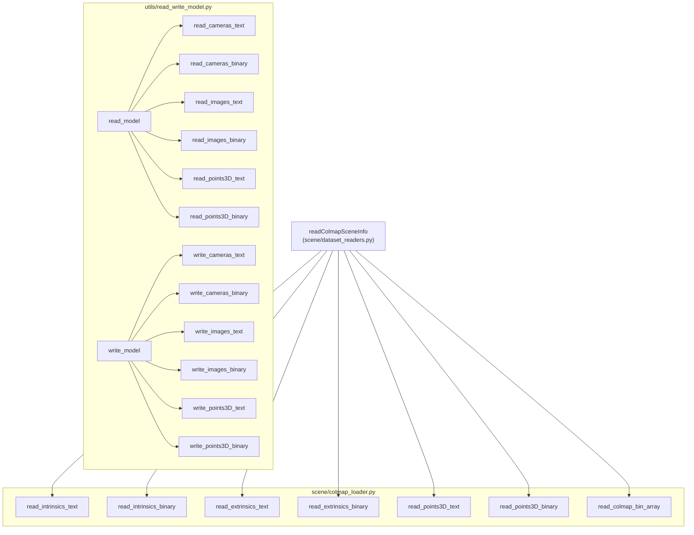

# COLMAP I/O

# COLMAP I/O Module

## Overview

This module provides Python readers and writers for COLMAP's reconstruction file formats — both human-readable text (`.txt`) and compact binary (`.bin`). It is split across two files that serve different roles in the codebase:

| File | Role |
|---|---|
| `scene/colmap_loader.py` | Read-only loader optimised for the scene-initialisation pipeline. Returns simplified data structures (e.g. flat NumPy arrays for 3D points). |
| `utils/read_write_model.py` | Full-featured read/write utility (derived from COLMAP's official scripts). Returns rich namedtuples with complete track information. Supports round-trip serialisation. |

Both files are self-contained and share no imports with each other; they duplicate the core data structures and low-level helpers intentionally so each can be used independently.

## Architecture



`scene/colmap_loader.py` is the entry point used at runtime by the Gaussian Splatting scene loader. `utils/read_write_model.py` is a general-purpose utility for offline model inspection, conversion, and round-tripping.

## Data Structures

All primary entities are represented as `namedtuple` instances (identical definitions in both files):

### `CameraModel(model_id, model_name, num_params)`

Metadata for a supported camera model. Used to resolve binary camera entries where only `model_id` is stored.

### `Camera(id, model, width, height, params)`

| Field | Type | Description |
|---|---|---|
| `id` | `int` | Unique camera identifier |
| `model` | `str` | Model name, e.g. `"PINHOLE"`, `"OPENCV"` |
| `width` | `int` | Image width in pixels |
| `height` | `int` | Image height in pixels |
| `params` | `np.ndarray` | Intrinsic parameters (length depends on model) |

### `Image(id, qvec, tvec, camera_id, name, xys, point3D_ids)`

| Field | Type | Description |
|---|---|---|
| `id` | `int` | Unique image identifier |
| `qvec` | `np.ndarray` (shape 4) | Quaternion `(w, x, y, z)` for camera orientation |
| `tvec` | `np.ndarray` (shape 3) | Translation vector for camera position |
| `camera_id` | `int` | References a `Camera.id` |
| `name` | `str` | Image filename |
| `xys` | `np.ndarray` (shape N×2) | 2D keypoint pixel coordinates |
| `point3D_ids` | `np.ndarray` (shape N) | Associated 3D point IDs (`-1` if unobserved`)` |

The `Image` class (extending `BaseImage`) adds a convenience method:

```python
img = Image(...)
R = img.qvec2rotmat()   # returns 3×3 rotation matrix from qvec
```

### `Point3D(id, xyz, rgb, error, image_ids, point2D_idxs)`

| Field | Type | Description |
|---|---|---|
| `id` | `int` | Unique 3D point identifier |
| `xyz` | `np.ndarray` (shape 3) | 3D position |
| `rgb` | `np.ndarray` (shape 3) | Colour as uint8 |
| `error` | `float` | Reprojection error |
| `image_ids` | `np.ndarray` | IDs of images observing this point (the "track") |
| `point2D_idxs` | `np.ndarray` | Corresponding 2D keypoint indices in each image |

> **Important difference:** `scene/colmap_loader.py`'s `read_points3D_text` and `read_points3D_binary` return `(xyzs, rgbs, errors)` as flat NumPy arrays — they discard point IDs and track data. `utils/read_write_model.py`'s equivalents return a `dict[int, Point3D]` with full track information, enabling round-trip writes.

## Camera Models

The `CAMERA_MODELS` set and the lookup dictionaries `CAMERA_MODEL_IDS` / `CAMERA_MODEL_NAMES` map between numeric IDs and model metadata:

| ID | Name | Params |
|---|---|---|
| 0 | `SIMPLE_PINHOLE` | 3 (`f, cx, cy`) |
| 1 | `PINHOLE` | 4 (`fx, fy, cx, cy`) |
| 2 | `SIMPLE_RADIAL` | 4 |
| 3 | `RADIAL` | 5 |
| 4 | `OPENCV` | 8 |
| 5 | `OPENCV_FISHEYE` | 8 |
| 6 | `FULL_OPENCV` | 12 |
| 7 | `FOV` | 5 |
| 8 | `SIMPLE_RADIAL_FISHEYE` | 4 |
| 9 | `RADIAL_FISHEYE` | 5 |
| 10 | `THIN_PRISM_FISHEYE` | 12 |

**Note:** `scene/colmap_loader.py`'s `read_intrinsics_text` asserts that the camera model is `"PINHOLE"`. The rest of the Gaussian Splatting pipeline assumes this model. `utils/read_write_model.py` supports all models without restriction.

## Rotation Conversions

Two standalone functions convert between quaternion and rotation-matrix representations:

### `qvec2rotmat(qvec) → np.ndarray (3×3)`

Converts a quaternion `(w, x, y, z)` to a 3×3 rotation matrix. Uses the standard formula for unit quaternions.

### `rotmat2qvec(R) → np.ndarray (shape 4)`

Converts a 3×3 rotation matrix back to a quaternion `(w, x, y, z)`. Uses Shepperd's method via the symmetric matrix `K` and eigendecomposition, ensuring numerical stability. The scalar part `w` is forced non-negative for canonical form.

Both functions are defined identically in each file.

## Low-Level Binary Helpers

### `read_next_bytes(fid, num_bytes, format_char_sequence, endian_character="<")`

Reads `num_bytes` from the open file handle `fid`, unpacks using `struct.unpack` with the given format string and little-endian byte order. Returns a tuple of unpacked values.

### `write_next_bytes(fid, data, format_char_sequence, endian_character="<")` *(utils only)*

Packs `data` (scalar or list/tuple) using `struct.pack` and writes to `fid`. This is the inverse of `read_next_bytes` and only exists in `utils/read_write_model.py`.

## Reading Functions

### `scene/colmap_loader.py` — Read API

These functions are called by `readColmapSceneInfo` in `scene/dataset_readers.py`.

| Function | Input | Returns |
|---|---|---|
| `read_intrinsics_text(path)` | `cameras.txt` | `dict[int, Camera]` (PINHOLE only) |
| `read_intrinsics_binary(path)` | `cameras.bin` | `dict[int, Camera]` |
| `read_extrinsics_text(path)` | `images.txt` | `dict[int, Image]` |
| `read_extrinsics_binary(path)` | `images.bin` | `dict[int, Image]` |
| `read_points3D_text(path)` | `points3D.txt` | `(xyzs, rgbs, errors)` — arrays of shape `(N,3)`, `(N,3)`, `(N,1)` |
| `read_points3D_binary(path)` | `points3D.bin` | `(xyzs, rgbs, errors)` — arrays of shape `(N,3)`, `(N,3)`, `(N,1)` |
| `read_colmap_bin_array(path)` | Dense binary file (depth/normal maps) | `np.ndarray` |

The points3D readers perform a two-pass read for text (first pass counts lines, second pass fills arrays) and a single-pass read for binary. Both discard track data (`image_ids`, `point2D_idxs`) and point IDs.

`read_colmap_bin_array` reads COLMAP's dense binary format (used for depth and normal maps). The header contains `width&height&channels` as text, followed by `float32` data in Fortran (column-major) order. The function transposes to row-major and squeezes singleton dimensions.

### `utils/read_write_model.py` — Read API

| Function | Input | Returns |
|---|---|---|
| `read_cameras_text(path)` | `cameras.txt` | `dict[int, Camera]` |
| `read_cameras_binary(path)` | `cameras.bin` | `dict[int, Camera]` |
| `read_images_text(path)` | `images.txt` | `dict[int, Image]` |
| `read_images_binary(path)` | `images.bin` | `dict[int, Image]` |
| `read_points3D_text(path)` | `points3D.txt` | `dict[int, Point3D]` |
| `read_points3D_binary(path)` | `points3D.bin` | `dict[int, Point3D]` |

All return fully-populated namedtuples with track data preserved.

## Writing Functions *(utils only)*

`scene/colmap_loader.py` has no write capability. All write functions live in `utils/read_write_model.py`:

| Function | Writes |
|---|---|
| `write_cameras_text(cameras, path)` | `cameras.txt` with header comment |
| `write_cameras_binary(cameras, path)` | `cameras.bin` |
| `write_images_text(images, path)` | `images.txt` (two lines per image) |
| `write_images_binary(images, path)` | `images.bin` |
| `write_points3D_text(points3D, path)` | `points3D.txt` with header comment |
| `write_points3D_binary(points3D, path)` | `points3D.bin` |

Text writers include COLMAP-compatible header comments with counts and statistics. Binary writers use `write_next_bytes` with the same format sequences the readers expect, ensuring round-trip fidelity.

## Convenience API *(utils only)*

### `read_model(path, ext="") → (cameras, images, points3D)`

Reads a complete COLMAP reconstruction from a directory. If `ext` is empty, auto-detects the format by checking for `cameras.bin`/`cameras.txt` (and the other two companion files). Returns three dictionaries.

### `write_model(cameras, images, points3D, path, ext=".bin") → (cameras, images, points3D)`

Writes a complete reconstruction to a directory. Default format is binary.

### `detect_model_format(path, ext) → bool`

Checks whether all three expected files (`cameras` + `ext`, `images` + `ext`, `points3D` + `ext`) exist in the given directory. Used internally by `read_model`.

## Binary Format Details

For developers modifying or extending the binary readers/writers, the COLMAP binary layout is:

**cameras.bin:** `Q` (num_cameras), then per camera: `iiQQ` (id, model_id, width, height) + `d×num_params` (params).

**images.bin:** `Q` (num_images), then per image: `idddddddi` (id, qw, qx, qy, qz, tx, ty, tz, camera_id) + null-terminated UTF-8 name string + `Q` (num_points2D) + `ddq×num_points2D` (x, y, point3D_id per keypoint).

**points3D.bin:** `Q` (num_points), then per point: `QdddBBBd` (id, x, y, z, r, g, b, error) + `Q` (track_length) + `ii×track_length` (image_id, point2D_idx per track element).

All multi-byte values are little-endian (`"<"`).

## Integration with the Codebase

The primary integration point is `readColmapSceneInfo` in `scene/dataset_readers.py`, which:

1. Calls `read_intrinsics_text` or `read_intrinsics_binary` to load camera intrinsics.
2. Calls `read_extrinsics_text` or `read_extrinsics_binary` to load per-image extrinsics.
3. Calls `read_points3D_text` or `read_points3D_binary` to load the sparse point cloud (used for initialisation / point sampling).
4. Calls `qvec2rotmat` to convert each image's quaternion to a rotation matrix for downstream camera-to-world transforms.
5. Optionally calls `read_colmap_bin_array` for depth priors.

`utils/read_write_model.py` is not imported by the runtime pipeline. It serves as a standalone utility for format conversion, model inspection, and debugging.