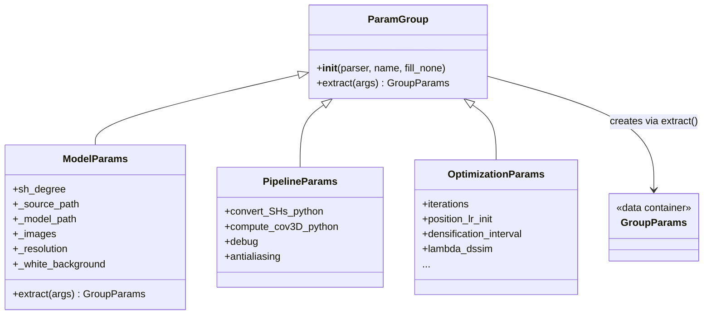

# Configuration & Parameters

# Configuration & Parameters

## Overview

The `arguments` module provides a structured, declarative system for defining, parsing, and extracting configuration parameters for 3D Gaussian Splatting training and rendering. It wraps Python's `argparse` with a class-based convention where instance attributes on a `ParamGroup` subclass are automatically promoted to CLI arguments, and parsed values can be extracted back into typed, namespaced objects.

## Architecture



## Core Classes

### `GroupParams`

A bare container class with no predefined attributes. Instances are populated dynamically by `ParamGroup.extract()` and serve as lightweight, attribute-accessible namespaces for a specific parameter group.

### `ParamGroup`

The base class that bridges instance attribute declarations and `argparse` argument registration.

**Shorthand convention:** Any instance attribute whose name starts with an underscore (`_`) is registered with both a long form (`--name`) and a single-letter shorthand (`-n`, using the first character of the name after stripping the underscore). The underscore is stripped from the final argument name.

| Attribute Declaration | CLI Flag | Shorthand |
|---|---|---|
| `self.sh_degree = 3` | `--sh_degree` | — |
| `self._source_path = ""` | `--source_path` | `-s` |
| `self._white_background = False` | `--white_background` | `-w` |

**Boolean handling:** `bool` attributes are registered with `action="store_true"` rather than accepting a value. The default is the attribute's initial value. This means `--white_background` enables it; omitting the flag leaves it at its default.

#### `__init__(self, parser, name, fill_none=False)`

Iterates over `vars(self)`, registers each attribute as an argument in a new argument group named `name`. When `fill_none=True`, all defaults are set to `None` instead of the attribute values — used by `ModelParams` with its sentinel pattern to create a parser that doesn't inject defaults.

#### `extract(self, args) → GroupParams`

Given a parsed `Namespace` (the full result of `parser.parse_args()`), pulls out only the keys that belong to this group (matching either the plain name or the underscore-prefixed declaration name) and returns them in a `GroupParams` instance.

## Parameter Groups

### `ModelParams` — Loading Parameters

Controls dataset and model I/O configuration.

| Attribute | Default | Shorthand | Description |
|---|---|---|---|
| `sh_degree` | `3` | — | Maximum spherical harmonics degree |
| `source_path` | `""` | `-s` | Path to the source dataset |
| `model_path` | `""` | `-m` | Path to the trained model directory |
| `images` | `"images"` | `-i` | Subdirectory name for input images |
| `depths` | `""` | `-d` | Subdirectory name for depth maps (empty = unused) |
| `resolution` | `-1` | `-r` | Input resolution (`-1` = native) |
| `white_background` | `False` | `-w` | Composite on white instead of black |
| `train_test_exp` | `False` | — | Enable separate exposure compensation for train/test |
| `data_device` | `"cuda"` | — | Device for data loading (`cuda` or `cpu`) |
| `eval` | `False` | — | Enable evaluation split during training |

**Sentinel pattern:** `ModelParams.__init__` accepts a `sentinel` flag. When `sentinel=False` (the default for normal use), `fill_none` is passed through to `ParamGroup.__init__`, causing all defaults to be `None`. This is used by `get_combined_args` to avoid the parser injecting defaults that would override saved config values.

**Path resolution:** `ModelParams.extract()` overrides the base method to resolve `source_path` to an absolute path via `os.path.abspath()`.

### `PipelineParams` — Pipeline Parameters

Controls which computation paths are active during rendering.

| Attribute | Default | Description |
|---|---|---|
| `convert_SHs_python` | `False` | Use Python-based SH conversion instead of CUDA |
| `compute_cov3D_python` | `False` | Use Python-based 3D covariance computation instead of CUDA |
| `debug` | `False` | Enable pipeline debug mode |
| `antialiasing` | `False` | Enable anti-aliasing during rasterization |

### `OptimizationParams` — Optimization Parameters

Controls all training hyperparameters, learning rate schedules, and densification behavior.

**Learning rates:**

| Attribute | Default | Description |
|---|---|---|
| `position_lr_init` | `0.00016` | Initial Gaussian position learning rate |
| `position_lr_final` | `0.0000016` | Final position learning rate (after delay + max steps) |
| `position_lr_delay_mult` | `0.01` | Multiplier applied during the delay warmup phase |
| `position_lr_max_steps` | `30_000` | Step count over which position LR decays |
| `feature_lr` | `0.0025` | SH color features learning rate |
| `opacity_lr` | `0.025` | Opacity learning rate |
| `scaling_lr` | `0.005` | Scaling learning rate |
| `rotation_lr` | `0.001` | Rotation learning rate |
| `exposure_lr_init` | `0.01` | Initial exposure compensation learning rate |
| `exposure_lr_final` | `0.001` | Final exposure compensation learning rate |
| `exposure_lr_delay_steps` | `0` | Steps before exposure LR begins decaying |
| `exposure_lr_delay_mult` | `0.0` | Exposure LR delay multiplier |

**Densification:**

| Attribute | Default | Description |
|---|---|---|
| `densify_from_iter` | `500` | First iteration to trigger densification |
| `densify_until_iter` | `15_000` | Last iteration to trigger densification |
| `densification_interval` | `100` | Iterations between densification passes |
| `densify_grad_threshold` | `0.0002` | Position gradient norm threshold for splitting/cloning |
| `opacity_reset_interval` | `3_000` | Iterations between opacity resets |
| `percent_dense` | `0.01` | Fraction of scene extent defining "overly dense" Gaussians |

**Loss and training:**

| Attribute | Default | Description |
|---|---|---|
| `iterations` | `30_000` | Total training iterations |
| `lambda_dssim` | `0.2` | Weight for D-SSIM loss term (`1 - lambda_dssim` for L1) |
| `depth_l1_weight_init` | `1.0` | Initial weight for depth L1 loss |
| `depth_l1_weight_final` | `0.01` | Final weight for depth L1 loss |
| `random_background` | `False` | Randomize background color each iteration |
| `optimizer_type` | `"default"` | Optimizer selection (`"default"` or `"sparse_adam"`) |

## Argument Merging

### `get_combined_args(parser) → Namespace`

Resumes training or applies overrides by merging two sources of configuration:

1. **Saved config file** — `<model_path>/cfg_args` containing a `Namespace()` string written during the initial training run.
2. **Command-line arguments** — current `sys.argv` overrides.

```python
# Typical usage at training resume:
parser = ArgumentParser()
model_params = ModelParams(parser, sentinel=True)  # sentinel=True → fill_none=True → no defaults injected
pipeline_params = PipelineParams(parser)
optim_params = OptimizationParams(parser)
args = get_combined_args(parser)
```

**Merge rule:** Values from the config file form the base. Any command-line value that is not `None` overwrites the config value. This means CLI flags only override when explicitly provided; omitted flags fall back to the saved configuration.

**Warning:** The function uses `eval()` to parse the config file contents. The file is expected to contain a valid Python `Namespace(...)` expression. This is safe when the config file is self-generated, but do not manually edit it with untrusted input.

## Usage Patterns

### Registering and parsing arguments

```python
from argparse import ArgumentParser
from arguments import ModelParams, PipelineParams, OptimizationParams

parser = ArgumentParser(description="Training script")
model_params = ModelParams(parser)
pipeline_params = PipelineParams(parser)
optim_params = OptimizationParams(parser)

args = parser.parse_args()
```

### Extracting typed parameter groups

After parsing, extract each group into its own namespace:

```python
model = model_params.extract(args)    # GroupParams with source_path, sh_degree, etc.
pipeline = pipeline_params.extract(args)
optim = optim_params.extract(args)

print(model.source_path)   # absolute path
print(optim.iterations)     # 30000
```

### Extending with a new parameter group

Subclass `ParamGroup`, declare attributes as instance variables, and call `super().__init__()`:

```python
class MyCustomParams(ParamGroup):
    def __init__(self, parser):
        self.custom_flag = False        # --custom_flag, store_true
        self._batch_size = 32           # --batch_size -b, int, default 32
        self.learning_rate = 0.001      # --learning_rate, float, default 0.001
        super().__init__(parser, "Custom Parameters")
```

Follow the underscore-prefix convention for any parameter that benefits from a short flag. Boolean attributes are automatically registered as `store_true` actions.