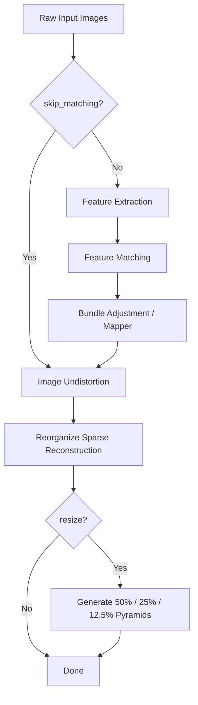

# Conversion

# Conversion Module

## Overview

`convert.py` is a standalone preprocessing script that transforms a directory of raw input images into a COLMAP-compatible dataset structure suitable for 3D Gaussian Splatting training. It wraps the full COLMAP Structure-from-Motion pipeline — feature extraction, matching, bundle adjustment, and image undistortion — and optionally generates multi-resolution image pyramids using ImageMagick.

The script is based on the shell converter provided in the MipNeRF 360 repository and is intended to be invoked directly from the command line before training.

## Pipeline



## Command-Line Arguments

| Argument | Short | Type | Default | Description |
|---|---|---|---|---|
| `--source_path` | `-s` | `str` | *required* | Root directory containing an `input/` subfolder with raw images |
| `--no_gpu` | — | flag | `False` | Disable GPU acceleration for COLMAP's SIFT extraction and matching |
| `--skip_matching` | — | flag | `False` | Skip feature extraction, matching, and mapping; go directly to undistortion (use when a COLMAP reconstruction already exists) |
| `--camera` | — | `str` | `OPENCV` | COLMAP camera model type (e.g., `SIMPLE_PINHOLE`, `PINHOLE`, `OPENCV`) |
| `--colmap_executable` | — | `str` | `""` | Path to the COLMAP binary. Defaults to `colmap` on `$PATH` |
| `--resize` | — | flag | `False` | Generate downsampled image pyramids at ½, ¼, and ⅛ resolution |
| `--magick_executable` | — | `str` | `""` | Path to the ImageMagick binary. Defaults to `magick` on `$PATH` |

## Expected Input Layout

```
<source_path>/
└── input/
    ├── image_001.jpg
    ├── image_002.jpg
    └── ...
```

The `input/` directory must contain the raw photographs. All other directories are created by the script.

## Output Structure

After a full run (with `--resize`), the directory tree becomes:

```
<source_path>/
├── input/                  # Original images (unchanged)
├── distorted/
│   ├── database.db         # COLMAP feature/matching database
│   └── sparse/
│       └── 0/              # Initial sparse reconstruction (before undistortion)
├── sparse/
│   └── 0/                  # Final sparse reconstruction (cameras, points, images bin files)
├── images/                 # Undistorted images (full resolution)
├── images_2/               # 50% resolution
├── images_4/               # 25% resolution
└── images_8/               # 12.5% resolution
```

## Pipeline Stages

### 1. Feature Extraction

Invokes `colmap feature_extractor` on the images in `input/`. Key parameters:

- `ImageReader.single_camera` is set to `1`, meaning all images share a single intrinsic model. Change `--camera` if your dataset requires per-image intrinsics or a different distortion model.
- `SiftExtraction.use_gpu` is controlled by `--no_gpu`.

Output: feature descriptors written to `distorted/database.db`.

### 2. Feature Matching

Invokes `colmap exhaustive_matcher` against the same database. Uses exhaustive matching (every image pair), which is appropriate for small-to-medium datasets. For very large datasets (hundreds of images), consider running COLMAP's sequential or spatial matcher manually instead.

Output: matches written to `distorted/database.db`.

### 3. Bundle Adjustment (Mapper)

Invokes `colmap mapper` to run incremental SfM, producing a sparse point cloud and camera poses. The global bundle adjustment tolerance is tightened to `0.000001` (from COLMAP's default), which speeds up convergence.

Output: sparse reconstruction in `distorted/sparse/0/`.

### 4. Image Undistortion

Invokes `colmap image_undistorter` to warp images into ideal pinhole intrinsics using the reconstruction from stage 3. This step always runs, even with `--skip_matching`.

Output: undistorted images in `images/`, and a clean sparse reconstruction in `sparse/`.

### 5. Sparse File Reorganization

COLMAP's `image_undistorter` writes the sparse reconstruction files directly into `sparse/` (not inside a `0/` subdirectory). The script moves them into `sparse/0/` to match the directory layout expected by the Gaussian Splatting training code.

### 6. Multi-Resolution Image Pyramids

When `--resize` is set, the script creates three downsampled copies of every image in `images/`:

| Directory | Scale | Use Case |
|---|---|---|
| `images_2` | 50% | Coarse training / preview |
| `images_4` | 25% | Coarse training |
| `images_8` | 12.5% | Coarse training |

Resizing is performed with `magick mogrify -resize`. Each image is first copied with `shutil.copy2` (preserving metadata), then resized in-place.

## Skipping Existing Reconstructions

If you already have a COLMAP reconstruction (e.g., from a prior run or manual processing), use `--skip_matching` to jump directly to the undistortion step. In this case, the script expects the reconstruction to exist at `<source_path>/distorted/sparse/0/`.

## Error Handling

Every COLMAP and ImageMagick invocation checks the process exit code. On failure, the script logs an error via `logging.error` and terminates immediately with the failing exit code. There is no partial recovery — fix the issue and re-run.

## Dependencies

- **COLMAP** — required for all SfM and undistortion steps. Must be on `$PATH` or specified via `--colmap_executable`.
- **ImageMagick** — required only when `--resize` is used. Must be on `$PATH` or specified via `--magick_executable`.

## Usage Examples

**Full pipeline with GPU:**
```bash
python convert.py -s /data/my_scene
```

**Full pipeline, force CPU for SIFT:**
```bash
python convert.py -s /data/my_scene --no_gpu
```

**Skip SfM, only undistort + resize:**
```bash
python convert.py -s /data/my_scene --skip_matching --resize
```

**Custom COLMAP binary and OPENCV camera model:**
```bash
python convert.py -s /data/my_scene --colmap_executable /usr/local/bin/colmap --camera OPENCV
```

## Limitations

- The script uses `exhaustive_matcher`, which has quadratic cost in the number of images. For datasets with more than ~200 images, consider running COLMAP manually with a sequential or vocabulary-tree matcher.
- `ImageReader.single_camera` is hardcoded to `1`. If your dataset uses multiple cameras with different intrinsics, you will need to modify the script or run COLMAP manually.
- The script provides no resumability — if it fails mid-way, you must re-run from the beginning or manually clean up partial outputs.
- Image resizing uses percentage-based scaling, so the absolute pixel dimensions depend on the input image size. There is no option to resize to a target pixel count.