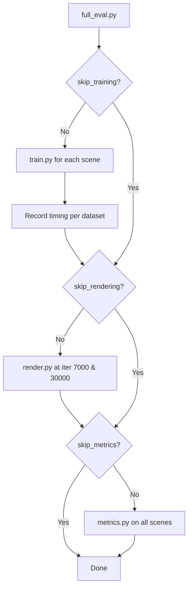

# Evaluation & Metrics

# Evaluation & Metrics

## Overview

This module provides image-quality evaluation for rendered scenes by computing three standard metrics—**PSNR**, **SSIM**, and **LPIPS**—against ground-truth images. It ships as two entry points:

- **`metrics.py`** — computes metrics on already-rendered output and writes JSON results.
- **`full_eval.py`** — orchestrates the full benchmark pipeline (train → render → metrics) across standard datasets.

Both are designed to be run as standalone CLI scripts.

---

## Metrics Computed

| Metric | Source | Range | Interpretation |
|--------|--------|-------|----------------|
| **PSNR** | `utils/image_utils.psnr` | 0–∞ dB | Higher is better. Peak signal-to-noise ratio derived from MSE. |
| **SSIM** | `utils.loss_utils.ssim` | 0–1 | Higher is better. Structural similarity using a Gaussian-windowed comparison of luminance, contrast, and structure. |
| **LPIPS** | `lpipsPyTorch.lpips` (VGG backbone) | 0–1 | Lower is better. Learned perceptual similarity via deep features. |

### PSNR Implementation

Defined in `utils/image_utils.py`:

```python
def mse(img1, img2):
    return (((img1 - img2)) ** 2).view(img1.shape[0], -1).mean(1, keepdim=True)

def psnr(img1, img2):
    mse = (((img1 - img2)) ** 2).view(img1.shape[0], -1).mean(1, keepdim=True)
    return 20 * torch.log10(1.0 / torch.sqrt(mse))
```

Both functions expect batched tensors in `[B, C, H, W]` format with values in `[0, 1]`. The `1.0` constant assumes the images are normalized to that range (which they are—see `readImages` below).

### SSIM Call Chain

`evaluate` calls `ssim` from `utils.loss_utils`, which internally calls `_ssim` after creating a Gaussian window via `create_window` → `gaussian`. This is the same SSIM used during training (called from `training_report` in `train.py`), ensuring consistency between training-time monitoring and final evaluation.

---

## Expected Directory Layout

`metrics.py` expects each model path to contain a `test/` directory with one subdirectory per method, each holding paired `renders/` and `gt/` folders with identically-named image files:

```
<model_path>/
└── test/
    └── <method_name>/
        ├── renders/
        │   ├── 0001.png
        │   ├── 0002.png
        │   └── ...
        └── gt/
            ├── 0001.png
            ├── 0002.png
            └── ...
```

This structure is produced by `render.py` when run with the `--eval` flag.

---

## `metrics.py` — Core Evaluation

### `readImages(renders_dir, gt_dir)`

Loads all images from both directories, matching by filename.

- Converts each image to a CUDA tensor via `tf.to_tensor` (PIL → `[0,1]` float tensor).
- Strips the alpha channel, keeping only the first 3 channels (`[:, :3, :, :]`).
- Returns three lists: `renders`, `gts`, `image_names`.

**Important:** Filenames must match exactly between `renders/` and `gt/`. The function iterates over `os.listdir(renders_dir)` and opens the same filename from `gt_dir`.

### `evaluate(model_paths)`

Main evaluation loop. For each scene directory in `model_paths`:

1. Iterates over every method subdirectory under `<scene>/test/`.
2. Calls `readImages` to load rendered and ground-truth pairs.
3. Computes SSIM, PSNR, and LPIPS per view (with a `tqdm` progress bar).
4. Prints aggregate means to stdout.
5. Writes two JSON files:

| File | Content |
|------|---------|
| `<scene>/results.json` | Aggregate mean per metric, per method |
| `<scene>/per_view.json` | Per-view metric values keyed by image name, per method |

Errors for individual scenes are caught and reported without halting the full evaluation.

### CLI Usage

```bash
python metrics.py -m <path1> <path2> ...
```

The `-m` / `--model_paths` argument accepts one or more scene directories.

---

## `full_eval.py` — Full Benchmark Pipeline

This script automates the complete evaluation workflow across three standard benchmark datasets:

| Dataset | Scenes | Image Resolution |
|---------|--------|-----------------|
| Mip-NeRF 360 (outdoor) | bicycle, flowers, garden, stump, treehill | `images_4` (1/4 res) |
| Mip-NeRF 360 (indoor) | room, counter, kitchen, bonsai | `images_2` (1/2 res) |
| Tanks and Temples | truck, train | full resolution |
| Deep Blending | drjohnson, playroom | full resolution |

### Execution Flow



### CLI Arguments

| Flag | Description |
|------|-------------|
| `--skip_training` | Skip the training phase |
| `--skip_rendering` | Skip the rendering phase |
| `--skip_metrics` | Skip metric computation |
| `--output_path` | Root output directory (default: `./eval`) |
| `--use_depth` | Pass `-d depths2/` to training |
| `--use_expcomp` | Enable exposure compensation training |
| `--fast` | Use `sparse_adam` optimizer |
| `--aa` | Enable antialiasing |
| `-m360` | Path to Mip-NeRF 360 dataset root (required if training or rendering) |
| `-tat` | Path to Tanks and Temples dataset root (required if training or rendering) |
| `-db` | Path to Deep Blending dataset root (required if training or rendering) |

### Training Phase

Each scene is trained with `--disable_viewer --quiet --eval --test_iterations -1`. Optional flags (`--antialiasing`, `-d depths2/`, exposure compensation args, `--optimizer_type sparse_adam`) are appended based on the CLI flags. Indoor Mip-NeRF 360 scenes use `-i images_2`; outdoor use `-i images_4`.

Training time is recorded per dataset group and written to `<output_path>/timing.txt`.

### Rendering Phase

Each scene is rendered at both iteration 7000 and iteration 30000 using `render.py --skip_train --eval`. The `--use_expcomp` and `--aa` flags propagate to rendering where applicable.

### Metrics Phase

Invokes `metrics.py` with all scene output directories, computing the three metrics across every rendered method.

---

## Integration with the Codebase

The evaluation module sits at the end of the Gaussian Splatting pipeline:

- **Training** (`train.py`) uses `ssim` and `psnr` from `utils/loss_utils` and `utils/image_utils` for on-the-fly reporting via `training_report`.
- **Rendering** (`render.py`) with `--eval` produces the `test/<method>/{renders,gt}` directory structure that `metrics.py` consumes.
- **Evaluation** (`metrics.py`) reuses the same `ssim` and `psnr` implementations, plus adds LPIPS for perceptual quality assessment.

This shared metric code ensures that numbers reported during training and final evaluation are directly comparable.

---

## Output Format

### `results.json`

```json
{
 "point_cloud_7000": {
  "SSIM": 0.9512,
  "PSNR": 28.342,
  "LPIPS": 0.087
 },
 "point_cloud_30000": {
  "SSIM": 0.9734,
  "PSNR": 31.105,
  "LPIPS": 0.042
 }
}
```

### `per_view.json`

```json
{
 "point_cloud_7000": {
  "SSIM": {"0001.png": 0.96, "0002.png": 0.94},
  "PSNR": {"0001.png": 29.1, "0002.png": 27.5},
  "LPIPS": {"0001.png": 0.07, "0002.png": 0.10}
 }
}
```

---

## Notes

- **GPU required.** `readImages` moves all tensors to CUDA (` .cuda()`). Running on CPU will fail.
- **Alpha channel handling.** Only RGB channels are retained (`:3`). RGBA ground-truth images are safe to use.
- **Error resilience.** `evaluate` wraps each scene in a try/except, so a single corrupt image or missing directory won't abort the entire batch.
- **LPIPS backbone.** The VGG network (`net_type='vgg'`) is used for all LPIPS computations. The `lpipsPyTorch` package must be installed and will download pretrained weights on first use.