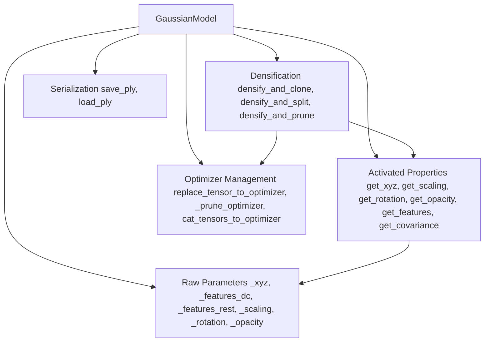

# Gaussian Model

# GaussianModel

The central data structure for 3D Gaussian Splatting. `GaussianModel` stores, optimizes, and manages the full set of Gaussian parameters — positions, spherical harmonic coefficients, scaling, rotation, and opacity — along with the infrastructure for adaptive densification, per-image exposure compensation, and PLY serialization.

## Architecture Overview

## Parameter Storage & Activations

All optimizable parameters are stored in their **raw (pre-activation) form** as `nn.Parameter` instances, prefixed with an underscore. Properties apply the corresponding activation function on access:

| Raw Parameter | Property | Activation | Inverse Activation |
|---|---|---|---|
| `_xyz` | `get_xyz` | None (identity) | — |
| `_scaling` | `get_scaling` | `torch.exp` | `torch.log` |
| `_rotation` | `get_rotation` | `F.normalize` (quaternion) | — |
| `_opacity` | `get_opacity` | `torch.sigmoid` | `inverse_sigmoid` |
| `_features_dc` | `get_features_dc` | None | — |
| `_features_rest` | `get_features_rest` | None | — |

The **covariance** is computed on-the-fly via `get_covariance(scaling_modifier)`, which calls `build_covariance_from_scaling_rotation` to construct the symmetric covariance matrix from the activated scaling and raw rotation, using `build_scaling_rotation` and `strip_symmetric`.

Spherical harmonic features are split into two groups:
- **`_features_dc`**: The DC (0th-order) SH coefficient — shape `(N, 1, 3)`.
- **`_features_rest`**: Higher-order SH coefficients — shape `(N, (max_sh_degree+1)² - 1, 3)`.

`get_features` concatenates both along dim=1, yielding shape `(N, (max_sh_degree+1)², 3)`.

## Initialization

### `create_from_pcd(pcd, cam_infos, spatial_lr_scale)`

Initializes all Gaussian parameters from a `BasicPointCloud`:

1. **Positions** — taken directly from `pcd.points`.
2. **Colors** — converted from RGB to SH DC coefficients via `RGB2SH`. Higher-order SH coefficients are zeroed.
3. **Scaling** — computed from KNN distances: `distCUDA2` finds the squared distance to the nearest neighbor for each point, then `log(sqrt(dist2))` is replicated across all 3 axes. This gives each Gaussian an initial size proportional to local point density.
4. **Rotation** — initialized to identity quaternion `(1, 0, 0, 0)`.
5. **Opacity** — initialized to `inverse_sigmoid(0.1)`, i.e., a raw value that maps through sigmoid to 0.1.
6. **Exposure** — per-camera 3×4 affine correction matrices, initialized to identity. A mapping from `image_name` to index is built from `cam_infos`.

### `load_ply(path, use_train_test_exp)`

Restores all parameters from a PLY file. Parses vertex attributes by naming convention (`f_dc_*`, `f_rest_*`, `scale_*`, `rot_*`, `opacity`). Sets `active_sh_degree = max_sh_degree`. Optionally loads pretrained exposure parameters from a sibling `exposure.json` file.

## Training Setup & Learning Rate Scheduling

### `training_setup(training_args)`

Configures the optimizer with six parameter groups, each with its own learning rate:

| Group Name | Parameter | Learning Rate |
|---|---|---|
| `xyz` | `_xyz` | `position_lr_init × spatial_lr_scale` |
| `f_dc` | `_features_dc` | `feature_lr` |
| `f_rest` | `_features_rest` | `feature_lr / 20.0` |
| `opacity` | `_opacity` | `opacity_lr` |
| `scaling` | `_scaling` | `scaling_lr` |
| `rotation` | `_rotation` | `rotation_lr` |

Two optimizer types are supported:
- **`"default"`** — standard `torch.optim.Adam` (eps=1e-15).
- **`"sparse_adam"`** — `SparseGaussianAdam` from the diff-gaussian-rasterization package, falling back to Adam if unavailable.

A separate `exposure_optimizer` (Adam) manages `_exposure` parameters.

Position and exposure learning rates follow exponential decay schedules built by `get_expon_lr_func`, stored in `xyz_scheduler_args` and `exposure_scheduler_args`.

### `update_learning_rate(iteration)`

Called each training step. Updates the `xyz` param group's learning rate via `xyz_scheduler_args`. If no pretrained exposures are loaded, also updates the exposure learning rate. Returns the new xyz learning rate.

### `oneupSHdegree()`

Increments `active_sh_degree` by 1 (up to `max_sh_degree`). Called periodically during training to progressively enable higher-order SH coefficients.

## Densification

Densification is the core adaptive mechanism that grows and prunes the Gaussian set during training. It operates on view-space positional gradient statistics accumulated via `add_densification_stats`.

### `add_densification_stats(viewspace_point_tensor, update_filter)`

Accumulates the L2 norm of view-space gradients into `xyz_gradient_accum` and increments `denom` for points visible in the current frame (indicated by `update_filter`). These running averages drive densification decisions.

### `densify_and_prune(max_grad, min_opacity, extent, max_screen_size, radii)`

The main entry point called from the training loop. Orchestrates the full densification cycle:

1. Computes average gradients: `xyz_gradient_accum / denom` (NaN-safe).
2. **Clones** small Gaussians with high gradients via `densify_and_clone`.
3. **Splits** large Gaussians with high gradients via `densify_and_split`.
4. **Prunes** Gaussians that are too transparent (`opacity < min_opacity`), too large in screen space (`max_radii2D > max_screen_size`), or too large in world space (`max scaling > 0.1 × extent`).

### `densify_and_clone(grads, grad_threshold, scene_extent)`

Duplicates Gaussians whose gradient norm exceeds `grad_threshold` **and** whose maximum scale is at most `percent_dense × scene_extent`. Cloned points inherit all properties of the source. This handles under-reconstruction in regions where Gaussians are small enough.

### `densify_and_split(grads, grad_threshold, scene_extent, N=2)`

Replaces large Gaussians (gradient above threshold **and** max scale > `percent_dense × scene_extent`) with `N` smaller ones:

1. Samples `N` offset positions from a Gaussian distribution scaled by the current scaling and rotated by the current rotation.
2. New scaling = `current_scaling / (0.8 × N)` (slightly smaller to maintain coverage).
3. New rotation and SH features are copied from the parent.
4. The original parent point is pruned after the children are added.

### `prune_points(mask)`

Removes all points where `mask` is `True`. Delegates to `_prune_optimizer` to correctly slice optimizer state (exp_avg, exp_avg_sq) along with the parameters. Also prunes `xyz_gradient_accum`, `denom`, `max_radii2D`, and `tmp_radii`.

### `reset_opacity()`

Clamps all opacities to at most 0.01 (after sigmoid), then converts back to raw values. Used periodically during training to force the model to rely on geometry rather than opacity for rendering. Implemented via `replace_tensor_to_optimizer`.

## Optimizer State Management

Densification operations must keep optimizer momentum buffers (Adam's `exp_avg` and `exp_avg_sq`) consistent with the changing parameter tensors. Three internal methods handle this:

- **`_prune_optimizer(mask)`** — Slices optimizer state and parameters using a boolean mask. Points where `mask` is `True` are **kept**.
- **`cat_tensors_to_optimizer(tensors_dict)`** — Appends new parameter rows and zero-initialized momentum buffers to existing optimizer state.
- **`replace_tensor_to_optimizer(tensor, name)`** — Replaces a parameter entirely (e.g., during `reset_opacity`), resetting its momentum buffers to zero.

All three return a dict mapping group names to the new `nn.Parameter` objects, which are then assigned back to the model's raw parameter attributes.

## Serialization

### `save_ply(path)`

Writes all Gaussian parameters to a PLY file. Attributes are named following the convention used by `construct_list_of_attributes`: `x/y/z`, `nx/ny/nz` (zeros), `f_dc_0..2`, `f_rest_0..M`, `opacity`, `scale_0..2`, `rot_0..3`. The directory is created via `mkdir_p` if it doesn't exist.

### `load_ply(path, use_train_test_exp)`

Reads a PLY file and reconstructs all parameters. SH features are parsed by naming convention and reshaped to `(N, 3, SH_coeffs)`. When `use_train_test_exp` is `True`, attempts to load pretrained exposure matrices from `exposure.json` two directories up from the PLY file.

## State Capture & Restoration

### `capture()`

Returns a tuple of all model state needed to resume training: active SH degree, all raw parameters, `max_radii2D`, gradient accumulators, `denom`, optimizer state dict, and `spatial_lr_scale`.

### `restore(model_args, training_args)`

Reconstructs the model from a `capture()` tuple. Calls `training_setup` to reinitialize the optimizer, then reloads the saved optimizer state dict and gradient accumulators.

## Exposure Compensation

The model maintains per-camera 3×4 affine exposure correction matrices (`_exposure`), optimized separately from the main Gaussians.

- **`get_exposure`** — Returns the full `_exposure` parameter tensor.
- **`get_exposure_from_name(image_name)`** — Looks up the exposure for a specific image. If `pretrained_exposures` is set (loaded from `exposure.json`), returns the fixed pretrained value; otherwise returns the learnable parameter at the mapped index.

The exposure optimizer and scheduler are managed independently in `training_setup` and `update_learning_rate`.

## Integration with the Codebase

| Caller | Method Called | Purpose |
|---|---|---|
| `Scene.__init__` | `create_from_pcd` / `load_ply` | Initialize or restore the Gaussian set |
| `Scene.save` | `save_ply`, `get_exposure_from_name` | Persist model to disk |
| `train.py` training loop | `training_setup`, `update_learning_rate`, `oneupSHdegree`, `densify_and_prune`, `reset_opacity`, `add_densification_stats`, `capture`, `restore` | Full training lifecycle |
| `GaussianRenderer.render` | `get_covariance`, `get_exposure_from_name` | Access activated parameters for rasterization |