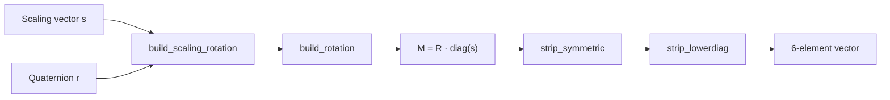

# General Utilities

# General Utilities

This module provides foundational utilities for the 3D Gaussian Splatting pipeline, spanning mathematical helpers for covariance/rotation computation, learning rate scheduling, image conversion, filesystem operations, and depth map scaling. It is organized across three files:

| File | Domain |
|---|---|
| `utils/general_utils.py` | Math, learning rate, image I/O, reproducibility |
| `utils/system_utils.py` | Filesystem and checkpoint iteration helpers |
| `utils/make_depth_scale.py` | Standalone depth scale/offset computation script |

---

## Covariance and Rotation Pipeline

The most critical functions in this module form a pipeline that constructs and compresses 3D covariance matrices for Gaussian primitives. This is the core geometric computation underpinning how each Gaussian's shape is represented.



### `build_rotation(r)`

Converts a batch of quaternions to 3×3 rotation matrices using the standard quaternion-to-rotation formula.

**Parameters:**
- `r` — Tensor of shape `(N, 4)` in **(w, x, y, z)** order (scalar-first convention).

**Returns:** Tensor of shape `(N, 3, 3)` with rotation matrices on CUDA.

**Details:** Quaternions are normalized before conversion. The implementation follows the standard formula:

```
R = [1-2(y²+z²)   2(xy-wz)   2(xz+wy)]
    [2(xy+wz)   1-2(x²+z²)   2(yz-wx)]
    [2(xz-wy)     2(yz+wx)   1-2(x²+y²)]
```

**Called by:** `build_scaling_rotation`, and directly by `densify_and_split` in `GaussianModel` when splitting Gaussians (new Gaussians inherit the parent's rotation but need it as a matrix for covariance recomputation).

### `build_scaling_rotation(s, r)`

Constructs the combined scaling-rotation matrix **M = R · diag(s)** for each Gaussian in the batch.

**Parameters:**
- `s` — Tensor of shape `(N, 3)`, per-axis scaling factors.
- `r` — Tensor of shape `(N, 4)`, quaternions in (w, x, y, z) order.

**Returns:** Tensor of shape `(N, 3, 3)` on CUDA. Each matrix is the product of the rotation matrix and the diagonal scaling matrix.

**Called by:** `build_covariance_from_scaling_rotation` in `GaussianModel`, which then computes the full covariance as **Σ = M · Mᵀ**.

### `strip_lowerdiag(L)` / `strip_symmetric(sym)`

Extracts the 6 unique elements from a batch of symmetric 3×3 matrices by taking the lower triangle.

**Parameters:**
- `L` / `sym` — Tensor of shape `(N, 3, 3)`, symmetric matrices.

**Returns:** Tensor of shape `(N, 6)` with elements in order: `[L₀₀, L₀₁, L₀₂, L₁₁, L₁₂, L₂₂]`.

`strip_symmetric` is a thin wrapper that delegates to `strip_lowerdiag`. The distinction exists because for symmetric matrices the lower and upper triangles are identical, but the naming clarifies intent at call sites.

**Called by:** `build_covariance_from_scaling_rotation` in `GaussianModel`, after computing **Σ = M · Mᵀ** (which is symmetric by construction), to obtain the compact 6-element representation stored per Gaussian.

---

## Learning Rate Scheduling

### `get_expon_lr_func(lr_init, lr_final, lr_delay_steps=0, lr_delay_mult=1.0, max_steps=1000000)`

Returns a closure that computes a log-linearly interpolated (exponentially decaying) learning rate for a given step, with an optional warmup delay.

**Parameters:**
- `lr_init` — Initial learning rate at step 0.
- `lr_final` — Final learning rate at step `max_steps`.
- `lr_delay_steps` — Number of warmup steps. If > 0, the rate is scaled down at the start and eased back to normal.
- `lr_delay_mult` — Multiplier applied at step 0 during warmup. The effective initial rate becomes `lr_init * lr_delay_mult`.
- `max_steps` — Total optimization steps.

**Returns:** A callable `helper(step) -> float`.

**Behavior:**

1. If `step < 0` or both `lr_init` and `lr_final` are 0, returns `0.0` (parameter is disabled).
2. **Warmup phase** (when `lr_delay_steps > 0` and `step < lr_delay_steps`): A smooth scaling factor is applied using a half-cosine ramp: `delay_rate = lr_delay_mult + (1 - lr_delay_mult) * sin(π/2 · step/lr_delay_steps)`. This starts at `lr_delay_mult` and reaches 1.0 at `step = lr_delay_steps`.
3. **Exponential decay**: The base rate is `exp(log(lr_init) · (1-t) + log(lr_final) · t)` where `t = clip(step / max_steps, 0, 1)`. This is equivalent to log-linear interpolation between `lr_init` and `lr_final`.
4. The final rate is `delay_rate * log_lerp`.

**Called by:** `training_setup` in `GaussianModel` (for setting up parameter group schedulers) and `training` in `train.py` (for the main training loop scheduler).

---

## Image Conversion

### `PILtoTorch(pil_image, resolution)`

Converts a PIL image to a PyTorch tensor in CHW format with values in [0, 1].

**Parameters:**
- `pil_image` — A PIL Image object.
- `resolution` — Target resolution as a `(width, height)` tuple (passed to PIL's `resize`).

**Returns:** Float tensor in `(C, H, W)` layout. Grayscale images get an explicit channel dimension (`1, H, W`).

**Called by:** `Camera.__init__` when loading ground-truth images for training.

### `inverse_sigmoid(x)`

Computes the logit function: `log(x / (1 - x))`. This is the mathematical inverse of the sigmoid activation, used to convert probabilities back to logit-space parameters.

---

## Reproducibility and Logging

### `safe_state(silent)`

Initializes a deterministic random state and optionally silences stdout.

**Parameters:**
- `silent` — If `True`, suppresses all stdout output. If `False`, each line is timestamped with `[dd/mm HH:MM:SS]`.

**Side effects:**
- Seeds `random`, `numpy`, and `torch` (CPU) with seed `0`.
- Sets the CUDA device to `cuda:0`.
- Replaces `sys.stdout` with a custom wrapper that either suppresses or timestamps output.

**Note:** This does **not** set `torch.cuda.manual_seed`, so GPU-side RNG is not fully deterministic from this function alone.

---

## Filesystem Utilities (`system_utils.py`)

### `mkdir_p(folder_path)`

Creates a directory and all parent directories, equivalent to `mkdir -p`. Silently ignores `EEXIST` errors when the directory already exists; re-raises all other errors.

**Called by:** `save_ply` in `GaussianModel` when writing output point clouds.

### `searchForMaxIteration(folder)`

Scans a folder for checkpoint iteration files and returns the highest iteration number. Expects filenames to follow the pattern `*_N` where `N` is the iteration count (extracted by splitting on `_` and taking the last element as an integer).

**Called by:** `Scene.__init__` to find the latest checkpoint when loading a trained model.

---

## Depth Scale Computation (`make_depth_scale.py`)

A standalone script that computes per-image scale and offset parameters to align monocular depth predictions with COLMAP's sparse reconstruction. This is used as a preprocessing step when incorporating monocular depth priors.

### `get_scales(key, cameras, images, points3d_ordered, args)`

Computes the scale and offset for a single image by comparing COLMAP-projected inverse depths against a monocular inverse depth map.

**Algorithm:**

1. Projects 3D points into the camera frame using the image's extrinsics (`qvec`, `tvec`).
2. Computes inverse COLMAP depth (`1 / z`) at each observed 2D keypoint.
3. Reads the corresponding monocular inverse depth map from disk and resamples it at the keypoint locations using `cv2.remap`.
4. Computes a robust alignment using **median and mean absolute deviation**:
   - `scale = MAD_colmap / MAD_mono`
   - `offset = median_colmap - median_mono × scale`
5. Returns `None` if fewer than 10 valid correspondences exist or if the COLMAP depth range is degenerate.

**Returns:** `{"image_name": str, "scale": float, "offset": float}` or `None`.

### Main script flow

1. Reads the COLMAP sparse model from `<base_dir>/sparse/0/`.
2. Builds an ordered array of 3D point coordinates indexed by point ID.
3. Parallelizes `get_scales` across all images using `joblib.Parallel` (threading backend).
4. Writes the resulting `{image_name: {scale, offset}}` mapping to `<base_dir>/sparse/0/depth_params.json`.

**Usage:**
```
python make_depth_scale.py --base_dir <path> --depths_dir <path> --model_type bin
```

**Known issue:** The function body references `images_metas` (the parameter name in `main`) instead of the formal parameter `images`, causing a `NameError` at runtime. This is a bug in the source — the reference on the `pts_idx` line should use `images` rather than `images_metas`.

---

## Integration Map

The following summarizes how the rest of the codebase depends on this module:

| Caller | Callee | Purpose |
|---|---|---|
| `GaussianModel.build_covariance_from_scaling_rotation` | `build_scaling_rotation` → `build_rotation` | Construct per-Gaussian covariance matrices |
| `GaussianModel.build_covariance_from_scaling_rotation` | `strip_symmetric` → `strip_lowerdiag` | Compress symmetric covariance to 6-element form |
| `GaussianModel.densify_and_split` | `build_rotation` | Reconstruct rotation matrix when splitting Gaussians |
| `GaussianModel.training_setup` | `get_expon_lr_func` | Create LR schedulers for each parameter group |
| `train.py` training loop | `get_expon_lr_func` | Create the main position LR scheduler |
| `Camera.__init__` | `PILtoTorch` | Load GT images as tensors |
| `GaussianModel.save_ply` | `mkdir_p` | Ensure output directory exists |
| `Scene.__init__` | `searchForMaxIteration` | Find latest checkpoint to resume from |