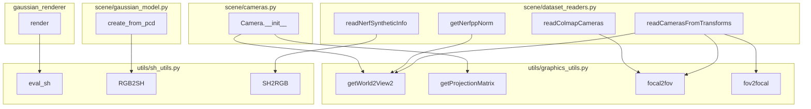

# Graphics & Math Utilities

# Graphics & Math Utilities

This module provides the foundational geometric, projection, and spherical harmonics computations used across the 3D Gaussian Splatting pipeline. It is split into two files:

- **`utils/graphics_utils.py`** — Camera coordinate transforms, perspective projection, and FOV/focal conversions
- **`utils/sh_utils.py`** — Spherical harmonics (SH) basis evaluation and color-space conversion

Both files are stateless: every function is pure and operates on NumPy arrays or PyTorch tensors passed as arguments.

## Module Architecture



---

## `utils/graphics_utils.py`

### `BasicPointCloud`

A `NamedTuple` representing a 3D point cloud with per-point attributes:

| Field | Type | Description |
|-------|------|-------------|
| `points` | `np.array` | `(N, 3)` vertex positions |
| `colors` | `np.array` | `(N, 3)` RGB colors |
| `normals` | `np.array` | `(N, 3)` surface normals |

Used as the interchange format when initializing a Gaussian model from an input point cloud (e.g., from SfM or COLMAP).

---

### `geom_transform_points(points, transf_matrix)`

Applies a 4×4 homogeneous transformation to a set of 3D points.

**Parameters:**
- `points` — `torch.Tensor` of shape `(P, 3)`
- `transf_matrix` — `torch.Tensor` of shape `(4, 4)`

**Returns:** `torch.Tensor` of shape `(P, 3)` — the transformed points.

**How it works:**
1. Appends a column of ones to create homogeneous coordinates `(P, 4)`.
2. Right-multiplies by the (broadcast) transformation matrix.
3. Performs perspective division by the `w` component, with a small epsilon (`1e-7`) added to the denominator to avoid division by zero.

This handles both affine and projective transforms correctly. The `squeeze(dim=0)` on the output removes the batch dimension introduced by `unsqueeze(0)` on the matrix.

---

### `getWorld2View(R, t)`

Builds a 4×4 world-to-camera (view) matrix from a rotation and translation.

**Parameters:**
- `R` — `np.array` of shape `(3, 3)`, the camera orientation (world→camera rotation)
- `t` — `np.array` of shape `(3,)`, the camera translation in camera space

**Returns:** `np.float32` array of shape `(4, 4)`

The matrix is constructed as:

```
| R^T | t |
| 0 0 0| 1 |
```

Note that `R` is transposed before insertion, which means the input `R` is expected to be the **camera-to-world** rotation (the convention used by many dataset formats), and the transpose converts it to world-to-camera.

---

### `getWorld2View2(R, t, translate, scale)`

Extended version of `getWorld2View` that re-centers and optionally rescales the scene around the camera.

**Parameters:**
- `R` — `np.array(3, 3)`, camera-to-world rotation
- `t` — `np.array(3,)`, camera translation
- `translate` — `np.array(3,)`, offset added to the camera center (default `[0, 0, 0]`)
- `scale` — `float`, multiplicative scale applied to the camera center (default `1.0`)

**Returns:** `np.float32` array of shape `(4, 4)`

**How it works:**
1. Builds the standard world-to-view matrix `Rt`.
2. Inverts it to get the camera-to-world matrix `C2W`.
3. Extracts the camera center `C2W[:3, 3]`, applies `(center + translate) * scale`.
4. Writes the transformed center back and inverts again to produce the final world-to-view matrix.

This is the primary function used during scene loading. The `translate` and `scale` parameters allow normalizing the scene so all cameras are centered and at a consistent scale — critical for stable optimization. Called from both `Camera.__init__` and `getNerfppNorm`.

---

### `getProjectionMatrix(znear, zfar, fovX, fovY)`

Constructs a symmetric perspective projection matrix for a Vulkan-style clip space (depth range `[0, 1]`).

**Parameters:**
- `znear` — `float`, distance to the near plane
- `zfar` — `float`, distance to the far plane
- `fovX` — `float`, full horizontal field of view in radians
- `fovY` — `float`, full vertical field of view in radians

**Returns:** `torch.Tensor` of shape `(4, 4)`

The matrix follows the standard symmetric frustum form:

```
| 2n/(r-l)    0       (r+l)/(r-l)       0       |
|    0     2n/(t-b)   (t+b)/(t-b)       0       |
|    0        0        f/(f-n)     -fn/(f-n) |
|    0        0           1             0       |
```

Where `n = znear`, `f = zfar`, and `t, b, r, l` are derived from the FOV angles. Because the frustum is symmetric, `r = -l` and `t = -b`, which zeros out the off-center terms `(r+l)/(r-l)` and `(t+b)/(t-b)` — though they are computed and stored for generality.

The `z_sign = 1.0` hardcodes a forward-looking depth convention. Row 3 (`P[3, 2] = z_sign`) maps the view-space z into the w clip component, enabling perspective division.

---

### `fov2focal(fov, pixels)`

Converts a field of view angle to a focal length in pixel units.

```python
focal = pixels / (2 * tan(fov / 2))
```

**Parameters:**
- `fov` — `float`, full field of view in radians
- `pixels` — `float`, image dimension (width or height) in pixels

**Returns:** `float` — focal length in pixels

Used when parsing NeRF Synthetic datasets where only FOV is provided but the renderer needs focal length.

---

### `focal2fov(focal, pixels)`

Inverse of `fov2focal`. Converts a focal length in pixels to a field of view in radians.

```python
fov = 2 * atan(pixels / (2 * focal))
```

Used when parsing COLMAP datasets where focal length is known but the camera model requires FOV.

---

## `utils/sh_utils.py`

### Spherical Harmonics Constants

The module pre-computes the normalization constants for real spherical harmonics up to degree 4:

| Constant | Degree | Values | Count |
|----------|--------|--------|-------|
| `C0` | 0 | `0.28209...` | 1 |
| `C1` | 1 | `0.48860...` | 1 (shared for all 3 bands) |
| `C2` | 2 | 5 coefficients | 5 |
| `C3` | 3 | 7 coefficients | 7 |
| `C4` | 4 | 9 coefficients | 9 |

Total SH coefficients through degree `d`: `(d + 1)²`. Degree 4 requires 25 coefficients per color channel.

---

### `eval_sh(deg, sh, dirs)`

Evaluates spherical harmonics at given unit directions using hardcoded polynomial expressions.

**Parameters:**
- `deg` — `int`, maximum SH degree to evaluate (0–4)
- `sh` — tensor of shape `(..., C, (deg+1)²)`, SH coefficients. `C` is the number of color channels (typically 3).
- `dirs` — tensor of shape `(..., 3)`, unit direction vectors

**Returns:** tensor of shape `(..., C)` — evaluated color values

**How it works:**

The function incrementally accumulates contributions from each degree level. Each level multiplies the corresponding SH basis function (expressed as a polynomial in `x, y, z` components of the direction) by its coefficient from `sh`:

- **Degree 0:** Constant term `C0 * sh[..., 0]` — this is the diffuse/ambient color.
- **Degree 1:** Linear terms in `x, y, z` — captures first-order directional shading.
- **Degree 2:** Quadratic terms (`xx, yy, zz, xy, yz, xz`) — captures anisotropic effects.
- **Degree 3:** Cubic terms — higher-frequency directional detail.
- **Degree 4:** Quartic terms — finest angular detail.

The assertion `sh.shape[-1] >= (deg + 1)²` ensures enough coefficients are provided for the requested degree. Extra coefficients beyond `(deg+1)²` are ignored.

**Usage context:** Called from `gaussian_renderer/render()` during every forward pass to compute view-dependent color for each Gaussian. This is the most performance-critical SH function in the codebase.

---

### `RGB2SH(rgb)`

Converts an RGB color value to its 0th-order SH coefficient.

```python
sh = (rgb - 0.5) / C0
```

**Parameters:**
- `rgb` — tensor or array of RGB values in `[0, 1]`

**Returns:** SH coefficient such that `SH2RGB(result) ≈ rgb`

The `0.5` offset centers the color range around zero before scaling by `1/C0`, which maps the DC SH basis to the expected RGB range. Called from `create_from_pcd` when initializing Gaussian color attributes from an input point cloud's RGB values.

---

### `SH2RGB(sh)`

Inverse of `RGB2SH`. Converts a 0th-order SH coefficient back to RGB.

```python
rgb = sh * C0 + 0.5
```

Called from `readNerfSyntheticInfo` when converting stored SH coefficients back to RGB for visualization or validation.

---

## Integration Points

| Consumer | Function Called | Purpose |
|----------|----------------|---------|
| `scene/gaussian_model.py` → `create_from_pcd` | `RGB2SH` | Initialize 0th-order SH from point cloud RGB |
| `scene/dataset_readers.py` → `readCamerasFromTransforms` | `focal2fov`, `fov2focal`, `getWorld2View2` | Parse camera intrinsics/extrinsics from NeRF Synthetic JSON |
| `scene/dataset_readers.py` → `readColmapCameras` | `focal2fov` | Convert COLMAP focal length to FOV |
| `scene/dataset_readers.py` → `readNerfSyntheticInfo` | `SH2RGB` | Convert SH DC term to RGB for processing |
| `scene/dataset_readers.py` → `getNerfppNorm` | `getWorld2View2` | Compute scene normalization bounds |
| `scene/cameras.py` → `Camera.__init__` | `getWorld2View2`, `getProjectionMatrix` | Build camera view and projection matrices |
| `gaussian_renderer/__init__.py` → `render` | `eval_sh` | Compute view-dependent color per Gaussian during rendering |
| `utils/camera_utils.py` → `camera_to_JSON` | `fov2focal` | Serialize camera parameters |

## Design Notes

**Why hardcoded SH polynomials?** The `eval_sh` function avoids any loop or dynamic dispatch by explicitly writing out each basis polynomial. This eliminates branching and enables efficient vectorized execution on GPU tensors, which matters because `eval_sh` runs on every forward pass for every Gaussian.

**Why two `getWorld2View` variants?** `getWorld2View` is the minimal version for cases where no scene normalization is needed. `getWorld2View2` adds the centering/scaling transform used during dataset loading to place the scene at the origin and normalize its scale — a prerequisite for stable training convergence.

**Epsilon in `geom_transform_points`:** The `1e-7` added to the denominator before perspective division prevents NaN when the homogeneous `w` component is zero (degenerate projection). This is a safety measure rather than a mathematically meaningful correction.