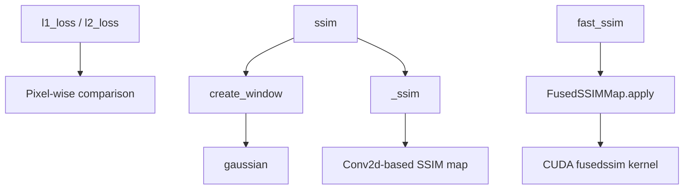

# Loss Functions

# Loss Functions (`utils/loss_utils.py`)

Image similarity and reconstruction loss functions used during training and evaluation of 3D Gaussian Splatting models. The module provides L1/L2 pixel-level losses, a pure-PyTorch SSIM implementation, and a CUDA-fused SSIM variant for accelerated computation.

## Architecture



## Constants

| Constant | Value | Purpose |
|----------|-------|---------|
| `C1` | `(0.01)²` | Stabilization constant for luminance comparison in SSIM |
| `C2` | `(0.03)²` | Stabilization constant for contrast/comparison in SSIM |

These follow the standard SSIM formulation from Wang et al. (2004), where `0.01` and `0.03` are the default `k1`/`k2` multipliers against the dynamic range.

## Pixel-Level Losses

### `l1_loss(network_output, gt)`

Mean absolute error between prediction and ground truth. Returns a scalar.

```python
loss = l1_loss(rendered_img, gt_img)
```

### `l2_loss(network_output, gt)`

Mean squared error between prediction and ground truth. Returns a scalar.

```python
loss = l2_loss(rendered_img, gt_img)
```

Both functions accept tensors of any shape — they operate element-wise and reduce via `.mean()`.

## SSIM (Structural Similarity Index Measure)

The module provides two SSIM implementations: a flexible pure-PyTorch version and a faster CUDA-fused version.

### Pure PyTorch: `ssim(img1, img2, window_size=11, size_average=True)`

Computes SSIM using depthwise 2D convolutions with a Gaussian weighting window.

**Parameters:**
- `img1`, `img2` — Image tensors of shape `(C, H, W)` or `(N, C, H, W)`. Must share the same device and dtype.
- `window_size` — Side length of the square Gaussian kernel. Default `11`.
- `size_average` — If `True`, returns a single scalar (mean over all spatial locations and channels). If `False`, returns per-image means (useful for batched inputs).

**Returns:** A scalar (or per-image tensor) in the range `[-1, 1]`, where 1 indicates identical images.

**How it works:**

1. `create_window(window_size, channel)` builds a 2D Gaussian kernel:
   - `gaussian(window_size, sigma)` generates a 1D Gaussian with `sigma=1.5`.
   - The 1D vector is outer-producted with itself to form a 2D kernel, then expanded across all channels for depthwise convolution.

2. `_ssim(img1, img2, window, window_size, channel, size_average)` computes the SSIM map:
   - Local means (`mu1`, `mu2`) via depthwise `F.conv2d` with the Gaussian window.
   - Local variances (`sigma1_sq`, `sigma2_sq`) and covariance (`sigma12`) computed as `E[X²] - (E[X])²`.
   - The SSIM map is: `((2·mu1·mu2 + C1)(2·sigma12 + C2)) / ((mu1² + mu2² + C1)(sigma1² + sigma2² + C2))`

### CUDA-Fused: `fast_ssim(img1, img2)`

A performance-optimized SSIM that delegates both forward and backward passes to custom CUDA kernels.

```python
loss = fast_ssim(rendered_img, gt_img)
```

**How it works:**

`FusedSSIMMap` is a `torch.autograd.Function` subclass that:
- **Forward:** Calls `fusedssim(C1, C2, img1, img2)` from the `diff_gaussian_rasterization._C` extension, returning a per-pixel SSIM map.
- **Backward:** Calls `fusedssim_backward(C1, C2, img1, img2, opt_grad)` to compute gradients with respect to `img1` only (gradients for `C1`, `C2`, and `img2` are `None`).

`fast_ssim` wraps this by applying `FusedSSIMMap` and averaging the resulting map.

> **Note:** The fused CUDA extension is optional. If `diff_gaussian_rasterization._C` is not available, the import fails silently and `fast_ssim` / `FusedSSIMMap` will raise at call time. The pure-PyTorch `ssim` always works as a fallback.

## Integration with the Codebase

| Caller | Functions Used | Purpose |
|--------|---------------|---------|
| `train.py` (training loop) | `l1_loss`, `ssim` | Combined reconstruction loss: `L = (1 - λ)·L1 + λ·(1 - SSIM)` |
| `train.py` (`training_report`) | `l1_loss` | Logging training metrics |
| `metrics.py` (`evaluate`) | `ssim`, `l1_loss` | Computing final evaluation scores |

The typical training loss combines L1 and SSIM with a weighting parameter λ (commonly 0.2):

```python
Ll1 = l1_loss(render, gt)
loss = (1.0 - opt.lambda_dssim) * Ll1 + opt.lambda_dssim * (1.0 - ssim(render, gt))
```

## Implementation Details

**Window creation and device handling:** `create_window` returns a `Variable`-wrapped tensor. `ssim` automatically moves the window to the same device and dtype as the input images, so no manual device management is needed.

**Padding:** The convolution in `_ssim` uses `padding = window_size // 2`, ensuring the output SSIM map has the same spatial dimensions as the input images.

**Gradient flow:** In `FusedSSIMMap.backward`, `img1` is saved via `.detach()` while `img2` is saved with gradients intact. Gradients propagate only through `img1` (the rendered image), which is the correct behavior during training where only the rendering needs gradient updates.