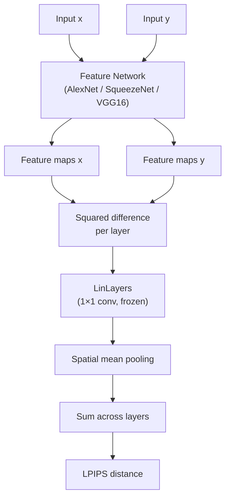

# LPIPS Module

# LPIPS Module

## Overview

This module implements **Learned Perceptual Image Patch Similarity (LPIPS)**, a perceptual distance metric that quantifies how visually different two images are. Unlike pixel-level metrics (MSE, PSNR), LPIPS leverages deep feature representations from pretrained networks and a set of learned linear weights to produce a distance that correlates with human judgment of visual similarity.

Lower LPIPS values indicate greater perceptual similarity. A value of 0 means identical images.

## Architecture



## Usage

### Convenience Function

```python
import torch
from lpipsPyTorch import lpips

x = torch.randn(1, 3, 64, 64)  # images in [-1, 1] or [0, 1] range
y = torch.randn(1, 3, 64, 64)

distance = lpips(x, y, net_type='alex')  # scalar tensor
```

This creates a temporary `LPIPS` criterion, moves it to the device of `x`, and computes the distance. For repeated evaluations, use the module directly to avoid re-instantiation.

### Module Interface

```python
from lpipsPyTorch import LPIPS

criterion = LPIPS(net_type='vgg').to('cuda')
dist1 = criterion(img_a, img_b)
dist2 = criterion(img_c, img_d)  # reuses same instance
```

**Arguments:**

| Parameter  | Type  | Default  | Description                                        |
|------------|-------|----------|----------------------------------------------------|
| `net_type` | `str` | `'alex'` | Feature backbone: `'alex'`, `'squeeze'`, or `'vgg'` |
| `version`  | `str` | `'0.1'`  | LPIPS weight version. Currently only `'0.1'` is supported. |

**Input tensors** `x` and `y` must share the same shape: `(N, 3, H, W)`.

**Output** shape: `(N, 1, 1, 1)` — a per-sample scalar distance (use `.item()` or `.squeeze()` as needed).

## How It Works

### 1. Feature Extraction

Each backbone network (`AlexNet`, `SqueezeNet`, `VGG16`) inherits from `BaseNet`, which:

1. **Z-score normalizes** the input using per-channel statistics (mean and std registered as buffers). These are *not* standard ImageNet normalization values — they are specific to LPIPS.
2. **Propagates** the input through the network's feature layers sequentially.
3. **Extracts activations** at designated target layers, applying L2 channel-wise normalization via `normalize_activation` (divides each spatial position's channel vector by its L2 norm, with `eps=1e-10` for stability).
4. **Stops early** once all target layers have been captured.

All backbone parameters are frozen (`requires_grad=False`).

### 2. Target Layers and Channel Counts

| Network     | Target Layer Indices | Channel List                              |
|-------------|----------------------|-------------------------------------------|
| `AlexNet`   | 2, 5, 8, 10, 12     | 64, 192, 384, 256, 256                    |
| `SqueezeNet`| 2, 5, 8, 10, 11, 12, 13 | 64, 128, 256, 384, 384, 512, 512    |
| `VGG16`     | 4, 9, 16, 23, 30    | 64, 128, 256, 512, 512                    |

Layer indices correspond to positions in the `features` Sequential module of each torchvision model. The channel list (`n_channels_list`) reports the output channel dimension at each target layer and determines the architecture of the linear calibration layers.

### 3. Learned Linear Calibration (`LinLayers`)

For each extracted feature layer, a `1×1` convolution maps from `n_channels → 1` with no bias. These layers:

- Are initialized from **pretrained LPIPS weights** downloaded from the [original LPIPS repository](https://github.com/richzhang/PerceptualSimilarity) via `get_state_dict`.
- Are **frozen** (`requires_grad=False`) — they encode the learned importance of each channel for perceptual distance.
- Are wrapped in `nn.ModuleList` so they can be indexed in parallel with the feature list.

### 4. Distance Computation

The `LPIPS.forward` method:

```python
feat_x, feat_y = self.net(x), self.net(y)          # extract features
diff = [(fx - fy) ** 2 for fx, fy in zip(feat_x, feat_y)]  # squared diff per layer
res = [l(d).mean((2, 3), True) for d, l in zip(diff, self.lin)]  # calibrate + spatial mean
return torch.sum(torch.cat(res, 0), 0, True)       # sum across layers
```

Step by step:
1. Extract multi-scale features from both images.
2. Compute the **squared difference** at each layer.
3. Apply the corresponding **linear calibration** (1×1 conv) and take the **spatial mean** (averaging over H and W dimensions).
4. **Sum** the calibrated distances across all layers to produce the final scalar.

## Weight Loading

`get_state_dict` in `modules/utils.py` handles downloading and key remapping:

- Downloads `.pth` files from `https://raw.githubusercontent.com/richzhang/PerceptualSimilarity/master/lpips/weights/v{version}/{net_type}.pth`
- Maps to CPU when CUDA is unavailable.
- Strips `lin` and `model.` prefixes from state dict keys to match the `LinLayers` module structure.

Weights are cached by `torch.hub` after the first download.

## Integration with External Code

The module is typically called from an evaluation pipeline:

```
metrics.py  →  lpips()  (convenience function in __init__.py)
```

For batch evaluation or integration into training loops, instantiate `LPIPS` once and reuse it to avoid repeated weight downloads and model construction overhead.

## Notes

- **Input range**: The z-score normalization in `BaseNet` applies fixed mean/std values. Ensure your input tensors are in a consistent range (the original LPIPS paper uses [−1, 1] via a `2x - 1` transform from [0, 1] inputs, but the hardcoded z-score values here suggest a specific expected distribution — verify compatibility with your data pipeline).
- **No gradients through backbone**: Both the feature network and linear layers have `requires_grad=False`. To compute gradients through LPIPS (e.g., for perceptual loss optimization), you must re-enable gradients on the backbone via `net.set_requires_grad(True)` and on the linear layers by setting their parameters' `requires_grad` to `True`.
- **Version support**: Only version `'0.1'` is implemented. Attempting other values raises an `AssertionError`.