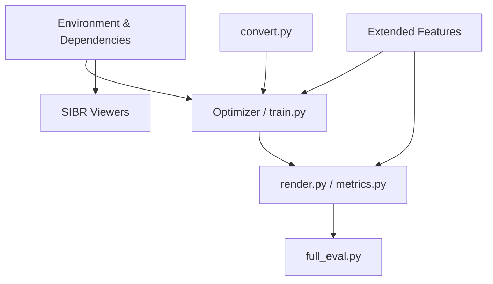

# Other

# 3D Gaussian Splatting — Project Configuration, Evaluation & Extended Features

## Overview

This module covers the top-level project infrastructure: the Conda environment definition, the evaluation and benchmarking framework, and the extended feature set added after the original publication. These components sit outside the core training/rendering pipeline but are essential for reproducibility, quality improvement, and measuring results against published baselines.

The codebase has four primary components that this documentation ties together:



---

## Environment Setup

The Conda environment is defined in `environment.yml` and pins specific versions for reproducibility:

| Package | Version | Notes |
|---------|---------|-------|
| Python | 3.7.13 | Pinned |
| PyTorch | 1.12.1 | Must match CUDA runtime |
| torchvision | 0.13.1 | |
| torchaudio | 0.12.1 | |
| cudatoolkit | 11.6 | **Known issues with 11.6**; 11.8 recommended |
| plyfile | — | PLY I/O for Gaussian models |
| tqdm | — | Progress bars |

### Pip-installed submodules

Three local submodules are installed via pip from `submodules/`:

- **`diff-gaussian-rasterization`** — The differentiable rasterizer. Swap to the `3dgs_accel` branch for the accelerated version (see [Training Speed Acceleration](#training-speed-acceleration)).
- **`simple-knn`** — K-nearest neighbors used during initialization.
- **`fused-ssim`** — Fused SSIM loss implementation for faster training.

Additional pip dependencies: `opencv-python`, `joblib`.

### Creating the environment

```shell
conda env create --file environment.yml
conda activate gaussian_splatting
```

To avoid filling the system drive with Conda packages:

```shell
conda config --add pkgs_dirs <Drive>/<pkg_path>
conda env create --file environment.yml --prefix <Drive>/<env_path>/gaussian_splatting
conda activate <Drive>/<env_path>/gaussian_splatting
```

### Compatibility with newer stacks

Limited testing confirms the codebase works with Python 3.8, PyTorch 2.0.0, and CUDA 12. The critical requirement is that PyTorch's CUDA runtime version matches the installed CUDA SDK with no major version mismatch.

---

## Evaluation Framework

### Single-scene evaluation

Three scripts run in sequence:

```shell
python train.py -s <dataset> --eval        # Train with held-out test set
python render.py -m <model_path>            # Render train + test views
python metrics.py -m <model_path>           # Compute L1, PSNR, SSIM, LPIPS
```

`render.py` auto-reads training parameters from the model directory. You can override `--source_path`, `--resolution`, `--white_background`, `--convert_SHs_python`, and `--convert_cov3D_python` on the command line.

`metrics.py` accepts a space-separated list of model paths via `--model_paths / -m`.

### Full benchmark evaluation

`full_eval.py` reproduces the paper's evaluation across all three benchmark datasets:

```shell
python full_eval.py -m360 <mipnerf360> -tat <tanks_and_temples> -db <deep_blending>
```

Key flags:

| Flag | Purpose |
|------|---------|
| `--skip_training` | Skip training; evaluate pre-trained models |
| `--skip_rendering` | Skip rendering; compute metrics on existing images |
| `--skip_metrics` | Skip metric computation |
| `--output_path` | Output directory (default `./eval`) |

When evaluating pre-trained models, specify their location with `-o` and provide source dataset paths. When computing metrics on pre-rendered evaluation images, source datasets are unnecessary.

Full evaluation takes ~7 hours on an A6000.

---

## Extended Features

These features were integrated after the original release and are controlled via command-line flags during training and rendering.

### Training Speed Acceleration

Replaces the default rasterizer with the [Taming-3DGS](https://humansensinglab.github.io/taming-3dgs/) accelerated version and adds a fused SSIM loss.

**Installation:**

```bash
pip uninstall diff-gaussian-rasterization -y
cd submodules/diff-gaussian-rasterization
rm -r build
git checkout 3dgs_accel
pip install .
```

**Usage:**

| `--optimizer_type` | Speedup | Notes |
|--------------------|---------|-------|
| `default` | ~1.6× | Drop-in replacement |
| `sparse_adam` | ~2.7× | Sparse Adam optimizer |

The accelerated rasterizer has behavioral differences from the original. Quality metrics vary slightly depending on the optimizer choice and whether depth regularization or anti-aliasing are also enabled (see `results.md` for per-scene breakdowns).

### Depth Regularization

Uses monocular depth maps as priors during optimization. Most effective on untextured regions (roads, walls) and for removing floating artifacts. Integrated from the [Hierarchical 3DGS](https://repo-sam.inria.fr/fungraph/hierarchical-3d-gaussians/) paper.

**Setup for real-world datasets:**

1. Clone [Depth Anything v2](https://github.com/DepthAnything/Depth-Anything-V2) and download the `depth_anything_v2_vitl.pth` weights to `checkpoints/`.
2. Generate depth maps:
   ```bash
   python Depth-Anything-V2/run.py --encoder vitl --pred-only --grayscale \
       --img-path <input_images> --outdir <output_path>
   ```
3. Generate scale parameters:
   ```bash
   python utils/make_depth_scale.py --base_dir <colmap_path> --depths_dir <depths_path>
   ```

**Training flag:** `-d <path to depth maps>`

For synthetic datasets, depth maps can be produced directly without the above pipeline.

**Quality impact:** Improves Deep Blending scenes significantly; effect varies on other datasets and can occasionally degrade results.

### Exposure Compensation

Optimizes a per-image 3×4 affine transform to handle exposure variations in "in the wild" captures (e.g., smartphone photos with auto-exposure). Based on the approach from [Hierarchical 3DGS](https://repo-sam.inria.fr/fungraph/hierarchical-3d-gaussians/).

**Training flags:**

```
--exposure_lr_init 0.001
--exposure_lr_final 0.0001
--exposure_lr_delay_steps 5000
--exposure_lr_delay_mult 0.001
--train_test_exp
```

The `--train_test_exp` flag changes the train/test split: the left half of test images is included in training (to optimize their exposure transforms), and only the right half is used for testing. **Metrics from this mode are not comparable to standard evaluation** because the split differs.

Exposure compensation is applied during training only; it is not applied during real-time navigation in the viewer.

### Anti-aliasing

Integrates the EWA filter from [Mip Splatting](https://niujinshuchong.github.io/mip-splatting/) to reduce aliasing artifacts.

**Training flag:** `--antialiasing`

**Rendering flag:** `--antialiasing` (must match training setting)

**Viewer:** Toggle anti-aliasing from the floating menu; enable it when viewing a model trained with `--antialiasing`.

---

## Feature Compatibility Matrix

The extended features are designed to be composable. The following combinations have been tested and benchmarked in `results.md`:

| Feature | Default Rasterizer | Accelerated Rasterizer (default optimizer) | Accelerated Rasterizer (sparse_adam) |
|---------|--------------------|---------------------------------------------|--------------------------------------|
| Depth regularization | ✓ | ✓ | ✓ |
| Anti-aliasing | ✓ | ✓ | ✓ |
| Exposure compensation | ✓ | ✓ | ✓ |
| Depth + Anti-aliasing | ✓ | ✓ | ✓ |
| All three | ✓ | ✓ | ✓ |

Quality metrics (PSNR, SSIM, LPIPS) for every combination across MipNeRF360, Tanks&Temples, and Deep Blending datasets are charted in `results.md`.

---

## Data Processing Pipeline

### Expected COLMAP structure

```
<location>/
├── images/
│   ├── <image 0>
│   ├── <image 1>
│   └── ...
└── sparse/
    └── 0/
        ├── cameras.bin
        ├── images.bin
        └── points3D.bin
```

Camera models must be `SIMPLE_PINHOLE` or `PINHOLE`.

### Converting raw images

Place input images in `<location>/input/`, then:

```shell
python convert.py -s <location> [--resize]
```

This runs COLMAP feature extraction, matching, and bundle adjustment, then performs image undistortion. With `--resize`, ImageMagick creates 1/2, 1/4, and 1/8 resolution copies.

If you already have COLMAP data (e.g., from an `OPENCV` camera model), place it in `<location>/distorted/` and skip matching:

```shell
python convert.py -s <location> --skip_matching [--resize]
```

Key `convert.py` flags:

| Flag | Purpose |
|------|---------|
| `--no_gpu` | Disable GPU in COLMAP |
| `--skip_matching` | Use existing COLMAP data |
| `--camera` | Camera model for matching (default `OPENCV`) |
| `--resize` | Create multi-resolution images |
| `--colmap_executable` | Path to COLMAP (`.bat` on Windows) |
| `--magick_executable` | Path to ImageMagick |

---

## Viewer Ecosystem

Two viewers are provided, both built on the [SIBR](https://sibr.gitlabpages.inria.fr/) framework.

### Network Viewer (`SIBR_remoteGaussian_app`)

Connects to a **running training process** for live visualization. Default connection: `localhost:6009`. Match `--ip` and `--port` between the optimizer and viewer if running on different machines.

Key flags: `--path`, `--ip`, `--port`, `--rendering-size`, `--load_images`.

### Real-Time Viewer (`SIBR_gaussianViewer_app`)

Loads a **trained model** for interactive real-time rendering. Requires CUDA-capable GPU (Compute 7.0+).

```shell
./SIBR_gaussianViewer_app -m <path to trained model>
```

Key flags: `--model-path`, `--iteration`, `--path`, `--rendering-size`, `--load_images`, `--device`, `--no_interop`.

**Performance tips:**
- Disable V-Sync (system-wide and in the app's Display menu)
- On multi-GPU systems, ensure the OpenGL/Display GPU matches the CUDA GPU
- Use `--no_interop` on WSL2 with MESA software rendering

### Top View

Accessible via `Views > Top View` in either viewer. Renders the SfM point cloud alongside input camera positions and the user's current camera. Useful for verifying camera alignment and understanding spatial coverage.

Features:
- Navigate in FPS, trackball, or orbit mode
- Snap to closest input camera from the Point view
- Display ground-truth images at camera positions (requires `--load_images` / `--images-path`)
- Fade between point cloud and ground-truth view
- Toggle and scale meshes

---

## Training Configuration Reference

### Core training parameters

| Parameter | Default | Description |
|-----------|---------|-------------|
| `--iterations` | 30,000 | Total training iterations |
| `--sh_degree` | 3 | Spherical harmonics order (max 3) |
| `--resolution` / `-r` | auto | `1`=original, `2`=1/2, `4`=1/4, `8`=1/8; auto-downscales if width > 1.6K |
| `--data_device` | `cuda` | Set to `cpu` to reduce VRAM on large datasets |
| `--white_background` / `-w` | off | Use white background (for NeRF Synthetic) |

### Learning rates

| Parameter | Default |
|-----------|---------|
| `--position_lr_init` | 0.00016 |
| `--position_lr_final` | 0.0000016 |
| `--position_lr_max_steps` | 30,000 |
| `--position_lr_delay_mult` | 0.01 |
| `--feature_lr` | 0.0025 |
| `--opacity_lr` | 0.05 |
| `--scaling_lr` | 0.005 |
| `--rotation_lr` | 0.001 |

### Densification controls

| Parameter | Default | Description |
|-----------|---------|-------------|
| `--densify_from_iter` | 500 | When densification starts |
| `--densify_until_iter` | 15,000 | When densification stops |
| `--densify_grad_threshold` | 0.0002 | 2D gradient threshold for splitting/cloning |
| `--densification_interval` | 100 | Iterations between densification steps |
| `--opacity_reset_interval` | 3,000 | Iterations between opacity resets |
| `--percent_dense` | 0.01 | Scene extent percentage for forced densification |

### Loss

| Parameter | Default | Description |
|-----------|---------|-------------|
| `--lambda_dssim` | 0.2 | SSIM weight in combined loss (0–1) |

### Debugging

| Parameter | Default | Description |
|-----------|---------|-------------|
| `--debug` | off | Creates dump file on rasterizer failure |
| `--debug_from` | 0 | Iteration after which debug mode activates (slow) |
| `--convert_SHs_python` | off | Use PyTorch SH computation (for debugging) |
| `--convert_cov3D_python` | off | Use PyTorch 3D covariance computation (for debugging) |

---

## Low-VRAM Training

The 24 GB requirement is for full-quality training. To reduce memory:

- Increase `--densify_grad_threshold` (reduces point count)
- Increase `--densification_interval` (less frequent densification)
- Reduce `--densify_until_iter` (stop densification earlier)
- Set `--test_iterations -1` to avoid memory spikes during testing
- Set `--data_device cpu` to offload source images
- Use `--resolution 2` or `--resolution 4` for smaller inputs

All of these trade quality for memory. A very high `--densify_grad_threshold` effectively disables densification entirely.

---

## Large-Scale Scene Tips

For extensive scenes (city-scale, driving datasets with extreme scale variation):

- Reduce `--position_lr_init` (e.g., ×0.3 or ×0.1)
- Reduce `--position_lr_final` proportionally
- Reduce `--scaling_lr` (e.g., ×0.3)

The more extensive the scene, the lower these values should be to prevent Gaussians from overshooting during optimization.