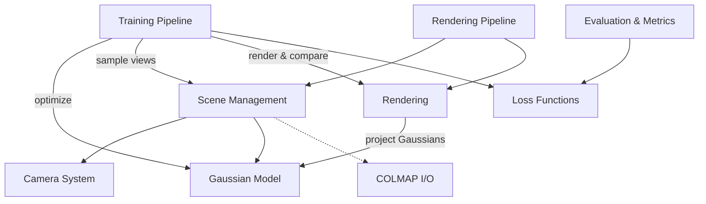

# gaussian-splatting — Wiki

# 3D Gaussian Splatting

Welcome to the **3D Gaussian Splatting** codebase — an implementation of the SIGGRAPH 2023 paper for real-time radiance field rendering. The system represents scenes as collections of 3D Gaussian primitives with learnable positions, orientations, scales, opacities, and spherical harmonic color coefficients. Through differentiable rasterization and adaptive densification, it produces photorealistic novel-view synthesis at real-time frame rates.

## Architecture

## End-to-End Flows

### Preprocessing

Raw photographs are converted into a COLMAP reconstruction using the [Conversion](conversion.md) script, which runs feature extraction, matching, sparse reconstruction, and image undistortion. The resulting dataset is read by [COLMAP I/O](colmap-io.md) during scene initialization.

### Training

The [Training Pipeline](training-pipeline.md) is the heart of the system. It loads a [Scene](scene-management.md) (which builds [Cameras](camera-system.md) and an initial point cloud), initializes a [GaussianModel](gaussian-model.md), and enters an optimization loop. Each iteration randomly selects a training camera, calls [Rendering](rendering.md) to produce a rasterized image, computes a combined L1/SSIM loss via [Loss Functions](loss-functions.md), backpropagates, and periodically runs adaptive densification and pruning on the Gaussians. Trained models are saved as PLY files through the GaussianModel's serialization.

### Rendering

The [Rendering Pipeline](rendering-pipeline.md) loads a trained checkpoint, reconstructs the scene and Gaussian model, then iterates over camera views to write rendered images to disk. Each view calls into the [Rendering](rendering.md) module, which evaluates spherical harmonics, computes Gaussian covariances, and feeds everything into the CUDA-accelerated `diff_gaussian_rasterization` rasterizer.

### Evaluation

[Evaluation & Metrics](evaluation-metrics.md) computes PSNR, SSIM, and LPIPS against ground-truth images. The [LPIPS Module](lpips-module.md) provides the perceptual distance metric, while SSIM reuse flows through [Loss Functions](loss-functions.md).

## Supporting Modules

- [Configuration & Parameters](configuration-parameters.md) — Declarative CLI argument system built on `ParamGroup` classes
- [Graphics & Math Utilities](graphics-math-utilities.md) — Coordinate transforms, projection math, and spherical harmonics evaluation
- [General Utilities](general-utilities.md) — Covariance helpers, learning-rate scheduling, image I/O, and filesystem operations

## Getting Started

1. **Environment**: Install the Conda environment defined in `environment.yml`, which pins CUDA-compatible PyTorch and all Python dependencies.
2. **CUDA extensions**: Build the two required CUDA submodules — `diff_gaussian_rasterization` and `simple-knn` — following the instructions in the main repository.
3. **Prepare data**: Run `convert.py` on a directory of images to produce a COLMAP dataset, or download the pre-processed [T&T+DB COLMAP dataset](https://repo-sam.inria.fr/fungraph/3d-gaussian-splatting/datasets/input/tandt_db.zip).
4. **Train**: `python train.py -s <path-to-colmap-dataset>` — see [Configuration & Parameters](configuration-parameters.md) for all CLI options.
5. **Render**: `python render.py -m <path-to-trained-model>`
6. **Evaluate**: `python metrics.py -m <path-to-trained-model>`

Pre-trained models and evaluation images are available from the [project webpage](https://repo-sam.inria.fr/fungraph/3d-gaussian-splatting/) if you want to skip training and go straight to rendering or benchmarking.