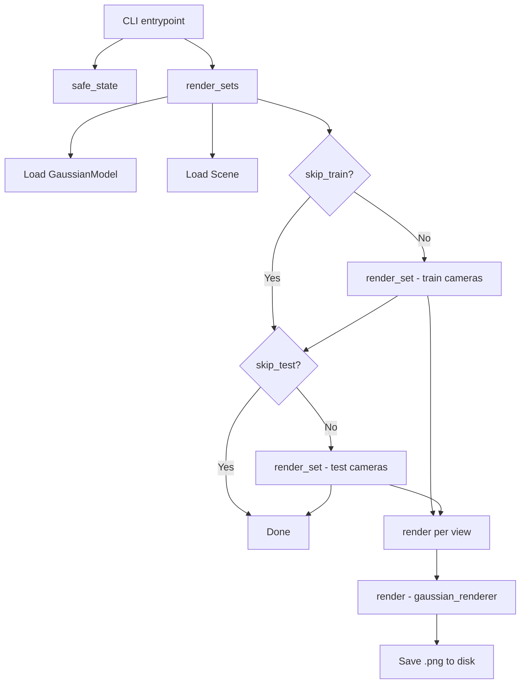

# Rendering Pipeline

# Rendering Pipeline (`render.py`)

## Purpose

Offline rendering script for a trained 3D Gaussian Splatting model. Given a trained checkpoint, it reconstructs the `Scene` and `GaussianModel`, iterates over camera views, and writes per-view rendered images and their corresponding ground-truth frames to disk. This is the primary tool for generating evaluation outputs and visual inspection of a trained model.

## Execution Flow



## Key Functions

### `render_set`

```python
def render_set(model_path, name, iteration, views, gaussians, pipeline, background, train_test_exp, separate_sh)
```

Renders every camera view in `views` and saves both the rendering and the ground-truth image.

**Parameters:**

| Parameter | Type | Description |
|---|---|---|
| `model_path` | `str` | Root model directory (output path base) |
| `name` | `str` | Split name — `"train"` or `"test"`, used as a subdirectory |
| `iteration` | `int` | Trained iteration number, embedded in the output path |
| `views` | list | Camera objects from `Scene.getTrainCameras()` or `Scene.getTestCameras()` |
| `gaussians` | `GaussianModel` | Loaded Gaussian model with trained parameters |
| `pipeline` | `PipelineParams` | Rasterization pipeline configuration |
| `background` | `torch.Tensor` | Background color tensor on CUDA (shape `[3]`) |
| `train_test_exp` | `bool` | Whether exposure compensation is enabled |
| `separate_sh` | `bool` | Whether to use separate spherical harmonics rendering |

**Output structure:**
```
<model_path>/<name>/ours_<iteration>/
├── renders/
│   ├── 00000.png
│   ├── 00001.png
│   └── ...
└── gt/
    ├── 00000.png
    ├── 00001.png
    └── ...
```

**Behavior details:**

- Runs entirely inside a `torch.no_grad()` context (inherited from `render_sets`).
- Calls `render(view, gaussians, pipeline, background, ...)` and extracts the `"render"` key from the returned dict.
- Ground truth is taken from `view.original_image[0:3, :, :]` — only the first 3 channels (RGB), dropping any alpha.
- When `train_test_exp` is `True`, both the rendering and GT are **horizontally cropped to the right half** of the image (`[..., width // 2:]`). This supports the exposure compensation training mode where the left half is used for training and the right half for evaluation.

### `render_sets`

```python
def render_sets(dataset: ModelParams, iteration: int, pipeline: PipelineParams, skip_train: bool, skip_test: bool, separate_sh: bool)
```

Top-level orchestration function. Loads the model and scene, constructs the background tensor, then delegates to `render_set` for each requested split.

**Key steps:**

1. Instantiates a `GaussianModel` with `dataset.sh_degree`.
2. Constructs a `Scene`, which automatically loads the trained Gaussians at the specified `iteration` (with `shuffle=False` for deterministic view ordering).
3. Builds the `background` tensor — white `[1,1,1]` if `dataset.white_background`, otherwise black `[0,0,0]`.
4. Calls `render_set` for train cameras (unless `skip_train`), then test cameras (unless `skip_test`).

## Downstream Call Chain

When `render_set` calls `render()` from `gaussian_renderer`, the following internal computations are triggered:

| Called function | Module | Purpose |
|---|---|---|
| `get_exposure_from_name` | `scene/gaussian_model.py` | Retrieves per-camera exposure parameters when `train_test_exp` is active |
| `get_covariance` | `scene/gaussian_model.py` | Computes 3D covariance matrices from the Gaussian's rotation and scale |
| `eval_sh` | `utils/sh_utils.py` | Evaluates spherical harmonics coefficients for view-dependent color |

These are not called directly by `render.py` — they are invoked internally by `render()` during rasterization. Understanding this chain is important if you need to debug rendering artifacts related to covariance computation or color evaluation.

## CLI Usage

```bash
python render.py -m <model_path> [--iteration N] [--skip_train] [--skip_test] [--quiet]
```

**Arguments:**

| Argument | Default | Description |
|---|---|---|
| `-m` / `--model_path` | (required) | Path to the trained model directory |
| `--iteration` | `-1` | Checkpoint iteration to load; `-1` loads the latest |
| `--skip_train` | `False` | Skip rendering training views |
| `--skip_test` | `False` | Skip rendering test views |
| `--quiet` | `False` | Suppress non-essential output |

Additional `ModelParams` and `PipelineParams` are registered on the same parser and can be passed as needed (e.g., `--white_background`, `--sh_degree`).

## Sparse Adam Availability

The module attempts to import `SparseGaussianAdam` from `diff_gaussian_rasterization` at load time:

```python
try:
    from diff_gaussian_rasterization import SparseGaussianAdam
    SPARSE_ADAM_AVAILABLE = True
except:
    SPARSE_ADAM_AVAILABLE = False
```

This flag is passed as the `separate_sh` argument to `render_sets`. When the sparse optimizer is available, spherical harmonics are rendered in a separate pass rather than bundled with the base color, which can improve visual quality for higher SH degrees. If the import fails, `SPARSE_ADAM_AVAILABLE` is `False` and SH is rendered jointly.

## Important Notes

- **No gradient computation**: The entire rendering loop runs under `torch.no_grad()`. This script is for inference/evaluation only.
- **CUDA required**: The background tensor is created on `"cuda"`. The `render()` function and the Gaussian rasterizer also require CUDA.
- **Image format**: Output images are saved via `torchvision.utils.save_image` as PNG. Values are expected in `[0, 1]` range.
- **Half-image cropping**: The `train_test_exp` mode crops to the right half of the image. This is a specific evaluation protocol — if you modify this script for a different dataset, verify whether this cropping is appropriate.