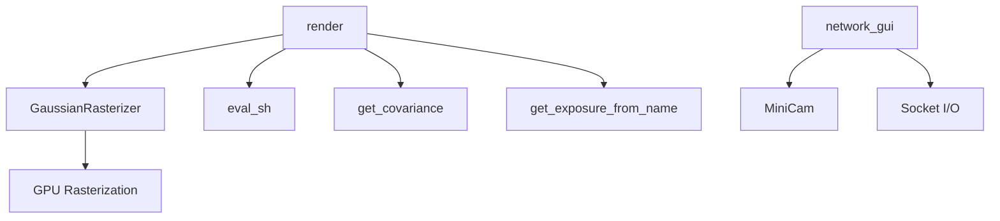

# Rendering

# Rendering Module

## Overview

The Rendering module is responsible for projecting 3D Gaussians onto 2D image planes and producing final rendered output. It wraps the CUDA-accelerated `diff_gaussian_rasterization` library, orchestrating the handoff between Gaussian model attributes and the differentiable rasterizer. A secondary component provides socket-based communication for interactive real-time viewing.

## Architecture



---

## Core Function: `render`

**Signature:**
```python
render(viewpoint_camera, pc: GaussianModel, pipe, bg_color: torch.Tensor,
       scaling_modifier=1.0, separate_sh=False, override_color=None,
       use_trained_exp=False)
```

### Parameters

| Parameter | Type | Description |
|---|---|---|
| `viewpoint_camera` | Camera | Viewpoint providing FoV, image dimensions, view/projection matrices, and camera center |
| `pc` | `GaussianModel` | The Gaussian scene model |
| `pipe` | Pipeline config | Controls compute paths: `compute_cov3D_python`, `convert_SHs_python`, `debug`, `antialiasing` |
| `bg_color` | `torch.Tensor` | Background color tensor — **must already reside on CUDA** |
| `scaling_modifier` | `float` | Global scale multiplier applied to Gaussian sizes (default `1.0`) |
| `separate_sh` | `bool` | If `True`, pass DC and higher-order SH coefficients separately to the rasterizer |
| `override_color` | `torch.Tensor` or `None` | Precomputed RGB colors; bypasses all SH evaluation when provided |
| `use_trained_exp` | `bool` | Apply per-image learned exposure correction |

### Return Value

Returns a dictionary:

| Key | Shape | Description |
|---|---|---|
| `render` | `(3, H, W)` | Clamped `[0, 1]` rendered RGB image |
| `viewspace_points` | `(N, 3)` | Screen-space positions with gradients enabled (for densification) |
| `visibility_filter` | `(V, 1)` | Indices of Gaussians with `radii > 0` (visible on screen) |
| `radii` | `(N,)` | Screen-space radii per Gaussian; zero means frustum-culled |
| `depth` | `(1, H, W)` | Rendered depth image |

### Execution Flow

The function proceeds through four decision stages:

#### 1. Screen-Space Point Allocation

A zero tensor matching `pc.get_xyz` is allocated on CUDA with `requires_grad=True` and `retain_grad()`. This captures 2D screen-space position gradients, which the training loop uses for Gaussian splitting/densification criteria.

#### 2. Covariance Computation Path

Two mutually exclusive paths controlled by `pipe.compute_cov3D_python`:

- **Python path** (`True`): Calls `pc.get_covariance(scaling_modifier)` to precompute the 3×3 covariance matrix on the CPU/Python side, passing `cov3D_precomp` to the rasterizer.
- **GPU path** (`False`, default): Passes raw `scales` and `rotations` to the rasterizer, which computes covariance internally on the GPU.

The Python path is useful for debugging or custom covariance logic but is slower.

#### 3. Color Computation Path

Three mutually exclusive paths, evaluated in priority order:

1. **`override_color` provided**: The supplied tensor is used directly as `colors_precomp`. All SH evaluation is skipped.
2. **`pipe.convert_SHs_python`** (`True`): Evaluates spherical harmonics in Python:
   - Reshapes `pc.get_features` into `(N, 3, (max_sh_degree+1)²)` view-dependent form
   - Computes view directions: `dir_pp = pc.get_xyz - camera_center`, normalized
   - Calls `eval_sh(active_sh_degree, shs_view, dir_pp_normalized)` from `utils.sh_utils`
   - Applies `clamp_min(sh2rgb + 0.5, 0.0)` to convert SH coefficients to RGB
3. **Default** (GPU SH evaluation): Passes `shs` (or `dc` + `shs` if `separate_sh=True`) to the rasterizer, which performs SH→RGB conversion on the GPU.

The `separate_sh` flag splits features into `pc.get_features_dc` (zeroth-order) and `pc.get_features_rest` (higher orders). This is required by certain rasterizer modes that handle DC terms differently.

#### 4. Exposure Compensation

When `use_trained_exp=True`, a per-image 3×3 color matrix and 3-vector bias are retrieved via `pc.get_exposure_from_name(viewpoint_camera.image_name)` and applied:

```python
rendered_image = torch.matmul(rendered_image.permute(1,2,0), exposure[:3,:3]).permute(2,0,1) + exposure[:3,3,None,None]
```

This models affine color transforms per training image, useful for datasets with varying exposure.

### Rasterizer Configuration

`GaussianRasterizationSettings` is constructed from the camera:

- `tanfovx` / `tanfovy`: Half-angle tangents derived from `viewpoint_camera.FoVx` / `FoVy`
- `viewmatrix` / `projmatrix`: World-view and full projection transforms from the camera
- `campos`: Camera center in world space (used for SH view directions)
- `sh_degree`: Active SH degree from the model (`pc.active_sh_degree`)
- `scale_modifier`: Passed through directly
- `antialiasing`: Controlled by `pipe.antialiasing`

---

## Network GUI: `network_gui`

Provides a TCP socket interface for an external real-time viewer (e.g., the SIBR viewer) to send camera parameters and receive rendered frames.

### Connection Lifecycle

1. **`init(wish_host, wish_port)`** — Binds a TCP listener on the specified host/port with a zero timeout (non-blocking accept).
2. **`try_connect()`** — Non-blocking accept call; sets the connection to blocking mode once established.
3. **`receive()`** — Reads a JSON message describing the camera and render options, returns parsed values.
4. **`send(message_bytes, verify)`** — Sends arbitrary bytes followed by an ASCII verification string.

### Message Protocol

Messages are length-prefixed: 4 bytes (little-endian `int32`) for the payload length, followed by UTF-8 JSON.

### `receive()` Return Values

On success, returns a tuple:

| Position | Value | Description |
|---|---|---|
| 0 | `MiniCam` | Camera object constructed from received parameters |
| 1 | `bool` | `do_training` — whether to continue training |
| 2 | `bool` | `do_shs_python` — force Python-side SH evaluation |
| 3 | `bool` | `do_rot_scale_python` — force Python-side covariance |
| 4 | `bool` | `keep_alive` — keep the connection open |
| 5 | `float` | `scaling_modifier` — Gaussian scale modifier |

Returns `(None, None, None, None, None, None)` if resolution is zero (viewer closed).

### Axis Convention Handling

The view and projection matrices received from the viewer have their Y and Z columns negated before construction of `MiniCam`:

```python
world_view_transform[:,1] = -world_view_transform[:,1]
world_view_transform[:,2] = -world_view_transform[:,2]
```

This converts from the viewer's coordinate convention (right-handed, Y-up) to the renderer's expected convention.

---

## Integration with the Codebase

### Callers

- **`train.py`** calls `render()` each training iteration to produce images and collect visibility/radius data for adaptive density control.
- **`render.py`** calls `render()` via `render_set()` during evaluation to produce test/train/holdout images, including the exposure compensation path (`use_trained_exp=True`).

### Dependencies on `GaussianModel`

The `render` function reads these properties from the `GaussianModel` instance:

| Property | Used When |
|---|---|
| `get_xyz` | Always — 3D means |
| `get_opacity` | Always — per-Gaussian opacity |
| `get_scaling` | GPU covariance path |
| `get_rotation` | GPU covariance path |
| `get_features` | Default SH path |
| `get_features_dc` / `get_features_rest` | `separate_sh=True` path |
| `get_covariance(scaling_modifier)` | `pipe.compute_cov3D_python=True` |
| `get_exposure_from_name(image_name)` | `use_trained_exp=True` |
| `active_sh_degree` | Rasterizer settings |
| `max_sh_degree` | Python SH reshape |

### Dependency on `utils.sh_utils`

`eval_sh` is called only in the Python SH conversion path (`pipe.convert_SHs_python=True`). It evaluates spherical harmonic basis functions given the active degree, SH coefficients, and normalized view directions.

### Dependency on `diff_gaussian_rasterization`

The external CUDA extension provides `GaussianRasterizer` and `GaussianRasterizationSettings`. The rasterizer's `__call__` accepts keyword arguments for means, SHs/colors, opacities, scales, rotations, and optional precomputed covariances. It returns `(rendered_image, radii, depth_image)`.