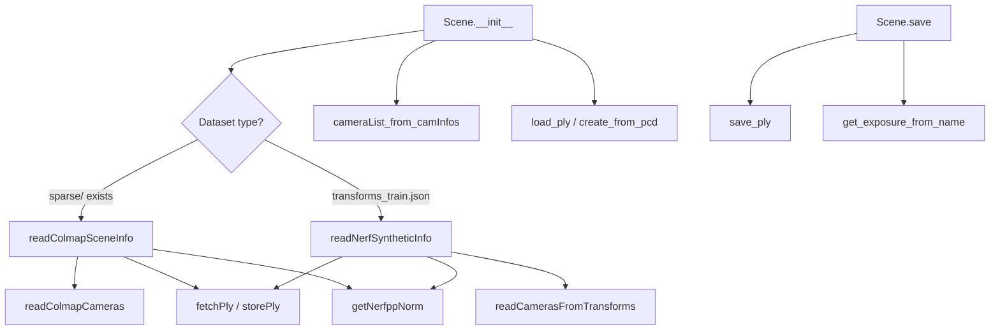

# Scene Management

# Scene Management

## Overview

The Scene module is responsible for discovering, loading, and managing 3D reconstruction datasets. It detects the dataset format (COLMAP or NeRF Synthetic/Blender), parses camera parameters and initial point clouds, builds camera objects at multiple resolutions, and coordinates saving trained models. It acts as the bridge between raw dataset files on disk and the `GaussianModel` used during training and rendering.

## Architecture



## The `Scene` Class

`Scene` is the primary entry point, instantiated once at the start of training or rendering.

### Constructor

```python
Scene(args: ModelParams, gaussians: GaussianModel, load_iteration=None, shuffle=True, resolution_scales=[1.0])
```

**Parameters:**

| Parameter | Description |
|---|---|
| `args` | `ModelParams` containing `source_path`, `model_path`, `images`, `depths`, `eval`, `white_background`, `train_test_exp` |
| `gaussians` | The `GaussianModel` instance to initialize or load into |
| `load_iteration` | Which saved iteration to load. `None` starts fresh, `-1` auto-detects the latest via `searchForMaxIteration` |
| `shuffle` | Randomly shuffle train/test camera lists for varied batching |
| `resolution_scales` | List of downscaling factors (e.g. `[1.0, 0.5, 0.25]`) for multi-resolution rendering |

**Initialization flow:**

1. **Determine load iteration** — If `load_iteration` is set, resolve the checkpoint to load from. `-1` searches `point_cloud/` subdirectories for the highest iteration number.

2. **Detect dataset format and load scene info** — Checks for `sparse/` directory (COLMAP) or `transforms_train.json` (Blender). Calls the corresponding reader via `sceneLoadTypeCallbacks`, producing a `SceneInfo` object.

3. **Persist initial data** (only when not loading a checkpoint) — Copies the initial point cloud PLY to `<model_path>/input.ply` and writes all camera parameters to `<model_path>/cameras.json`.

4. **Shuffle cameras** — If `shuffle=True`, randomly reorders train and test camera lists.

5. **Compute scene extent** — Stores `cameras_extent` from `SceneInfo.nerf_normalization["radius"]`, used downstream for density control and scaling.

6. **Build camera objects** — For each resolution scale, calls `cameraList_from_camInfos` to convert `CameraInfo` records into renderable camera objects. Results are stored in `self.train_cameras` and `self.test_cameras`, keyed by scale factor.

7. **Initialize or restore Gaussians** — If loading a checkpoint, calls `gaussians.load_ply(...)`. Otherwise, calls `gaussians.create_from_pcd(...)` using the scene's initial point cloud and camera extent.

### `save(iteration)`

Saves the current Gaussian model state:

- Writes the point cloud to `point_cloud/iteration_<N>/point_cloud.ply`
- Writes learned exposure values to `exposure.json`, mapping each image name to its exposure parameters

### `getTrainCameras(scale=1.0)` / `getTestCameras(scale=1.0)`

Return the list of camera objects at the given resolution scale. Called by the training loop and rendering scripts.

## Data Structures

### `CameraInfo`

A `NamedTuple` representing a single camera's metadata before it is converted into a renderable camera object.

| Field | Type | Description |
|---|---|---|
| `uid` | `int` | Unique camera identifier |
| `R` | `np.array` | 3×3 rotation matrix (transposed world-to-camera) |
| `T` | `np.array` | 3×1 translation vector |
| `FovY` | `np.array` | Vertical field of view in radians |
| `FovX` | `np.array` | Horizontal field of view in radians |
| `depth_params` | `dict` | Depth scaling parameters (COLMAP only), or `None` |
| `image_path` | `str` | Path to the RGB image file |
| `image_name` | `str` | Image filename (used as key for exposure mapping) |
| `depth_path` | `str` | Path to depth map, or `""` if unavailable |
| `width` | `int` | Image width in pixels |
| `height` | `int` | Image height in pixels |
| `is_test` | `bool` | Whether this camera is held out for evaluation |

### `SceneInfo`

A `NamedTuple` aggregating all parsed scene data.

| Field | Type | Description |
|---|---|---|
| `point_cloud` | `BasicPointCloud` | Initial 3D points, colors, and normals |
| `train_cameras` | `list[CameraInfo]` | Training camera descriptors |
| `test_cameras` | `list[CameraInfo]` | Test/evaluation camera descriptors |
| `nerf_normalization` | `dict` | Contains `"translate"` and `"radius"` for scene normalization |
| `ply_path` | `str` | Path to the initial point cloud PLY file |
| `is_nerf_synthetic` | `bool` | `True` for Blender datasets, `False` for COLMAP |

## Dataset Readers

The module supports two dataset formats, dispatched through `sceneLoadTypeCallbacks`:

```python
sceneLoadTypeCallbacks = {
    "Colmap": readColmapSceneInfo,
    "Blender": readNerfSyntheticInfo
}
```

### COLMAP — `readColmapSceneInfo`

```python
readColmapSceneInfo(path, images, depths, eval, train_test_exp, llffhold=8)
```

Reads a COLMAP reconstruction from `sparse/0/`. Handles both binary (`.bin`) and text (`.txt`) formats for extrinsics, intrinsics, and 3D points.

**Key behaviors:**

- **Camera intrinsics**: Supports `SIMPLE_PINHOLE` and `PINHOLE` models only. Other distortion models are rejected with an assertion.
- **Depth parameters**: If `depths` is non-empty, loads `sparse/0/depth_params.json` containing per-image scale factors. Computes a median scale across all images and attaches it to each entry.
- **Train/test split**: When `eval=True`, uses an LLFF-style holdout (every `llffhold`-th image by sorted name, default 8) or reads `sparse/0/test.txt`. When `eval=False`, all cameras go to training. When `train_test_exp=True`, test cameras are also included in the training set for exposure learning.
- **Point cloud**: Reads `sparse/0/points3D.ply`. If the PLY doesn't exist yet, converts from `points3D.bin` (or `.txt`) and caches the result via `storePly`.
- **NeRF++ normalization**: Computed from training camera positions to determine scene bounding radius.

### NeRF Synthetic (Blender) — `readNerfSyntheticInfo`

```python
readNerfSyntheticInfo(path, white_background, depths, eval, extension=".png")
```

Reads a Blender/NeRF synthetic dataset from `transforms_train.json` and `transforms_test.json`.

**Key behaviors:**

- **Coordinate conversion**: NeRF transform matrices use OpenGL conventions (Y up, Z back). The reader flips Y and Z axes (`c2w[:3, 1:3] *= -1`) to convert to COLMAP convention (Y down, Z forward).
- **Alpha compositing**: Images are composited against a white or black background based on `white_background`, using the alpha channel.
- **Field of view**: `camera_angle_x` from the JSON provides horizontal FoV; vertical FoV is derived from image dimensions via `fov2focal` and `focal2fov`.
- **Point cloud**: Since synthetic datasets lack COLMAP data, a random point cloud of 100,000 points is generated within a cube of ±1.3 units. Colors are initialized from random spherical harmonics via `SH2RGB`.
- **Train/test split**: When `eval=False`, test cameras are merged into the training set.

### `readColmapCameras`

```python
readColmapCameras(cam_extrinsics, cam_intrinsics, depths_params, images_folder, depths_folder, test_cam_names_list)
```

Iterates over COLMAP extrinsics, matches each to its intrinsics entry, and builds a `CameraInfo` for each camera. Rotation is extracted via `qvec2rotmat` and transposed to match the storage convention expected by downstream code.

### `readCamerasFromTransforms`

```python
readCamerasFromTransforms(path, transformsfile, depths_folder, white_background, is_test, extension=".png")
```

Parses a single NeRF `transforms_*.json` file. Each frame's `transform_matrix` is inverted to produce world-to-camera R and T. Images are opened to read dimensions and composited against the chosen background.

## Utility Functions

### `getNerfppNorm(cam_info)`

Computes NeRF++ normalization parameters from a list of `CameraInfo` objects. For each camera, computes the world-space camera center by inverting the world-to-view matrix. Returns:

```python
{"translate": np.array, "radius": float}
```

Where `translate` centers the cameras at the origin and `radius` is 1.1× the maximum distance from center to any camera. The `radius` value is stored as `Scene.cameras_extent` and used for density control and Gaussian scaling heuristics.

### `fetchPly(path)` / `storePly(path, xyz, rgb)`

- **`fetchPly`**: Reads a PLY file and returns a `BasicPointCloud` with positions, colors (normalized to [0,1]), and normals.
- **`storePly`**: Writes positions and colors to a PLY file with zero-filled normals. Used to cache converted COLMAP point clouds and generated random point clouds.

## Integration with the Codebase

The Scene module connects to several external components:

| Component | Interaction |
|---|---|
| `GaussianModel` | Initialized via `create_from_pcd` or restored via `load_ply`; saved via `save_ply`; exposure queried via `get_exposure_from_name` |
| `cameraList_from_camInfos` | Converts `CameraInfo` lists into renderable `Camera` objects at the requested resolution scale |
| `camera_to_JSON` | Serializes camera parameters for the `cameras.json` output |
| `searchForMaxIteration` | Finds the latest checkpoint iteration in the output directory |
| `colmap_loader` | Low-level readers for COLMAP binary/text files (`read_extrinsics_binary`, `read_intrinsics_binary`, `read_points3D_binary`, etc.) |
| `graphics_utils` | `focal2fov`, `fov2focal`, `getWorld2View2` for camera parameter conversions |
| `sh_utils` | `SH2RGB` for converting random colors to spherical harmonics initialization |

**Callers:** The training loop (`train.py`) constructs a `Scene`, calls `getTrainCameras()` each iteration, and calls `save()` periodically. The rendering script (`render.py`) calls `getTrainCameras()` and `getTestCameras()` to determine which views to render.

## Directory Layout Expectations

### COLMAP dataset
```
<source_path>/
├── sparse/
│   └── 0/
│       ├── cameras.bin (or .txt)
│       ├── images.bin  (or .txt)
│       ├── points3D.bin (or .txt)
│       └── depth_params.json  (optional, required if depths arg is set)
├── images/  (or custom dir via args.images)
└── depths/  (optional, via args.depths)
```

### NeRF Synthetic dataset
```
<source_path>/
├── transforms_train.json
├── transforms_test.json
├── train/
│   └── *.png
├── test/
│   └── *.png
└── depths/  (optional)
```

### Output directory (model_path)
```
<model_path>/
├── input.ply              (copy of initial point cloud)
├── cameras.json           (serialized camera parameters)
├── exposure.json          (learned exposure values, written on save)
└── point_cloud/
    └── iteration_<N>/
        └── point_cloud.ply
```