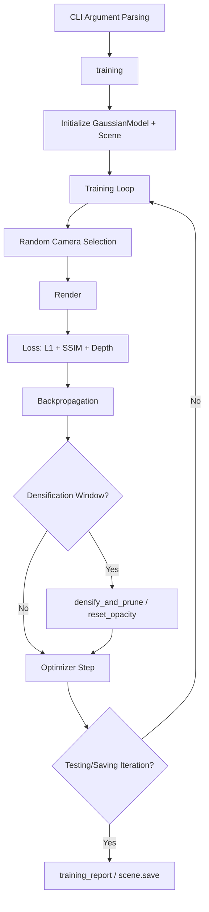

# Training Pipeline

# Training Pipeline

The training pipeline orchestrates the full optimization loop for 3D Gaussian Splatting. It initializes the scene and Gaussian model, then iteratively renders random training views, computes a combined L1/SSIM loss (with optional depth regularization), backpropagates, and performs adaptive densification and pruning of Gaussians until convergence.

## Architecture Overview



## Entry Point

The script is invoked directly. It parses three groups of structured parameters plus several standalone CLI flags:

| Parameter Group | Class | Key Settings |
|---|---|---|
| `ModelParams` (`-m`) | Dataset path, SH degree, white background, train/test exposure | |
| `OptimizationParams` (`-o`) | Iterations, learning rates, densification thresholds, optimizer type | |
| `PipelineParams` (`-p`) | Debug mode, SH/cov3D Python computation flags | |

**Standalone CLI arguments:**

- `--ip` / `--port` — Network viewer address (default `127.0.0.1:6009`)
- `--debug_from` — Enable pipeline debug from this iteration onward (default `-1`, disabled)
- `--detect_anomaly` — Enable PyTorch anomaly detection
- `--test_iterations` — Iterations at which to run validation (default `[7000, 30000]`)
- `--save_iterations` — Iterations at which to save the model (default `[7000, 30000]`, final iteration always appended)
- `--checkpoint_iterations` — Iterations at which to save full checkpoints
- `--start_checkpoint` — Path to a `.pth` checkpoint to resume from
- `--quiet` — Suppress non-essential output
- `--disable_viewer` — Disable the network GUI viewer

## Core Function: `training()`

```python
training(dataset, opt, pipe, testing_iterations, saving_iterations, checkpoint_iterations, checkpoint, debug_from)
```

### Initialization Phase

1. **Optimizer validation** — If `opt.optimizer_type == "sparse_adam"` but the `diff_gaussian_rasterization` package isn't installed, the process exits immediately.
2. **Output setup** — Calls `prepare_output_and_logger()` to create the output directory and initialize TensorBoard.
3. **Model creation** — Instantiates `GaussianModel(dataset.sh_degree, opt.optimizer_type)` and `Scene(dataset, gaussians)`. The scene loads training/test cameras and point cloud data.
4. **Training setup** — `gaussians.training_setup(opt)` configures all parameter groups and their optimizers.
5. **Checkpoint restoration** — If `checkpoint` is provided, loads `(model_params, first_iter)` via `torch.load` and calls `gaussians.restore(model_params, opt)`.
6. **Background** — White `[1,1,1]` if `dataset.white_background`, otherwise black `[0,0,0]`. Randomized when `opt.random_background` is enabled.

### Training Loop

Each iteration from `first_iter` to `opt.iterations` performs:

#### 1. Network GUI Handling
If the viewer is connected, the loop processes incoming viewer requests (custom camera, SH/cov3D flags, scaling modifier) and sends back rendered images. The loop breaks back into training when `do_training` is true and the iteration hasn't stalled.

#### 2. Learning Rate and SH Scheduling
- `gaussians.update_learning_rate(iteration)` adjusts per-parameter learning rates each iteration.
- Every 1000 iterations, `gaussians.oneupSHdegree()` increments the active spherical harmonics degree up to the configured maximum.

#### 3. Camera Selection
Training cameras are consumed via random pop from a stack. When the stack is exhausted, it is refilled from `scene.getTrainCameras()`. This ensures each camera is seen roughly once per epoch while maintaining random ordering.

#### 4. Rendering
```python
render_pkg = render(viewpoint_cam, gaussians, pipe, bg,
                    use_trained_exp=dataset.train_test_exp,
                    separate_sh=SPARSE_ADAM_AVAILABLE)
```
Key outputs extracted from `render_pkg`:
- `"render"` — the rendered image
- `"viewspace_points"` — screen-space positions for densification gradient tracking
- `"visibility_filter"` — boolean mask of visible Gaussians
- `"radii"` — screen-space radii per Gaussian
- `"depth"` — rendered inverse depth (used when depth regularization is active)

If the camera has an `alpha_mask`, it is applied to the rendered image before loss computation.

#### 5. Loss Computation

The primary loss is a weighted combination of L1 and SSIM:

```
loss = (1 - λ_dssim) * L1 + λ_dssim * (1 - SSIM)
```

Where `λ_dssim` is controlled by `opt.lambda_dssim`. SSIM is computed via `fused_ssim` (CUDA kernel) if available, falling back to the pure-Python `ssim()`.

**Depth regularization** is applied when both the weight schedule returns a positive value and the camera has reliable depth (`viewpoint_cam.depth_reliable`):

```python
Ll1depth = depth_l1_weight(iteration) * |render_invDepth - mono_invDepth| * depth_mask
```

The weight schedule follows an exponential decay from `opt.depth_l1_weight_init` to `opt.depth_l1_weight_final` over `opt.iterations` steps, computed by `get_expon_lr_func()`.

#### 6. Densification and Pruning

Active only when `iteration < opt.densify_until_iter`:

- **Statistics accumulation** — Every iteration calls `gaussians.add_densification_stats(viewspace_point_tensor, visibility_filter)` and tracks `max_radii2D` for visible Gaussians.
- **Densify and prune** — Triggered when `iteration >= opt.densify_from_iter` and `iteration % opt.densification_interval == 0`. Calls `gaussians.densify_and_prune(opt.densify_grad_threshold, 0.005, scene.cameras_extent, size_threshold, radii)`. The `size_threshold` is set to `20` only after `opt.opacity_reset_interval` has passed; before that it is `None` (no size-based pruning).
- **Opacity reset** — Triggered every `opt.opacity_reset_interval` iterations, or at `opt.densify_from_iter` when using white background. Calls `gaussians.reset_opacity()`.

#### 7. Optimizer Step

After backpropagation, two optimizer paths exist:

- **SparseGaussianAdam** (`use_sparse_adam == True`) — Passes a visibility mask (`radii > 0`) and total Gaussian count to `optimizer.step(visible, radii.shape[0])`, enabling per-Gaussian sparse updates that skip invisible Gaussians.
- **Standard Adam** — Calls `optimizer.step()` on all parameters.

In both cases, gradients are zeroed with `set_to_none=True`. The exposure optimizer (for train/test exposure compensation) is always stepped separately.

#### 8. Checkpointing

At iterations listed in `checkpoint_iterations`, the full model state is saved:

```python
torch.save((gaussians.capture(), iteration), f"{scene.model_path}/chkpnt{iteration}.pth")
```

At iterations in `saving_iterations`, `scene.save(iteration)` writes the Gaussian point cloud to PLY (triggers `save_ply` → `construct_list_of_attributes` → `mkdir_p`).

### Progress Tracking

An exponential moving average (EMA, α=0.4) of the total loss and depth loss is maintained for the tqdm progress bar, updated every 10 iterations.

## `prepare_output_and_logger(args)`

Sets up the output directory and returns a TensorBoard `SummaryWriter` (or `None` if TensorBoard isn't installed).

- If `args.model_path` is not set, it defaults to `./output/<OAR_JOB_ID or UUID prefix>`.
- Creates the directory and writes a `cfg_args` file capturing all arguments as a `Namespace`.
- Returns `None` with a warning if TensorBoard is unavailable.

## `training_report()`

```python
training_report(tb_writer, iteration, Ll1, loss, l1_loss, elapsed,
                 testing_iterations, scene, renderFunc, renderArgs, train_test_exp)
```

Called every iteration. Performs two roles:

**Per-iteration logging** (when `tb_writer` exists):
- `train_loss_patches/l1_loss` — current L1 loss
- `train_loss_patches/total_loss` — current total loss
- `iter_time` — CUDA-measured iteration time in ms

**Validation** (at iterations in `testing_iterations`):
- Evaluates all test cameras and a sample of 5 training cameras (indices 5, 10, 15, 20, 25).
- Computes per-view L1 and PSNR, averages per split, and logs to console and TensorBoard.
- When `train_test_exp` is enabled, only the right half of each image is compared (exposure compensation is trained on the left half).
- Logs an opacity histogram and total point count to TensorBoard.
- Calls `torch.cuda.empty_cache()` before and after validation to manage VRAM.

## Optional Features

| Feature | Enabled By | Effect |
|---|---|---|
| **Sparse Adam optimizer** | `opt.optimizer_type == "sparse_adam"` + installed rasterizer | Only updates visible Gaussians each step; significant speedup for large scenes |
| **Depth regularization** | `depth_l1_weight_init > 0` + cameras with `depth_reliable` | Monocular depth consistency loss with exponential weight decay |
| **Exposure compensation** | `dataset.train_test_exp` | Trains per-image exposure parameters; validation uses right-half comparison |
| **Random background** | `opt.random_background` | Samples a random RGB background each iteration instead of fixed black/white |
| **Alpha masking** | Cameras with `alpha_mask` attribute | Masks rendered output before loss computation |
| **Network viewer** | `--disable_viewer` not set | Live interactive rendering via `network_gui` on the configured IP/port |
| **Pipeline debug** | `--debug_from <iter>` | Enables debug mode in `PipelineParams` from the specified iteration |

## Resuming Training

Pass `--start_checkpoint <path>` to resume from a checkpoint file. The checkpoint must be a tuple `(model_params, iteration)` as produced by `gaussians.capture()`. The training loop resumes from `first_iter + 1` and preserves all optimizer state, Gaussian attributes, and accumulated densification statistics.