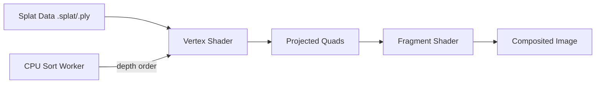

# Other

# Splat — WebGL 3D Gaussian Splatting Renderer

## Overview

Splat is a zero-dependency, WebGL 1.0 implementation of a real-time renderer for [3D Gaussian Splatting](https://repo-sam.inria.fr/fungraph/3d-gaussian-splatting/). It renders navigable 3D scenes from sets of photographs by treating reconstructed data as translucent 3D blobs (splats) — a generalization of point clouds that produces photorealistic results on ordinary graphics hardware, without the computational cost of NeRFs.

**Live demo:** [antimatter15.com/splat](https://antimatter15.com/splat/)

## Rendering Pipeline

The renderer follows a straightforward pipeline from splat data to screen:



1. **Projection** — Each splat's XYZ position is projected to screen coordinates via a projection matrix. Scale and quaternion rotation parameters are used to compute projected eigenvectors, producing a bounding quadrilateral on screen.

2. **Rasterization** — The fragment shader runs per-pixel on each quadrilateral. It computes the distance from the splat center and uses a Gaussian falloff to determine opacity, outputting an RGB color with alpha.

3. **Compositing** — Translucent splats must be drawn back-to-front. The renderer sorts splats by depth on the CPU in a Web Worker and feeds the ordered list to the GPU for painter's-algorithm compositing.

## Depth Sorting Strategy

Order-dependent transparency is the core rendering challenge. Splat evaluated and rejected several approaches before settling on CPU-based sorting:

| Approach | Outcome |
|---|---|
| **Stochastic transparency** | Grainy, dithered appearance — rejected |
| **Weighted blended OIT** | Fails with high-opacity overlapping splats — rejected |
| **Depth peeling** | Could not get working; likely too slow — rejected |
| **GPU bitonic/radix sort** | Possible but would split GPU time between sorting and rendering; not pursued |
| **CPU sort in Web Worker** | **Chosen** — ~4 FPS sort rate vs 60 FPS render, acceptable because depth order changes slowly during smooth camera movement |

The sort runs asynchronously, so momentary artifacts can appear during large camera jumps. This tradeoff keeps the GPU entirely focused on rendering.

## File Formats

### `.splat` format (primary)

A compact binary format storing per-splat data without spherical harmonics. Each splat contains position, scale, rotation (quaternion), and RGB color — no view-dependent shading coefficients. This keeps per-splat size small for efficient web delivery.

### `.ply` format (input)

The standard point cloud format used by the reference 3DGS training pipeline. Splat can convert `.ply` files on the fly — drag and drop a processed `.ply` onto the page and it auto-converts to `.splat`.

### Loading remote files

Append a `url` query parameter pointing to a CORS-enabled `.splat` file:

```
https://antimatter15.com/splat/?url=https://example.com/scene.splat
```

Optionally include a camera transform as a URL fragment (a JSON array of 16 floats representing a 4×4 column-major matrix):

```
https://antimatter15.com/splat/?url=scene.splat#[0.95,0.19,-0.23,0,-0.16,0.98,0.12,0,...]
```

## Controls

### Keyboard — Movement (arrow keys)

| Key | Action |
|---|---|
| ← / → | Strafe left / right |
| ↑ / ↓ | Move forward / back |
| `Space` | Jump |

### Keyboard — Camera (WASD)

| Key | Action |
|---|---|
| `A` / `D` | Turn left / right |
| `W` / `S` | Tilt up / down |
| `Q` / `E` | Roll counterclockwise / clockwise |
| `I` / `K` | Orbit up / down |
| `J` / `L` | Orbit left / right |

### Keyboard — Other

| Key | Action |
|---|---|
| `0`–`9` | Switch to pre-loaded camera view |
| `-` / `+` | Cycle through loaded cameras |
| `P` | Resume default animation |
| `V` | Save current view coordinates to URL |

### Mouse

- **Click + drag** — Orbit
- **Right-click + drag up/down** (or Ctrl/Cmd + drag) — Move forward/back
- **Right-click + drag left/right** (or Ctrl/Cmd + drag) — Strafe

### Trackpad

| Gesture | Action |
|---|---|
| Scroll up/down | Orbit down/up |
| Scroll left/right | Orbit left/right |
| Pinch | Move forward/back |
| Ctrl + scroll up/down | Move forward/back |
| Shift + scroll up/down | Move up/down |
| Shift + scroll left/right | Strafe left/right |

### Touch (mobile)

| Gesture | Action |
|---|---|
| One finger drag | Orbit |
| Two finger pinch | Move forward/back |
| Two finger rotate | Rotate camera CW/CCW |
| Two finger pan | Move side-to-side and up/down |

## Progressive Loading

Splat sorts splats by a combination of size and opacity, enabling progressive loading. The scene becomes visible and interactive before all splats are loaded — large, opaque splats render first, with finer detail filling in as loading continues.

## Limitations

- **No spherical harmonics** — View-dependent shading is not supported. Third-order SH requires 48 coefficients (~200 bytes per splat), which would bloat the `.splat` format significantly. Only RGB color is stored per splat.
- **WebGL 1.0 only** — No WebGL 2.0 or WebGPU dependencies. WebGL 2.0 adds no critical features beyond what extensions provide, and WebGPU lacks broad browser support.
- **Sort artifacts on large camera jumps** — The async CPU sort updates at ~4 FPS, so rapid orientation changes can produce momentary depth-ordering errors.

## Architecture Notes

- **Zero dependencies** — The entire renderer is vanilla JavaScript with WebGL 1.0. View source to read the unminified code directly.
- **Web Worker for sorting** — Keeps the main thread free for rendering and input handling.
- **Single-file implementation** — No build step required.