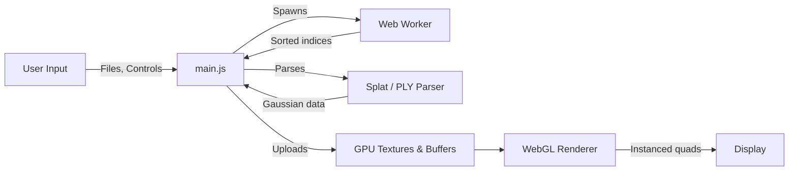

# splat-webgl — Wiki

# splat-webgl

Welcome to **splat-webgl** — a zero-dependency, WebGL-based real-time renderer for [3D Gaussian Splatting](https://repo-sam.inria.fr/fungraph/3d-gaussian-splatting/). It turns a set of photographs into a photorealistic, navigable 3D scene by rendering reconstructed data as translucent 3D splats. Unlike NeRFs, this approach runs efficiently on ordinary graphics hardware.

**Try it live:** [antimatter15.com/splat](https://antimatter15.com/splat/)

## Architecture



The system has two main subsystems. The [Web Interface](web-interface.md) is the core runtime: it loads `.splat` or `.ply` files, sorts splats by depth every frame via a Web Worker, uploads GPU resources, and renders alpha-blended instanced quads through WebGL. The [PLY to Splat Conversion](ply-to-splat-conversion.md) module is a standalone offline tool that converts 3D Gaussian Splatting PLY files into the compact binary `.splat` format the viewer consumes.

## End-to-End Rendering Flow

1. **File loading** — The user drops or selects a `.splat` or `.ply` file. `main.js` parses the Gaussian data (positions, scales, rotations, opacity, spherical harmonics).
2. **Worker creation** — `createWorker` spawns a Web Worker responsible for per-frame depth sorting.
3. **Per-frame sort** — On each frame, `runSort` in the Worker computes depth-sorted index arrays so front-to-back rendering order is correct.
4. **GPU upload** — Back in the main thread, `generateTexture` processes the sorted data. Gaussian attributes are packed into GPU textures using `packHalf2x16` and `floatToHalf` for compact half-float representation.
5. **Render** — The WebGL renderer draws instanced quads with alpha blending, producing the final splatted image.

## Getting Started

No build step is required. Clone the repository and open `index.html` in a browser:

```bash
git clone https://github.com/antimatter15/splat.git
cd splat
# Serve with any static file server, e.g.:
python3 -m http.server 8000
```

Then navigate to `http://localhost:8000` and drag-and-drop a `.splat` or `.ply` file onto the viewer.

## Navigation

The viewer supports keyboard, mouse, trackpad, touch, and gamepad input. See the [Web Interface](web-interface.md) page for full control details and rendering configuration.

> **Note:** For a more advanced renderer with animation support, multiple formats, and extended features, see [Spark](https://github.com/sparkjsdev/spark) and its [documentation](https://sparkjs.dev/).