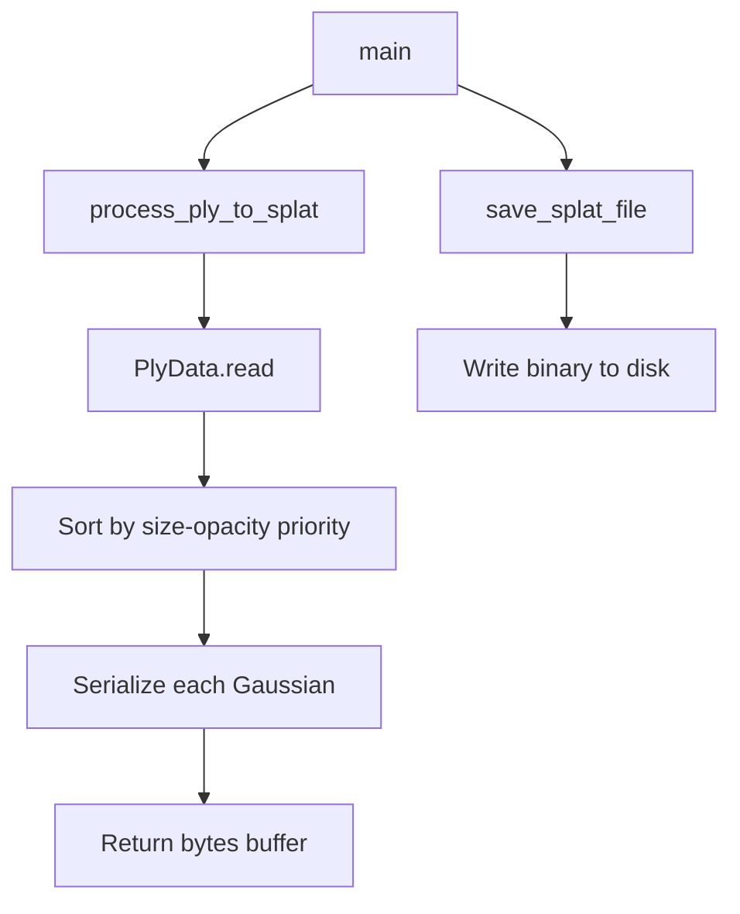

# PLY to Splat Conversion

# PLY to Splat Conversion

Converts 3D Gaussian Splatting PLY files into the binary SPLAT format consumed by web-based viewers (e.g., [antimatter15/splat](https://antimatter15.com/splat)).

## Overview

The module reads a PLY file containing Gaussian splat vertex data — positions, scales, rotations, opacity, and spherical harmonics coefficients — and writes a compact binary `.splat` file. Each Gaussian is sorted by a size-opacity heuristic before serialization, ensuring that larger, more opaque splats appear earlier in the output buffer.

## Data Format

Each Gaussian is encoded as a **32-byte** record:

| Field | Source PLY Property | Encoding | Size |
|---|---|---|---|
| Position | `x`, `y`, `z` | `float32` | 12 bytes |
| Scale | `scale_0`, `scale_1`, `scale_2` | `exp()` → `float32` | 12 bytes |
| Color + Alpha | `f_dc_0`, `f_dc_1`, `f_dc_2`, `opacity` | SH→RGB + sigmoid → `uint8` | 4 bytes |
| Rotation | `rot_0`, `rot_1`, `rot_2`, `rot_3` | Normalized quaternion → `uint8` | 4 bytes |

### Color Conversion

RGB channels are reconstructed from the 0th-order spherical harmonics (DC) coefficients:

```
channel = 0.5 + SH_C0 * f_dc_i    where SH_C0 = 0.28209479177387814
```

Alpha is the sigmoid of the raw opacity:

```
alpha = 1 / (1 + exp(-opacity))
```

All four channels are then scaled to `[0, 255]` and clipped.

### Rotation Encoding

The quaternion is normalized, then mapped from `[-1, 1]` to `[0, 255]`:

```
byte = (rot / ‖rot‖) * 128 + 128
```

This gives each component a range centered at 128, with values clipped to `[0, 255]`.

### Sort Order

Gaussians are sorted in descending order by:

```
priority = exp(scale_0 + scale_1 + scale_2) / (1 + exp(-opacity))
```

This places large, opaque splats first — a convention expected by the viewer's alpha-blending pipeline.

## API

### `process_ply_to_splat(ply_file_path)`

Reads a PLY file and returns the SPLAT binary payload as `bytes`.

```python
from convert import process_ply_to_splat, save_splat_file

splat_data = process_ply_to_splat("scene.ply")
save_splat_file(splat_data, "scene.splat")
```

**Parameters:**
- `ply_file_path` (`str`) — Path to the input `.ply` file.

**Returns:** `bytes` — The complete SPLAT binary buffer.

**Raises:** Propagates any exception from `PlyData.read` (e.g., file not found, malformed PLY).

### `save_splat_file(splat_data, output_path)`

Writes raw SPLAT bytes to disk.

**Parameters:**
- `splat_data` (`bytes`) — Output from `process_ply_to_splat`.
- `output_path` (`str`) — Destination file path.

## Command-Line Usage

```bash
# Single file — output goes to output.splat (default) or a custom path
python convert.py scene.ply
python convert.py scene.ply -o custom_name.splat

# Multiple files — each is written to <input>.splat, -o is ignored
python convert.py scene_a.ply scene_b.ply scene_c.ply
```

| Argument | Description |
|---|---|
| `input_files` | One or more `.ply` files to convert |
| `--output`, `-o` | Output path (default: `output.splat`). Only used when a single input is provided |

When multiple input files are given, each is saved alongside its source with a `.splat` extension appended (e.g., `scene.ply` → `scene.ply.splat`).

## Execution Flow



## Dependencies

- **plyfile** — PLY file parsing (`PlyData.read`)
- **numpy** — Array operations, exponential/sigmoid math, byte conversion