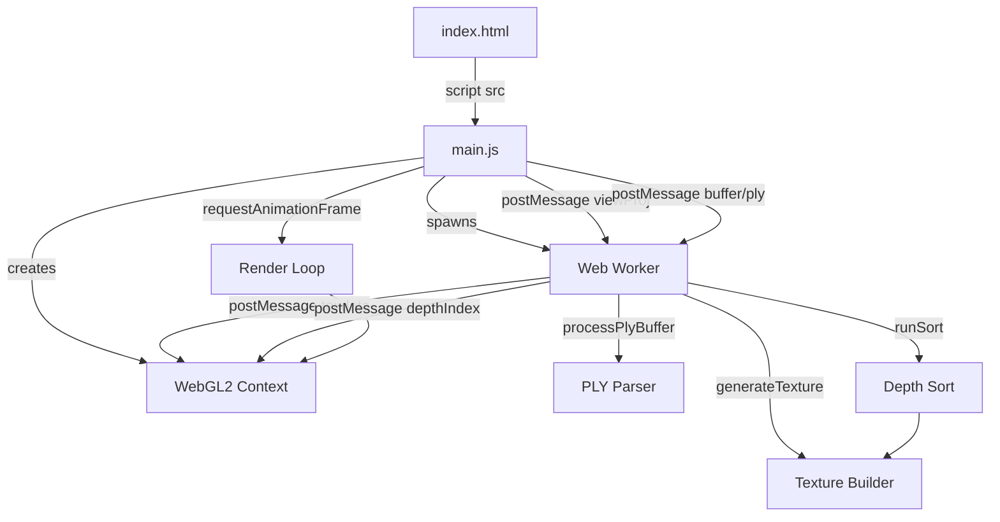

# Web Interface

# Web Interface Module

## Overview

This module implements a browser-based 3D Gaussian Splat renderer using WebGL2. It loads `.splat` or `.ply` files, sorts splats by depth on every frame using a Web Worker, uploads GPU textures and index buffers, and renders the result as instanced quads with alpha-blended Gaussian splats. The viewer supports keyboard, mouse, trackpad, touch, and gamepad navigation, plus drag-and-drop file loading and a carousel animation mode.

## Architecture



## Entry Point

`main()` is the async entry point. It:

1. Parses the URL hash for an initial view matrix (disabling carousel if present)
2. Fetches a `.splat` file from a configurable URL (`?url=` query param, defaulting to `train.splat` on HuggingFace)
3. Creates a Web Worker from `createWorker` via a Blob URL
4. Initializes the WebGL2 pipeline (shaders, buffers, textures, uniforms)
5. Registers all input event listeners
6. Starts the render loop via `requestAnimationFrame`
7. Streams the fetched file into `splatData`, progressively sending chunks to the worker

Errors are caught and displayed in the `#message` overlay.

## Camera System

### Predefined Cameras

The `cameras` array contains 10 hardcoded camera definitions, each with:

| Field | Type | Description |
|-------|------|-------------|
| `id` | number | Camera index |
| `img_name` | string | Source image identifier |
| `width` / `height` | number | Sensor dimensions in pixels |
| `position` | number[3] | Camera position in world space [x, y, z] |
| `rotation` | number[3][3] | 3×3 rotation matrix (row-major) |
| `fx` / `fy` | number | Focal lengths in pixels |

### Switching Cameras

- Press keys `0`–`9` to jump to a specific camera
- Press `-` or `+` to cycle through cameras
- Press `P` to resume the carousel animation
- Press `V` to serialize the current view matrix into the URL hash

### View Matrix Construction

`getViewMatrix(camera)` builds a 4×4 column-major view matrix from a camera's rotation and position:

```
camToWorld = [ R | -R^T * t ]
              [ 0 |     1    ]
```

`getProjectionMatrix(fx, fy, width, height)` produces a perspective projection with `znear=0.2`, `zfar=200`.

## Matrix Utilities

All matrices are flat 16-element arrays in column-major order (OpenGL convention).

| Function | Signature | Description |
|----------|-----------|-------------|
| `multiply4(a, b)` | `(float[16], float[16]) → float[16]` | Matrix product `a × b` |
| `invert4(a)` | `(float[16]) → float[16] \| null` | Full 4×4 inverse; returns `null` if singular |
| `rotate4(a, rad, x, y, z)` | `(float[16], number, number, number, number) → float[16]` | Post-multiplies `a` by a rotation of `rad` radians around axis `(x, y, z)` |
| `translate4(a, x, y, z)` | `(float[16], number, number, number) → float[16]` | Post-multiplies `a` by a translation `(x, y, z)` |

Navigation works by inverting the view matrix, applying transforms to the camera's world-space transform, then inverting back: `viewMatrix = invert4(translate4(invert4(viewMatrix), dx, dy, dz))`.

## Web Worker (`createWorker`)

The worker is created inline via `new Blob(["(", createWorker.toString(), ")(self)"])`. It handles four message types:

### Message Protocol

| Message | Fields | Behavior |
|---------|--------|----------|
| `{ ply }` | `ply: ArrayBuffer` | Parses PLY, converts to internal format, optionally triggers download |
| `{ buffer, vertexCount }` | Raw splat buffer | Stores the buffer for sorting |
| `{ vertexCount }` | Count only | Updates vertex count |
| `{ view }` | `view: float[16]` | Triggers depth sort for the given view-projection matrix |

### PLY Processing (`processPlyBuffer`)

Parses a PLY file by:

1. Reading the text header to extract `element vertex` count and per-property types/offsets
2. Using a `Proxy`-based accessor (`attrs`) to read row data by property name
3. Computing an importance score per splat: `exp(scale_0) × exp(scale_1) × exp(scale_2) × sigmoid(opacity)`
4. Sorting splats by importance (descending)
5. Writing the sorted output in the internal 32-byte-per-splat format:

| Offset | Size | Field |
|--------|------|-------|
| 0 | 12 bytes | Position (3 × float32) |
| 12 | 12 bytes | Scale (3 × float32) |
| 24 | 4 bytes | RGBA (4 × uint8) |
| 28 | 4 bytes | Quaternion rotation (4 × uint8, normalized to [0,255]) |

Color is converted from spherical harmonics DC coefficients (`f_dc_0/1/2`) using `SH_C0 = 0.28209479177387814`. Opacity passes through a sigmoid. If `scale_0` is absent, defaults of `scale=0.01` and `rot=(1,0,0,0)` are used.

If the `save` flag is set, the converted buffer is offered as a `.splat` download.

### Depth Sorting (`runSort`)

On each view-projection update:

1. **Early exit**: If the view direction hasn't changed significantly (`|dot - 1| < 0.01`), skip re-sorting
2. **Depth computation**: Projects each splat center through the view-projection matrix, quantizing to integer depth
3. **Counting sort**: 16-bit single-pass counting sort producing a `depthIndex` (Uint32Array of vertex indices)
4. **Texture generation** (`generateTexture`): On first sort or vertex count change, builds a GPU-ready texture

### Texture Generation (`generateTexture`)

Converts the internal splat buffer into a 2D texture layout:

- Texture dimensions: `width = 2048`, `height = ceil(2 * vertexCount / 2048)`
- Each splat occupies 8 texels (4 RGBA32UI pixels)
- Texels 0–2: position (float32)
- Texel 3: unused padding
- Texels 4–6: packed covariance matrix (3 `packHalf2x16` calls → 6 half-float pairs)
- Texel 7: RGBA color (uint8 in uint32)

The covariance is computed as `Σ = S × R`, where `S` is a diagonal scale matrix and `R` is the rotation matrix derived from the quaternion, then `cov2d` is projected later in the vertex shader.

`packHalf2x16(x, y)` packs two float16 values into a single uint32 using `floatToHalf`.

### Throttling

`throttledSort` ensures only one sort runs at a time. After a sort completes, if the view has changed again, it schedules another sort via `setTimeout(0)`.

## WebGL2 Rendering Pipeline

### Shaders

**Vertex shader** (`vertexShaderSource`):
- Reads per-instance `index` to fetch from the splat texture
- Computes camera-space position, projects to clip space
- Extracts the 3×3 covariance matrix from the texture, projects it through the Jacobian of the projection and the view rotation: `cov2d = T^T × Vrk × T` where `T = transpose(view3×3) × J`
- Computes eigenvalues of the 2D covariance to find the major/minor axes
- Outputs a quad vertex offset by the major and minor axes, scaled to viewport
- Passes depth-based attenuation and RGBA color to the fragment shader
- Splats outside a 1.2× clip boundary are culled (moved behind the far plane)

**Fragment shader** (`fragmentShaderSource`):
- Evaluates a 2D Gaussian: `A = -dot(vPosition, vPosition)`, discards if `A < -4.0`
- Outputs `exp(A) * alpha` for premultiplied alpha blending

### Blend Mode

```js
gl.blendFuncSeparate(ONE_MINUS_DST_ALPHA, ONE, ONE_MINUS_DST_ALPHA, ONE);
gl.blendEquationSeparate(FUNC_ADD, FUNC_ADD);
```

This implements an order-independent approximate blending where each splat's contribution is weighted by `1 - α_dst`, producing correct back-to-front compositing when sorted.

### Geometry

A single `TRIANGLE_FAN` of 4 vertices (`[-2,-2], [2,-2], [2,2], [-2,2]`) is instanced once per splat. The vertex shader positions each instance based on the splat's projected covariance.

### Progressive Loading

During streaming, partial data is sent to the worker with `vertexCount = Math.floor(bytesRead / rowLength)`. The progress bar (`#progress`) fills based on `vertexCount / totalExpected`. Once fully loaded, the progress bar is hidden and the spinner (`#spinner`) is dismissed.

## Input Handling

### Keyboard

| Key(s) | Action |
|--------|--------|
| Arrow Up/Down | Move forward/backward (or up/down with Shift) |
| Arrow Left/Right | Strafe left/right |
| W/S | Tilt camera up/down |
| A/D | Turn camera left/right |
| Q/E | Roll camera |
| I/K/J/L | Orbit (arcball-style) |
| Space | Jump (vertical offset with tilt animation) |
| 0–9 | Switch to predefined camera |
| `-` / `+` | Cycle cameras |
| P | Resume carousel animation |
| V | Save view to URL hash |

### Mouse

- **Left drag**: Orbit (rotate around focal point)
- **Right drag** or **Ctrl/Cmd + drag**: Pan (translate in screen plane)

### Wheel

- **Default**: Orbit (rotate around focal point)
- **Shift + scroll**: Pan in screen plane
- **Ctrl/Cmd + scroll**: Dolly (move forward/backward)

### Touch

- **One finger**: Orbit
- **Two-finger pinch**: Dolly
- **Two-finger rotate**: Roll camera
- **Two-finger pan**: Translate in screen plane

### Gamepad

- **Left stick**: Translate (axes 0, 1)
- **Right stick**: Rotate (axes 2, 3)
- **D-pad up/down (buttons 12/13)**: Vertical translate
- **D-pad left/right (buttons 14/15)**: Horizontal translate
- **Triggers (buttons 6/7)**: Roll
- **Bumpers (buttons 4/5)**: Cycle cameras
- **A (button 0)**: Jump
- **Y (button 3)**: Resume carousel

All gamepad input uses a 0.1 axis deadzone (`axisThreshold`).

## File Loading

### URL Parameter

The `?url=` query parameter specifies the `.splat` file to load. It defaults to `train.splat` on HuggingFace.

### Streaming

The file is streamed via `ReadableStream`. As chunks arrive, they're written into `splatData` and the worker is notified with incremental `vertexCount`. PLY files are only processed after the full download completes (detected by `isPly` checking the magic bytes `ply\n`).

### Drag and Drop

Dropping a file onto the page calls `selectFile`:

- **`.json` files**: Parsed as a camera array, replacing the global `cameras` and updating the projection matrix
- **`.ply` files**: Sent to the worker with `{ ply, save: true }`, which converts and offers a `.splat` download
- **`.splat` files**: Sent directly to the worker with `{ buffer, vertexCount }`

### PLY Detection

`isPly(data)` checks if the first four bytes are `[112, 108, 121, 10]` (the ASCII string `"ply\n"`).

## Carousel Animation

When `carousel` is `true` (the default on load), the view matrix is overridden each frame:

```js
t = sin((Date.now() - start) / 5000);
inv = translate4(inv, 2.5 * t, 0, 6 * (1 - cos(t)));
inv = rotate4(inv, -0.6 * t, 0, 1, 0);
```

This produces a smooth oscillating orbit. Any user input sets `carousel = false`. Pressing `P` re-enables it.

## Jump Animation

The `jumpDelta` variable creates a vertical bounce effect:

- While `Space` (or gamepad button 0) is held, `jumpDelta` increases by 0.05 per frame (max 1.0)
- When released, it decreases by 0.05 per frame (min 0.0)
- Applied as a downward translation and forward tilt: `translate4(inv, 0, -jumpDelta, 0)` then `rotate4(inv, -0.1 * jumpDelta, 1, 0, 0)`

## Downsample Logic

If the total splat count exceeds 500,000, `downsample` is set to 1 (no downscaling). Otherwise it's set to `1 / devicePixelRatio`, reducing the canvas resolution on high-DPI displays for better performance.

## HuggingFace Spaces Mode

The inline script at the top of `<body>` checks if `location.host` includes `"hf.space"` and adds the `nohf` class to `<body>`. This hides branding elements (`.nohf` elements) and changes the progress bar and loading cube color to orange (`#ff9d0d`).

## UI Elements

| Element | ID | Purpose |
|---------|-----|---------|
| Canvas | `#canvas` | WebGL2 render target, full-viewport |
| Info panel | `#info` | Title, credits, expandable instructions |
| Progress bar | `#progress` | Blue (or orange in HF mode) bar showing load progress |
| Spinner | `#spinner` | Animated 3D CSS cube shown while loading |
| Message | `#message` | Red error text overlay |
| FPS counter | `#fps` | Bottom-right FPS display |
| Camera ID | `#camid` | Top-right camera index display |

## Render Loop (`frame`)

Called via `requestAnimationFrame`, each frame:

1. Processes keyboard/gamepad input to update the view matrix
2. Applies carousel animation if active
3. Applies jump animation
4. Computes `viewProj = multiply4(projectionMatrix, actualViewMatrix)`
5. Sends `viewProj` to the worker for sorting
6. Clears the framebuffer
7. If `vertexCount > 0`: uploads the view matrix uniform and calls `gl.drawArraysInstanced(TRIANGLE_FAN, 0, 4, vertexCount)`
8. Otherwise: shows the spinner
9. Updates the progress bar and FPS display