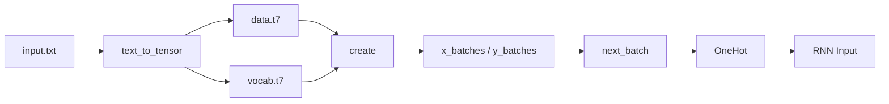

# Data Processing

# Data Processing Module

The Data Processing module provides utilities for transforming raw text into batched, numerically-encoded tensors suitable for character-level language model training. It consists of two components: a minibatch loader that handles file I/O, preprocessing, and data splitting, and a one-hot encoding module for neural network integration.

## Architecture



## CharSplitLMMinibatchLoader

A stateful data loader that reads a text file, encodes characters as integers, reshapes the data into minibatches, and partitions it into train/val/test splits. It is designed as a factory — you call `create()` rather than constructing instances directly.

### `create(data_dir, batch_size, seq_length, split_fractions)`

Factory method that builds and returns a fully initialized loader instance.

**Parameters:**

| Parameter | Type | Description |
|---|---|---|
| `data_dir` | string | Directory containing `input.txt`. Preprocessed `vocab.t7` and `data.t7` files are also stored here. |
| `batch_size` | number | Number of parallel sequences per batch. |
| `seq_length` | number | Length of each sequence in timesteps. |
| `split_fractions` | table | Three-element table `{train, val, test}` specifying the proportion of batches allocated to each split, e.g. `{0.9, 0.05, 0.05}`. |

**Returns:** A loader instance with the following fields:

| Field | Type | Description |
|---|---|---|
| `x_batches` | table of tensors | Input batches. Each tensor has shape `(batch_size, seq_length)`. |
| `y_batches` | table of tensors | Target batches (inputs shifted by one character). Same shape as `x_batches`. |
| `nbatches` | number | Total number of batches across all splits. |
| `ntrain` | number | Number of batches in the training split. |
| `nval` | number | Number of batches in the validation split. |
| `ntest` | number | Number of batches in the test split. |
| `vocab_mapping` | table | Character-to-integer mapping (e.g. `{a=1, b=2, ...}`). |
| `vocab_size` | number | Number of unique characters in the vocabulary. |
| `batch_ix` | table | Current batch index for each split `{train, val, test}`, indexed 1–3. |

**Preprocessing logic:**

1. Checks whether `vocab.t7` and `data.t7` already exist in `data_dir`.
2. If they don't exist, or if `input.txt` has been modified since the last preprocessing run, calls `text_to_tensor()` to regenerate them.
3. Loads the preprocessed tensor and vocabulary.
4. Truncates the data so the total length is evenly divisible by `batch_size * seq_length`.
5. Constructs `y_batches` by shifting `x_batches` by one position — the target for each timestep is the next character. The last target wraps around to the first character in the dataset.
6. Reshapes the 1D data into a 2D tensor of shape `(batch_size, total_length / batch_size)` and splits it along the second dimension into chunks of `seq_length`.
7. Partitions batches into train/val/test. When `split_fractions[3] == 0`, all remaining batches after the training set are assigned to validation (a common pattern when no test set is needed). Otherwise, test receives whatever batches remain after train and val are allocated, ensuring the counts sum to `nbatches` exactly.

**Important:** The data is laid out so that consecutive characters fall in different batch rows rather than consecutive positions within a row. This means each row is an independent contiguous sequence from the corpus, and consecutive timesteps within a batch advance along the sequence dimension, not across batches.

### `next_batch(split_index)`

Returns the next input/target batch pair for the specified split, advancing the internal pointer. Wraps around to the beginning when the end of the split is reached.

**Parameters:**

| Parameter | Type | Description |
|---|---|---|
| `split_index` | number | `1` for train, `2` for val, `3` for test. |

**Returns:** Two tensors — `x_batch` and `y_batch`, each of shape `(batch_size, seq_length)`.

The method computes the global batch index by offsetting within the combined batch array: validation batches start after training batches, and test batches start after training + validation batches.

**Error handling:** If the requested split has zero batches (e.g. `split_fractions = {1.0, 0, 0}` and you request a val batch), the method prints an error and calls `os.exit()`.

### `reset_batch_pointer(split_index, batch_index)`

Resets the internal batch pointer for a given split, useful for restarting an epoch.

**Parameters:**

| Parameter | Type | Default | Description |
|---|---|---|---|
| `split_index` | number | — | `1` for train, `2` for val, `3` for test. |
| `batch_index` | number | `0` | The batch index to set. On the next `next_batch()` call, the pointer will increment to `batch_index + 1`. |

### `text_to_tensor(in_textfile, out_vocabfile, out_tensorfile)`

Static method that performs one-time preprocessing of a raw text file into a numeric tensor and vocabulary file. Called automatically by `create()` when needed, but can also be invoked directly.

**Parameters:**

| Parameter | Type | Description |
|---|---|---|
| `in_textfile` | string | Path to the raw text file. |
| `out_vocabfile` | string | Path where the vocabulary mapping (Lua table, saved via `torch.save`) will be written. |
| `out_tensorfile` | string | Path where the encoded data tensor (`torch.ByteTensor`) will be written. |

**Processing steps:**

1. Reads the entire text file in chunks of 10,000 characters.
2. Builds a set of unique characters, sorts them lexicographically, and assigns each a sequential integer ID starting from 1.
3. Re-reads the file and maps each character to its integer ID, storing the result in a `ByteTensor`. This means the vocabulary size must not exceed 255 characters.
4. Saves the vocabulary mapping and the data tensor to disk via `torch.save`.

**Note:** The vocabulary mapping is sorted, so the ordering is deterministic across runs for the same input. However, if the input text changes (e.g. characters are added or removed), the integer assignments may shift, which is why `create()` checks file modification times and re-runs preprocessing when `input.txt` is newer than the cached files.

## OneHot

An `nn.Module` subclass that converts a tensor of integer indices into a one-hot representation. This is typically inserted after the data loader in a neural network graph to convert character IDs into sparse binary vectors before feeding them into an RNN or other model.

### `__init(outputSize)`

Constructs the module and caches an identity matrix of size `outputSize × outputSize` for efficient row-indexing during the forward pass.

| Parameter | Type | Description |
|---|---|---|
| `outputSize` | number | Size of the one-hot vector (should equal `vocab_size`). |

### `updateOutput(input)`

Performs the forward pass. Takes a 1D tensor of integer indices and returns a 2D tensor where each row is the one-hot vector corresponding to that index.

**Input shape:** `(N)` — a batch of `N` integer indices.

**Output shape:** `(N, outputSize)` — each row is a one-hot vector.

**Implementation:** The method indexes into the cached identity matrix using `torch.index` on dimension 1, which selects rows corresponding to the input indices. The input is cast to `long` to ensure valid indexing, and the identity matrix is cast to `float` to match the output type expected by downstream modules.

## Usage Example

```lua
-- Create the data loader
local loader = CharSplitLMMinibatchLoader.create(
    'data/tinyshakespeare/',
    50,          -- batch_size
    50,          -- seq_length
    {0.9, 0.05, 0.05}
)

-- Build a model with one-hot encoding
local onehot = OneHot(loader.vocab_size)
local rnn = nn.LSTM(loader.vocab_size, 128)
local model = nn.Sequential():add(onehot):add(rnn)

-- Training loop
loader:reset_batch_pointer(1)  -- reset train split
for i = 1, loader.ntrain do
    local x, y = loader:next_batch(1)  -- 1 = train
    -- x and y are ByteTensors of shape (batch_size, seq_length)
    -- onehot:convert(x) before feeding into model if needed
end
```

## Caveats

- **ByteTensor limitation:** `text_to_tensor` stores encoded data as `torch.ByteTensor`, limiting the vocabulary to 255 unique characters. For corpora with more unique symbols, the storage type must be changed (e.g. to `ShortTensor` or `IntTensor`).
- **Data truncation:** The total data length is truncated to be evenly divisible by `batch_size × seq_length`. Characters at the end of the file are silently discarded.
- **Circular target:** The last target character wraps to the first character in the dataset (`ydata[-1] = data[1]`). This creates an artificial transition that does not exist in the source text.
- **No shuffling:** Batches are served in sequential order and wrap around. There is no shuffling between epochs, which is typical for language modeling but may be undesirable for other tasks.