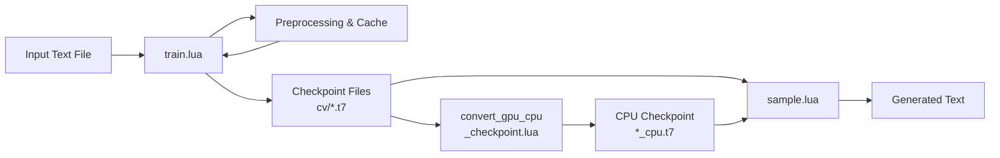

# Other

# char-rnn: Multi-layer Character-Level Recurrent Neural Network

## Overview

char-rnn implements multi-layer recurrent neural networks (RNN, LSTM, and GRU) for character-level language modeling. The model ingests a text file, trains a recurrent network to predict the next character in a sequence, and can then generate novel text that stylistically resembles the training data.

> **Note:** The [torch-rnn](https://github.com/jcjohns/torch-rnn) project by Justin Johnson is now recommended as the default implementation. It offers a cleaner codebase, uses Adam optimization, and hard-codes RNN/LSTM forward/backward passes for improved space/time efficiency. This repository remains available but torch-rnn should be preferred for new work.

## Architecture



The system operates in two phases: **training** (learning character-level probabilities from data) and **sampling** (generating text from a trained model checkpoint).

## Key Scripts

| Script | Purpose |
|--------|---------|
| `train.lua` | Trains the RNN on input data, writes checkpoints to `cv/` |
| `sample.lua` | Generates text from a saved checkpoint |
| `convert_gpu_cpu_checkpoint.lua` | Converts a GPU-trained checkpoint for CPU sampling |

## Requirements

**Core dependencies** (installed via LuaRocks):

- [Torch](http://torch.ch/) — the Lua-based scientific computing framework
- `nngraph` — graph-based neural network construction
- `optim` — optimization algorithms
- `nn` — neural network modules

**GPU support (optional):**

- **CUDA:** Install the [CUDA Toolkit](https://developer.nvidia.com/cuda-toolkit), then `cutorch` and `cunn` via LuaRocks. Enabled by default (`-gpuid 0`).
- **OpenCL:** Install `cltorch` and `clnn` via LuaRocks. Enabled with `-opencl 1` during training.

## Data Preparation

Place your training text as a single file named `input.txt` inside a subfolder of `data/`:

```
data/my_dataset/input.txt
```

On first run, `train.lua` preprocesses the file and writes two cache files alongside it. Subsequent runs load the cache directly.

**Dataset sizing guidelines:**

| Dataset Size | Recommended `rnn_size` | Notes |
|-------------|------------------------|-------|
| < 1 MB | Default (128) | Considered very small; model may underfit |
| ~2 MB | 128–256 | Default parameters reasonable |
| ~6 MB | 300+ | Larger models work significantly better |
| Large | Up to 700 with 3 layers | Bounded by GPU memory |

## Training

Run training with `train.lua`:

```bash
# CPU-only training on the included Tiny Shakespeare dataset
th train.lua -gpuid -1

# Custom dataset with a larger model
th train.lua -data_dir data/my_dataset -rnn_size 512 -num_layers 2 -dropout 0.5
```

Use `th train.lua -help` for all available options.

### Key Parameters

**Model architecture:**

- **`rnn_size`** — Number of hidden units per layer. Controls model capacity. Default: 128.
- **`num_layers`** — Number of recurrent layers. Recommended: 2 or 3. Default: 2.
- **`dropout`** — Dropout probability between layers (0–1). Helps prevent overfitting. Default: 0.
- **`model`** — RNN variant: `lstm` (default), `rnn`, or `gru`.

**Data layout:**

The input text (N characters) is split into chunks of size `batch_size × seq_length`, then allocated across train/validation/test splits.

- **`batch_size`** (B) — Number of parallel data streams. Default: 50.
- **`seq_length`** (S) — Length of each stream. Also the maximum backpropagation-through-time window. Default: 50.
- **`train_frac`** — Fraction of chunks for training. Default: 0.95.
- **`val_frac`** — Fraction of chunks for validation. Default: 0.05.

If your dataset is small, the total number of chunks may be insufficient. In that case, reduce `batch_size` or `seq_length` to create more, smaller chunks.

**Continuing training:**

Use `-init_from` to resume from a previous checkpoint, enabling further training or model fine-tuning.

### Checkpoints

Checkpoints are written to the `cv/` directory at intervals controlled by `eval_val_every`. Filenames encode the validation loss:

```
lm_lstm_epoch0.95_2.0681.t7
                │       │
                │       └── Validation loss (lower is better)
                └── Training progress (epoch fraction)
```

**Always select the checkpoint with the lowest validation loss for sampling** — this may not be the final checkpoint if overfitting has occurred.

## Sampling

Generate text from a trained checkpoint:

```bash
th sample.lua cv/lm_lstm_epoch30.00_1.3950.t7 -gpuid -1
```

The `gpuid` must match the training device: GPU checkpoints require GPU sampling, and CPU checkpoints require CPU sampling. Use `th sample.lua -help` for all options.

### Sampling Parameters

- **`-temperature`** — Divides predicted log probabilities before softmax. Range: (0, 1]. Default: 1.
  - **Low temperature** (e.g., 0.5): More conservative, likely predictions. Less diverse but fewer mistakes.
  - **High temperature** (e.g., 1.0): More diverse, surprising predictions. Higher risk of incoherence.
- **`-length`** — Number of characters to generate. Default: 2000.
- **`-primetext`** — Initial text to warm up the RNN with context before generation. Example: `-primetext "The meaning of life is "`

### GPU-to-CPU Checkpoint Conversion

To sample from a GPU-trained checkpoint on CPU, convert it first:

```bash
th convert_gpu_cpu_checkpoint.lua cv/lm_lstm_epoch30.00_1.3950.t7
```

This creates `cv/lm_lstm_epoch30.00_1.3950.t7_cpu.t7`, which can be used with `-gpuid -1`.

## Diagnosing Model Performance

### Validation vs. Training Loss

| Symptom | Diagnosis | Action |
|---------|-----------|--------|
| Training loss ≪ validation loss | Overfitting | Decrease `rnn_size`, increase `dropout` (try 0.5) |
| Training loss ≈ validation loss | Underfitting | Increase `rnn_size` or `num_layers` |

### Parameter Count vs. Data Size

The number of model parameters is printed at training start. As a rough heuristic, your parameter count and dataset size (in characters) should be the same order of magnitude:

- **1 MB file ≈ 1 million characters**
- If you have 100M characters but only 150K parameters → heavily underfitting → increase `rnn_size`.
- If you have 10M characters but 10M parameters → risk of overfitting → monitor validation loss closely, increase `dropout` if needed.

### Best Model Strategy

1. Make the network as large as your compute budget allows.
2. Sweep `dropout` values between 0 and 1.
3. Select the checkpoint with the lowest validation loss.
4. Ensure your validation set is large enough to produce a stable loss estimate.

## Origins and References

This codebase originated from the Oxford University Machine Learning [practical 6](https://github.com/oxford-cs-ml-2015/practical6), which was based on Wojciech Zaremba's [learning to execute](https://github.com/wojciechz/learning_to_execute) code. Justin Johnson contributed to portions of the implementation.

**Further reading on RNN language models:**

- [The Unreasonable Effectiveness of Recurrent Neural Networks](http://karpathy.github.io/2015/05/21/rnn-effectiveness/) — the blog post describing this project's context
- [Generating Sequences With Recurrent Neural Networks](http://arxiv.org/abs/1308.0850) — Alex Graves
- [Generating Text with Recurrent Neural Networks](http://www.cs.utoronto.ca/~ilya/pubs/2011/LANG-RNN.pdf) — Ilya Sutskever
- [Statistical Language Models Based on Neural Networks](http://www.fit.vutbr.cz/~imikolov/rnnlm/thesis.pdf) — Tomas Mikolov's thesis

## License

MIT